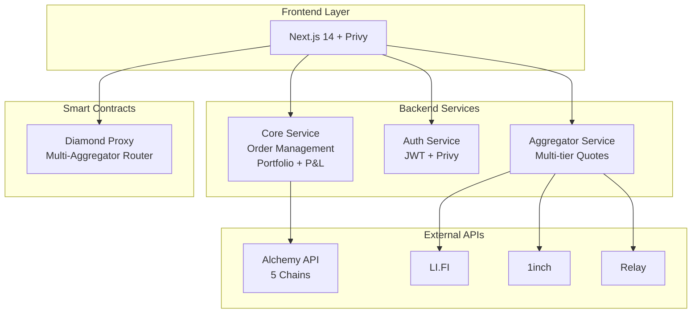

# MoonXFarm DEX - Cấu Trúc Thư Mục Toàn Diện

## Tổng Quan Kiến Trúc
Hệ thống MoonXFarm được tổ chức theo mô hình **Monorepo** với kiến trúc **Microservices**, hỗ trợ CI/CD độc lập cho từng service và khả năng mở rộng theo chiều ngang.

## Cây Thư Mục Chi Tiết

```
moonx-farm/
├── README.md                           # Tài liệu tổng quan dự án
├── .gitignore                          # Git ignore patterns
├── .github/                            # GitHub Actions workflows
│   ├── workflows/
│   │   ├── ci-contracts.yml           # CI cho smart contracts
│   │   ├── ci-backend-services.yml    # CI cho backend services
│   │   ├── ci-frontend.yml            # CI cho frontend
│   │   ├── ci-workers.yml             # CI cho async workers
│   │   └── security-scan.yml          # Security & dependency scan
│   └── templates/                      # Issue/PR templates
│
├── docs/                               # Tài liệu dự án
│   ├── architecture/                   # Kiến trúc hệ thống
│   │   ├── system-design.md
│   │   ├── api-specs/                 # OpenAPI specifications
│   │   │   ├── auth-service.yaml
│   │   │   ├── aggregator-service.yaml
│   │   │   ├── swap-orchestrator.yaml
│   │   │   └── wallet-registry.yaml
│   │   └── diagrams/                  # Mermaid diagrams
│   ├── deployment/                     # Deployment guides
│   ├── security/                       # Security assessments
│   └── user-guides/                    # User documentation
│
├── packages/                           # Shared packages
│   ├── common/                         # Common utilities (✅ UPDATED)
│   │   ├── package.json
│   │   ├── src/
│   │   │   ├── constants/
│   │   │   │   └── index.ts           # Application constants
│   │   │   ├── types/
│   │   │   │   └── index.ts           # Shared TypeScript types
│   │   │   ├── utils/
│   │   │   │   └── index.ts           # Utility functions
│   │   │   ├── validation/             # Validation schemas
│   │   │   │   ├── api.ts             # API validation
│   │   │   │   ├── base.ts            # Base validation schemas
│   │   │   │   ├── blockchain.ts      # Blockchain validation
│   │   │   │   ├── index.ts           # Validation exports
│   │   │   │   ├── orders.ts          # Order validation
│   │   │   │   ├── trading.ts         # Trading validation
│   │   │   │   └── utils.ts           # Validation utilities
│   │   │   ├── errors.ts              # Error definitions
│   │   │   ├── logger.ts              # Centralized logging
│   │   │   └── index.ts               # Package exports
│   │   ├── tsconfig.json
│   │   └── tests/
│   ├── api-client/                     # API client SDK
│   │   ├── package.json
│   │   ├── src/
│   │   │   ├── clients/
│   │   │   ├── types/
│   │   │   └── index.ts
│   │   └── tests/
│   └── infrastructure/                 # Infrastructure managers (✅ UPDATED)
│       ├── package.json
│       ├── README.md                  # Infrastructure documentation
│       └── src/
│           ├── database.ts            # Database connection manager
│           ├── redis.ts               # Redis connection manager
│           ├── kafka.ts               # Kafka connection manager
│           └── index.ts               # Infrastructure exports
│
├── configs/                            # Centralized Configuration Management (✅ IMPLEMENTED)
│   ├── package.json                   # @moonx-farm/configs package
│   ├── tsconfig.json                  # TypeScript configuration
│   ├── README.md                      # Configuration documentation
│   ├── LOGGER_INTEGRATION.md         # Logger integration guide
│   ├── index.ts                       # Generic config manager with profiles
│   ├── schemas.ts                     # Zod validation schemas
│   ├── utils.ts                       # Configuration utility functions
│   ├── example.ts                     # Configuration examples
│   └── test-logger.ts                 # Logger testing utilities
│
├── contracts/                          # Smart Contracts (Diamond Proxy Pattern) ✅ IMPLEMENTED
│   ├── package.json                   # Node.js dependencies & Hardhat setup
│   ├── hardhat.config.js              # Hardhat configuration với multi-network
│   ├── README.md                      # Comprehensive contracts documentation
│   ├── .env                           # Environment variables (not in repo)
│   ├── src/                           # Solidity contracts
│   │   ├── Diamond.sol                # MoonXFarmRouter (main Diamond contract)
│   │   ├── MockERC20.sol              # Test token contract
│   │   ├── interfaces/                # Contract interfaces
│   │   │   ├── IDiamondCut.sol
│   │   │   ├── IDiamondLoupe.sol
│   │   │   ├── IERC165.sol
│   │   │   └── IERC173.sol
│   │   ├── facets/                    # Diamond facets (ACTUAL IMPLEMENTATION)
│   │   │   ├── DiamondCutFacet.sol    # Upgrade functionality
│   │   │   ├── DiamondLoupeFacet.sol  # Introspection
│   │   │   ├── OwnershipFacet.sol     # Access control
│   │   │   ├── FeeCollectorFacet.sol  # Fee management
│   │   │   ├── LifiProxyFacet.sol     # LI.FI aggregator integration
│   │   │   ├── OneInchProxyFacet.sol  # 1inch aggregator integration
│   │   │   ├── RelayProxyFacet.sol    # Relay.link aggregator integration
│   │   │   ├── Test1Facet.sol         # Test facet for upgrades
│   │   │   └── Test2Facet.sol         # Test facet for upgrades
│   │   ├── helpers/                   # Helper contracts
│   │   │   ├── AggregatorProxy.sol    # Base proxy for aggregators
│   │   │   ├── ReentrancyGuard.sol    # Reentrancy protection
│   │   │   └── test/                  # Test utility contracts
│   │   │       ├── BadInit.sol        # Test initialization failure
│   │   │       ├── ComplexStorage*.sol # Diamond upgrade testing
│   │   │       ├── RecursiveInit.sol  # Recursive call testing
│   │   │       └── StorageInitializer.sol # Storage layout testing
│   │   ├── libraries/                 # Shared libraries
│   │   │   ├── LibDiamond.sol         # Diamond storage & management
│   │   │   ├── LibFeeCollector.sol    # Fee collection logic
│   │   │   ├── LibReentrancyGuard.sol # Reentrancy protection
│   │   │   ├── LibUtil.sol            # General utilities
│   │   │   └── LibBytes.sol           # Byte manipulation
│   │   ├── errors/                    # Custom error definitions
│   │   │   ├── GenericErrors.sol      # General errors
│   │   │   └── RouterErrors.sol       # Router-specific errors
│   │   ├── mocks/                     # Mock contracts for testing
│   │   │   ├── MockAggregator.sol     # Mock aggregator
│   │   │   └── MockERC20.sol          # Mock ERC20 token
│   │   └── upgradeInitializers/       # Contract upgrade initializers
│   ├── script/                        # Deployment & management scripts
│   │   ├── deploy.js                  # Main deployment script (Hardhat)
│   │   ├── deploy-and-verify.js       # Deploy with verification
│   │   ├── manageFacets.js            # Facet management
│   │   ├── add-aggregator-facets.sh   # Add aggregator facets
│   │   ├── manage-facets.sh           # Facet management shell script
│   │   ├── test-deployed.js           # Test deployed contracts
│   │   ├── test-deployed.sh           # Test deployment shell script
│   │   ├── fund-accounts.js           # Fund test accounts
│   │   ├── setup-test-tokens.js       # Setup test tokens
│   │   └── libraries/
│   │       └── diamond.js             # Diamond utilities
│   ├── test/                          # Contract tests
│   │   ├── unit/                      # Unit tests
│   │   │   └── MoonXFarmRouter.test.js # Main router tests
│   │   └── {integration}/             # Integration tests (future)
│   └── deployments/                   # Deployment artifacts
│       ├── base-mainnet/              # Base mainnet deployments
│       ├── base-testnet/              # Base testnet deployments
│       ├── bsc-mainnet/               # BSC mainnet deployments
│       └── bsc-testnet/               # BSC testnet deployments
│
├── services/                          # Core Backend Services
│   ├── core-service/                  # Core Platform Service (✅ COMPLETED) 
│   │   ├── Dockerfile
│   │   ├── package.json               # Fastify v5 + @moonx packages integration
│   │   ├── .env.example              # Service-specific env variables
│   │   ├── README.md                  # Core service documentation
│   │   ├── src/
│   │   │   ├── controllers/
│   │   │   │   ├── portfolioController.ts  # ✅ Portfolio management APIs với Alchemy integration
│   │   │   │   ├── orderController.ts      # ✅ Order Management System (CRUD với executions)
│   │   │   │   ├── pnlController.ts        # ✅ P&L analytics và calculation APIs
│   │   │   │   ├── tradesController.ts     # ✅ Trading history APIs (read-only)
│   │   │   │   └── healthController.ts     # ✅ Health check APIs
│   │   │   ├── services/
│   │   │   │   ├── portfolioService.ts     # ✅ Portfolio sync với Alchemy (5 chains)
│   │   │   │   ├── orderService.ts         # ✅ Complete order management (limit/DCA)
│   │   │   │   ├── pnlService.ts           # ✅ Real P&L calculation với cost basis
│   │   │   │   ├── tradesService.ts        # ✅ Trading history business logic
│   │   │   │   ├── alchemyService.ts       # ✅ Alchemy API integration với retry logic
│   │   │   │   ├── autoSyncService.ts      # ✅ Background sync với smart triggers
│   │   │   │   ├── cacheService.ts         # ✅ Redis caching với batch operations
│   │   │   │   └── databaseService.ts      # ✅ Enterprise-grade DB operations
│   │   │   ├── middleware/
│   │   │   │   ├── authMiddleware.ts       # ✅ Auth service integration
│   │   │   │   ├── validationMiddleware.ts # ✅ Request validation
│   │   │   │   ├── rateLimitMiddleware.ts  # ✅ Rate limiting
│   │   │   │   └── errorHandler.ts         # ✅ Error handling
│   │   │   ├── models/
│   │   │   │   ├── order.ts                # ✅ Order data models
│   │   │   │   ├── portfolio.ts            # ✅ Portfolio models  
│   │   │   │   ├── trade.ts                # ✅ Trade models
│   │   │   │   └── user.ts                 # ✅ User models
│   │   │   ├── schemas/
│   │   │   │   ├── orderSchemas.ts         # ✅ Order API validation schemas
│   │   │   │   ├── portfolioSchemas.ts     # ✅ Portfolio schemas
│   │   │   │   ├── pnlSchemas.ts           # ✅ P&L schemas
│   │   │   │   └── tradeSchemas.ts         # ✅ Trade schemas
│   │   │   ├── routes/
│   │   │   │   ├── orders.ts               # ✅ Complete order management endpoints
│   │   │   │   ├── portfolio.ts            # ✅ Portfolio endpoints
│   │   │   │   ├── pnl.ts                  # ✅ P&L endpoints
│   │   │   │   ├── trades.ts               # ✅ Trading history endpoints
│   │   │   │   └── health.ts               # ✅ Health endpoints
│   │   │   ├── types/
│   │   │   │   ├── index.ts                # ✅ Complete TypeScript definitions
│   │   │   │   └── fastify.ts              # ✅ Fastify type extensions
│   │   │   ├── migrations/
│   │   │   │   ├── 001_create_orders.sql   # ✅ Order tables với indexes
│   │   │   │   └── 002_create_user_trades.sql # ✅ User trades table
│   │   │   └── index.ts                    # ✅ Fastify server với @moonx-farm/configs
│   │   └── tests/
│   │       ├── unit/
│   │       └── integration/
│   │
│   ├── notify-service/                # Notification Service (📋 PLANNED)
│   │   ├── Dockerfile
│   │   ├── package.json
│   │   ├── .env.example
│   │   ├── src/
│   │   │   ├── controllers/
│   │   │   ├── services/
│   │   │   │   ├── socketManager.ts       # Socket.IO connection management
│   │   │   │   ├── notificationService.ts # Real-time alerts & copy trading
│   │   │   │   ├── emailService.ts        # Email notifications
│   │   │   │   └── pushNotificationService.ts # Push notifications
│   │   │   ├── events/
│   │   │   │   ├── swapEvents.ts          # Swap completion events
│   │   │   │   ├── orderEvents.ts         # Order execution events
│   │   │   │   ├── priceEvents.ts         # Price alert events
│   │   │   │   └── walletEvents.ts        # Wallet activity events
│   │   │   ├── consumers/                 # Kafka consumers
│   │   │   │   ├── swapConsumer.ts        # Process swap completions
│   │   │   │   ├── priceConsumer.ts       # Price alert triggers
│   │   │   │   └── orderConsumer.ts       # Order status updates
│   │   │   ├── models/
│   │   │   │   ├── notification.ts        # Notification data models
│   │   │   │   └── subscription.ts        # User subscription preferences
│   │   │   └── server.ts                  # Socket.IO server
│   │   └── tests/
│   │
│   ├── auth-service/                  # Authentication Service (✅ IMPLEMENTED)
│   │   ├── Dockerfile
│   │   ├── package.json               # Fastify v5 + modern plugins
│   │   ├── ENV_SETUP.md              # Comprehensive setup guide
│   │   ├── src/
│   │   │   ├── controllers/
│   │   │   │   ├── authController.ts  # Login, refresh, verify endpoints
│   │   │   │   ├── sessionController.ts # Session management
│   │   │   │   └── userController.ts  # User profile management
│   │   │   ├── services/
│   │   │   │   ├── privyService.ts    # Privy integration with config
│   │   │   │   ├── jwtService.ts      # JWT token management
│   │   │   │   ├── databaseService.ts # Database operations
│   │   │   │   └── redisService.ts    # Redis operations
│   │   │   ├── middleware/
│   │   │   │   ├── authMiddleware.ts  # JWT validation & user context
│   │   │   │   ├── errorHandler.ts    # Global error handling
│   │   │   │   └── requestLogger.ts   # Request logging plugin
│   │   │   ├── schemas/
│   │   │   │   └── index.ts          # JSON schemas for OpenAPI
│   │   │   ├── types/
│   │   │   │   └── index.ts          # TypeScript type definitions
│   │   │   └── server.ts             # Fastify server with Swagger
│   │   └── tests/
│   │       └── unit/
│   │           └── jwtService.test.ts
│   │
│   ├── wallet-registry/               # Wallet Registry Service (✅ IMPLEMENTED)
│   │   ├── Dockerfile
│   │   ├── package.json
│   │   ├── .env.example
│   │   ├── docs/                      # Comprehensive documentation
│   │   │   ├── SESSION_KEYS.md        # Session key architecture guide
│   │   │   └── SESSION_KEY_EXAMPLE.md # Workflow examples & best practices
│   │   ├── src/
│   │   │   ├── controllers/
│   │   │   │   └── walletController.ts # REST API endpoints với session key automation
│   │   │   ├── services/
│   │   │   │   ├── zeroDevClient.ts    # ZeroDev Account Abstraction integration
│   │   │   │   ├── sessionKeyManager.ts # Session key lifecycle management
│   │   │   │   ├── walletService.ts    # AA wallet operations
│   │   │   │   └── gasManager.ts       # Intelligent gas sponsorship
│   │   │   ├── types/
│   │   │   │   └── index.ts           # TypeScript types cho AA wallets & session keys
│   │   │   ├── models/                # Database models
│   │   │   └── server.ts              # Fastify server setup
│   │   └── tests/
│   │
│   ├── aggregator-service/                 # Aggregator Service (Go) - ✅ OPTIMIZED
│   │   ├── Dockerfile
│   │   ├── go.mod                     # Go dependencies với performance optimization
│   │   ├── go.sum
│   │   ├── .env.example
│   │   ├── cmd/
│   │   │   └── server/
│   │   │       └── main.go
│   │   ├── internal/
│   │   │   ├── handlers/
│   │   │   │   └── aggregator.go           # HTTP handlers cho aggregator
│   │   │   ├── services/
│   │   │   │   ├── aggregator.go            # ✅ Multi-tier aggregation với circuit breaker
│   │   │   │   ├── lifi.go                  # ✅ LiFi integration với cross-chain support
│   │   │   │   ├── oneinch.go                # ✅ 1inch integration (same-chain only)
│   │   │   │   ├── relay.go                  # ✅ Relay integration với cross-chain support
│   │   │   │   ├── external.go                # External API service (DexScreener, etc.)
│   │   │   │   └── cache.go                  # Redis caching với TTL optimization
│   │   │   ├── models/
│   │   │   │   └── aggregator.go              # ✅ Cross-chain models với ToChainID support
│   │   │   └── config/
│   │   └── tests/
│   │
│   ├── swap-orchestrator/             # Swap Orchestrator
│   │   ├── Dockerfile
│   │   ├── package.json
│   │   ├── .env.example
│   │   ├── src/
│   │   │   ├── controllers/
│   │   │   ├── services/
│   │   │   │   ├── userOpBuilder.ts
│   │   │   │   ├── bundlerClient.ts
│   │   │   │   ├── paymasterService.ts
│   │   │   │   └── gasEstimator.ts
│   │   │   └── server.ts
│   │   └── tests/
│   │
│   └── position-indexer/              # Position Indexer (📋 OPTIONAL - có thể integrate vào Core Service)
│       ├── Dockerfile
│       ├── package.json
│       ├── .env.example
│       ├── src/
│       │   ├── indexer/
│       │   │   ├── eventListener.ts       # Listen to blockchain events
│       │   │   └── blockProcessor.ts      # Process block data
│       │   ├── services/
│   │   │   │   ├── positionCalculator.ts  # Calculate position changes
│       │   │   └── pnlTracker.ts          # Track P&L changes real-time
│       │   └── server.ts                  # Optional - can be integrated into Core Service
│       └── tests/
│
├── workers/                           # Async Workers (📋 PLANNED)
│
├── workers/                           # Async Workers
│   ├── price-crawler/                 # Price Crawler Worker
│   │   ├── Dockerfile
│   │   ├── go.mod
│   │   ├── go.sum
│   │   ├── .env.example
│   │   ├── cmd/
│   │   │   └── crawler/
│   │   │       └── main.go
│   │   ├── internal/
│   │   │   ├── crawlers/
│   │   │   │   ├── binance.go
│   │   │   │   ├── dexscreener.go
│   │   │   │   └── coingecko.go
│   │   │   ├── publishers/
│   │   │   │   └── kafka.go
│   │   │   └── storage/
│   │   │       └── redis.go
│   │   └── tests/
│   │
│   └── order-executor/                # Order Executor Worker
│       ├── Dockerfile
│       ├── package.json
│       ├── .env.example
│       ├── src/
│       │   ├── executors/
│   │   │   ├── limitOrderExecutor.ts
│   │   │   └── dcaExecutor.ts
│   │   ├── services/
│   │   │   ├── orderMatcher.ts
│   │   │   └── userOpSubmitter.ts
│   │   ├── consumers/
│   │   │   └── priceTickConsumer.ts
│   │   └── worker.ts
│   │
│   └── tests/
│
├── apps/                              # Frontend Applications
│   └── web/                           # Next.js Web App (✅ FULLY IMPLEMENTED with Account Abstraction)
│       ├── package.json               # ✅ ZeroDev SDK v5.4+ integration + Privy + wagmi + Next.js 14+
│       ├── next.config.js             # Optimized config với image domains
│       ├── tailwind.config.js         # Jupiter-inspired design system
│       ├── .env.example               # Comprehensive environment variables
│       ├── public/
│       │   ├── icons/                 # App icons và favicon
│       │   └── logo.png               # MoonXFarm logo
│       ├── src/
│       │   ├── app/                   # Next.js App Router
│       │   │   ├── globals.css        # ✅ Global styles với Jupiter-like design
│       │   │   ├── layout.tsx         # ✅ Root layout với providers setup
│       │   │   ├── page.tsx           # ✅ Home page với swap interface
│       │   │   ├── wallet-settings/   # ✅ NEW: Wallet Management & Session Keys
│       │   │   │   └── page.tsx       # ✅ Wallet settings main page
│       │   │   ├── swap/              # ✅ Swap trading interface
│       │   │   │   └── page.tsx
│       │   │   ├── orders/            # ✅ Limit orders và DCA interface
│       │   │   │   └── page.tsx
│       │   │   ├── portfolio/         # ✅ Trading history và P&L tracking
│       │   │   │   └── page.tsx
│       │   │   └── alerts/            # ✅ Smart alerts và copy trading
│       │   │       └── page.tsx
│       │   ├── components/
│       │   │   ├── ui/                # ✅ shadcn/ui base components
│       │   │   ├── wallet/            # ✅ NEW: Wallet Management Components
│       │   │   │   └── wallet-settings.tsx # ✅ (48KB) Complete wallet management: Overview, Security, Session Keys, Advanced
│       │   │   ├── swap/              # ✅ Complete swap interface
│       │   │   │   ├── swap-interface.tsx
│       │   │   │   ├── token-selector.tsx
│       │   │   │   ├── price-chart.tsx
│       │   │   │   └── swap-settings.tsx
│       │   │   ├── orders/            # ✅ Limit orders và DCA components
│       │   │   │   ├── limit-interface.tsx
│       │   │   │   └── dca-interface.tsx
│       │   │   ├── charts/            # ✅ Chart components
│       │   │   ├── portfolio/         # ✅ Portfolio components
│       │   │   ├── alerts/            # ✅ Alert components
│       │   │   ├── layout/            # ✅ Navigation và header components
│       │   │   │   ├── header.tsx
│       │   │   │   └── navigation.tsx
│       │   │   └── providers/         # ✅ React providers
│       │   │       ├── privy-provider.tsx
│       │   │       ├── query-provider.tsx
│       │   │       └── theme-provider.tsx
│       │   ├── config/                # ✅ NEW: Application Configuration
│       │   │   └── chains.ts          # ✅ (205 lines) Multi-chain support: Base, BSC + Testnets, RPC management
│       │   ├── hooks/
│       │   │   ├── useAuth.ts         # ✅ Authentication hooks
│       │   │   ├── useSwap.ts         # ✅ Swap logic hooks
│       │   │   └── useQuote.ts        # ✅ Quote fetching hooks
│       │   ├── lib/
│       │   │   ├── session-keys.ts    # ✅ NEW: (21KB) ZeroDev Session Key Management: generation, approval, execution, revocation
│       │   │   ├── contracts.ts       # ✅ (15KB) Smart contract integration với environment-based addresses
│       │   │   ├── api-client.ts      # ✅ (19KB) Complete API client với auth và backend integration
│       │   │   ├── price-data-api.ts  # ✅ (10KB) DexScreener integration
│       │   │   └── utils.ts           # ✅ (7.5KB) Utility functions
│       │   └── types/
│       │       └── index.ts           # ✅ TypeScript type definitions
│       └── Dockerfile                 # Container configuration
│
├── infrastructure/                    # DevOps & Infrastructure
│   ├── docker/                        # Docker configurations
│   │   ├── docker-compose.yml         # Local development
│   │   ├── docker-compose.prod.yml    # Production setup
│   │   └── environments/
│   │       ├── development.env
│   │       ├── staging.env
│   │       └── production.env
│   │
│   ├── kubernetes/                    # Kubernetes manifests
│   │   ├── namespaces/
│   │   ├── services/
│   │   │   ├── api-gateway/
│   │   │   ├── notify-service/
│   │   │   ├── auth-service/
│   │   │   ├── wallet-registry/
│   │   │   ├── aggregator-service/
│   │   │   ├── swap-orchestrator/
│   │   │   └── position-indexer/
│   │   ├── workers/
│   │   │   ├── price-crawler/
│   │   │   └── order-executor/
│   │   ├── databases/
│   │   │   ├── postgresql/
│   │   │   ├── redis/
│   │   │   └── kafka/
│   │   └── ingress/
│   │
│   ├── helm/                          # Helm charts
│   │   ├── Chart.yaml
│   │   ├── values.yaml
│   │   ├── values-staging.yaml
│   │   ├── values-production.yaml
│   │   └── templates/
│   │       ├── services/
│   │       ├── workers/
│   │       ├── configmaps/
│   │       ├── secrets/
│   │       └── ingress/
│   │
│   ├── terraform/                     # Infrastructure as Code
│   │   ├── environments/
│   │   │   ├── staging/
│   │   │   └── production/
│   │   ├── modules/
│   │   │   ├── eks/
│   │   │   ├── rds/
│   │   │   ├── elasticache/
│   │   │   └── kafka/
│   │   └── variables.tf
│   │
│   └── monitoring/                    # Monitoring & Observability
│       ├── prometheus/
│       │   ├── prometheus.yml
│       │   └── rules/
│       ├── grafana/
│       │   ├── dashboards/
│       │   └── datasources/
│       ├── alertmanager/
│       │   └── alertmanager.yml
│       └── jaeger/
│           └── jaeger.yml
│
├── scripts/                           # Utility scripts
│   ├── setup/
│   │   ├── install-dependencies.sh
│   │   ├── setup-local-env.sh
│   │   └── generate-env-files.sh
│   ├── setup-env.sh                   # Automated environment setup script
│   ├── deployment/
│   │   ├── deploy-staging.sh
│   │   ├── deploy-production.sh
│   │   └── rollback.sh
│   ├── database/
│   │   ├── migrations/
│   │   ├── seeds/
│   │   └── backup-restore.sh
│   └── testing/
│       ├── run-integration-tests.sh
│       ├── load-test.sh
│       └── security-scan.sh
│
├── tests/                             # Integration & E2E tests
│   ├── integration/
│   │   ├── swap-flow.test.ts
│   │   ├── limit-order.test.ts
│   │   └── dca.test.ts
│   ├── e2e/
│   │   ├── playwright.config.ts
│   │   ├── swap.spec.ts
│   │   └── auth.spec.ts
│   └── performance/
│       ├── k6/
│       └── artillery/
│
├── database/                          # Database schemas & migrations (✅ PARTIAL)
│   ├── migrations/
│   │   ├── 001_create_users.sql       # User authentication tables
│   │   └── 002_create_user_sessions.sql # User session management
│   ├── seeds/
│   │   ├── test-data.sql
│   │   └── demo-data.sql
│   └── schemas/
│       ├── users.sql                  # User schema definition
│       ├── sessions.sql               # Session schema definition
│       ├── wallets.sql                # Wallet schema (future)
│       ├── orders.sql                 # Order schema (future)
│       └── positions.sql              # Position schema (future)
│
└── tools/                             # Development tools
    ├── generators/                    # Code generators
    │   ├── service-template/
    │   └── api-client-generator/
    ├── linters/
    │   ├── .eslintrc.js
    │   ├── .prettierrc
    │   └── solhint.config.js
    └── security/
        ├── audit-reports/
        └── security-checklist.md
```

## Mô Tả Chi Tiết Các Thư Mục Chính

### 1. `/contracts` - Smart Contracts (Multi-Aggregator Router)
**Mục đích**: MoonXFarmRouter - Diamond Proxy với multi-aggregator integration
- **Diamond.sol**: MoonXFarmRouter contract chính triển khai EIP-2535
- **Aggregator Facets**: LifiProxyFacet, OneInchProxyFacet, RelayProxyFacet cho liquidity aggregation
- **Core Facets**: DiamondCutFacet, DiamondLoupeFacet, OwnershipFacet, FeeCollectorFacet
- **AggregatorProxy**: Base contract với sophisticated fee collection system
- **Libraries**: LibDiamond, LibFeeCollector, LibUtil cho shared functionality
- **Scripts**: Hardhat deployment scripts với multi-network support
- **Testing**: Unit tests với comprehensive facet testing

### 2. `/services` - Core Backend Services
**Mục đích**: Simplified microservices architecture với Privy-first approach
- **core-service**: ✅ **COMPLETED** - Central platform APIs: Order Management System (limit/DCA orders), Portfolio Management với Alchemy integration (5 chains), Auto-sync mechanisms, P&L calculation, Trading history
- **auth-service**: ✅ **IMPLEMENTED** - Authentication với Privy integration, JWT management, Fastify v5, auto-generated OpenAPI docs, production-ready
- **aggregator-service**: ✅ **OPTIMIZED** - Multi-tier quote aggregation (<800ms fast, <3s comprehensive), circuit breaker pattern, cross-chain support (LiFi, Relay), industry-standard validation
- **notify-service**: 📋 **PLANNED** - Real-time notifications với Socket.IO, smart alerts, copy trading notifications, order execution alerts
- **position-indexer**: 📋 **OPTIONAL** - On-chain event tracking, real-time P&L updates (có thể integrate vào core-service thay vì standalone service)

**✅ SIMPLIFIED ARCHITECTURE BREAKTHROUGH**:
- ❌ **Wallet Registry**: Không cần thiết - Privy handles tất cả AA wallet operations directly
- ❌ **Swap Orchestrator**: Không cần thiết - Frontend tương tác trực tiếp với smart contracts through Privy
- ❌ **API Gateway**: Không cần thiết - Direct service connections với better performance

### 3. `/workers` - Async Workers
**Mục đích**: Xử lý các tác vụ bất đồng bộ
- **price-crawler**: Lấy giá từ CEX/DEX, publish vào Kafka
- **order-executor**: Lắng nghe price ticks, thực thi limit orders và DCA

### 4. `/apps/web` - Frontend
**Mục đích**: Giao diện người dùng sử dụng Next.js App Router
- Tích hợp Privy cho social login
- Sử dụng wagmi/viem cho blockchain interactions
- UI components từ shadcn/ui
- State management với Redux Toolkit

### 5. `/infrastructure` - DevOps
**Mục đích**: Cấu hình deployment và monitoring
- **kubernetes**: Manifests cho tất cả services
- **helm**: Charts cho deployment linh hoạt
- **terraform**: Infrastructure as Code
- **monitoring**: Prometheus, Grafana, AlertManager

### 6. `/packages` - Shared Libraries
**Mục đích**: Code dùng chung giữa các services
- **common**: ✅ **UPDATED** - Types, constants, utilities, validation schemas, centralized logging
- **api-client**: SDK cho internal API calls
- **infrastructure**: ✅ **UPDATED** - Infrastructure connection managers (Database, Redis, Kafka)

### 7. `/configs` - Centralized Configuration Management
**Mục đích**: ✅ **IMPLEMENTED** - Hệ thống quản lý cấu hình tập trung cho toàn bộ monorepo
- **Profile-based loading**: ✅ Mỗi service chỉ load config cần thiết với generic types
- **Type-safe validation**: ✅ Sử dụng Zod schemas cho validation
- **Environment management**: ✅ Quản lý biến môi trường từ file `.env` root
- **Utility functions**: ✅ Helper functions cho database, Redis, Kafka, JWT, v.v.
- **Configuration profiles**: ✅ `auth-service`, `aggregator-service`, `swap-orchestrator`, `web`, etc.

## File Cấu Hình Cần Thiết

### Root Level
- `package.json`: Workspace configuration cho monorepo
- `pnpm-workspace.yaml`: pnpm workspace configuration
- `turbo.json`: Turborepo configuration cho build optimization
- `docker-compose.yml`: Local development environment
- `env.example`: Comprehensive environment variables template (300+ variables) ✅
- `scripts/setup-env.sh`: Automated environment setup script ✅
- `tsconfig.json`: Root TypeScript configuration ✅

### Per Service
- `Dockerfile`: Container configuration
- `.env.example`: Service-specific environment variables (optional, sử dụng root env.example)
- `package.json` hoặc `go.mod`: Dependencies
- `README.md`: Service documentation

### Configuration Management
- `configs/`: Centralized configuration package với profile-based loading
- `env.example`: Comprehensive template với 300+ environment variables
- `scripts/setup-env.sh`: Automated environment setup với secure secret generation
- Configuration profiles cho từng service (auth-service, aggregator-service, etc.)
- Type-safe validation với Zod schemas

### CI/CD
- `.github/workflows/`: GitHub Actions workflows
- `ArgoCD` manifests trong `/infrastructure/kubernetes/`

## Gợi Ý Mở Rộng Cho Team Lớn

### 1. Multi-Repo Strategy (Khi team > 20 người)
```
moonx-farm-contracts/     # Smart contracts team
moonx-farm-backend/       # Backend services team  
moonx-farm-frontend/      # Frontend team
moonx-farm-workers/       # Data/Worker team
moonx-farm-infrastructure/ # DevOps team
```

### 2. Workspace Organization
```
packages/
├── @moonx/contracts-sdk/    # Contract interaction SDK
├── @moonx/api-types/        # Shared TypeScript types
├── @moonx/ui-components/    # Reusable UI components
├── @moonx-farm/configs/          # Centralized configuration management
└── @moonx/dev-tools/        # Development utilities
```

### 3. Team-Specific CI/CD
- Mỗi team có workflow CI/CD riêng
- Code owners file (CODEOWNERS) cho review process
- Feature flags để deploy từng phần độc lập

## Hệ Thống Configuration Management

### Centralized Configuration với Profile-Based Loading

Thư mục `/configs` cung cấp hệ thống quản lý cấu hình tập trung với các tính năng:

#### 1. Configuration Profiles
Mỗi service có profile riêng, chỉ load config cần thiết:

```typescript
// Auth Service - chỉ cần database, Redis, JWT
import { createAuthServiceConfig } from '@moonx-farm/configs';
const config = createAuthServiceConfig();

// Aggregator Service - cần Redis, external APIs, blockchain
import { createAggregatorServiceConfig } from '@moonx-farm/configs';  
const config = createAggregatorServiceConfig();

// Web App - cần frontend config
import { createWebConfig } from '@moonx-farm/configs';
const config = createWebConfig();
```

#### 2. Available Profiles
| Profile | Includes | Use Case |
|---------|----------|----------|
| `auth-service` | Base + Database + Redis + JWT | User authentication |
| `core-service` | Base + Database + Redis + JWT + APIs | Platform data APIs |
| `aggregator-service` | Base + Redis + APIs + Blockchain | Price quotes |
| `notify-service` | Base + Redis + Kafka | Real-time notifications |
| `position-indexer` | Base + DB + Redis + Kafka + Blockchain | Portfolio tracking |
| `price-crawler` | Base + Redis + Kafka + APIs + Blockchain | Price aggregation |
| `order-executor` | Base + DB + Redis + Kafka + Blockchain + Trading | Order processing |
| `web` | Base + Frontend | Next.js frontend |
| `full` | All schemas | Development/testing |
| ~~`api-gateway`~~ | ❌ Removed | Simplified architecture |
| ~~`wallet-registry`~~ | ❌ Removed | Privy handles wallets |
| ~~`swap-orchestrator`~~ | ❌ Removed | Direct interaction |

#### 3. Utility Functions
```typescript
import { 
  getDatabaseConfig,
  getRedisConfig, 
  getKafkaConfig,
  getJwtConfig,
  getNetworkConfigs,
  getTradingConfig,
  getApiKeys 
} from '@moonx-farm/configs';

// Lấy config cho từng service
const dbConfig = getDatabaseConfig('auth-service');
const coreConfig = getDatabaseConfig('core-service');
const redisConfig = getRedisConfig('aggregator-service');
const jwtConfig = getJwtConfig('core-service');
```

#### 4. Environment Setup
```bash
# Automated setup script
./scripts/setup-env.sh

# Tạo .env từ env.example
# Generate secure JWT/session secrets
# Prompt cho database, Redis, Kafka config
# Tạo environment-specific files
```

#### 5. Type Safety & Validation
- Sử dụng Zod schemas cho validation
- Type-safe configuration objects
- Runtime validation cho required configs
- Clear error messages cho missing variables

### Configuration File Structure
```
configs/
├── index.ts          # Main config manager & profiles
├── utils.ts          # Utility functions  
├── env.ts            # Zod schemas cho validation
├── example.ts        # Usage examples
├── package.json      # @moonx-farm/configs
├── tsconfig.json     # TypeScript config
└── README.md         # Detailed documentation
```

## Implementation Status

### ✅ Completed Components
| Component | Status | Description |
|-----------|--------|-------------|
| **configs** | ✅ IMPLEMENTED | Centralized configuration với generic types, Zod validation, profile-based loading |
| **packages/common** | ✅ UPDATED | Validation schemas, centralized logging, utilities |
| **packages/infrastructure** | ✅ UPDATED | Database, Redis, Kafka connection managers |
| **auth-service** | ✅ IMPLEMENTED | Fastify v5, Privy integration, auto-generated OpenAPI docs, production-ready |
| **aggregator-service** | ✅ OPTIMIZED | Multi-tier aggregation, circuit breaker, cross-chain support |
| **contracts** | ✅ IMPLEMENTED | Diamond proxy với environment-based contract addresses |
| **apps/web** | ✅ **FULLY IMPLEMENTED** | Complete Next.js app với ZeroDev AA integration, Session Key management, Wallet Settings, Multi-chain support |
| **core-service** | ✅ **COMPLETED** | Order Management System, Portfolio với Alchemy, Auto-sync, P&L calculation, ApiResponse standardization |
| **database/migrations** | ✅ UPDATED | User, session, orders, user_trades tables với comprehensive indexes |
| **env.example** | ✅ IMPLEMENTED | 300+ environment variables với documentation |
| **scripts/setup-env.sh** | ✅ IMPLEMENTED | Automated environment setup |

### 📋 Pending
- **notify-service**: Socket.IO real-time notifications, smart alerts, copy trading
- **position-indexer**: On-chain event tracking (OPTIONAL - có thể integrate vào core-service)
- **workers**: Price crawler và order executor
- **@moonx/api-client**: SDK cho internal API calls

### ❌ Removed Components (Architecture Simplification)
- **api-gateway**: Không cần thiết - Direct service connections
- **wallet-registry**: Không cần thiết - Privy handles AA wallets directly
- **swap-orchestrator**: Không cần thiết - Frontend interacts directly với contracts

### 🔧 Technical Achievements
- ✅ **Type Safety**: Loại bỏ `as any` antipatterns, generic config types
- ✅ **Modern Stack**: Fastify v5, latest plugins, Zod validation  
- ✅ **Documentation**: Auto-generated OpenAPI specs (dev only)
- ✅ **Environment Management**: Comprehensive env setup với validation
- ✅ **Infrastructure**: Simplified, optimized connection managers
- ✅ **Logging**: Centralized logging với structured format
- ✅ **Quote Optimization**: Multi-tier aggregation (<800ms fast quotes, <3s comprehensive), circuit breaker pattern, cross-chain support
- ✅ **Performance Patterns**: Industry-standard validation (1inch/LiFi patterns), metrics-driven provider selection, intelligent caching
- ✅ **Frontend Implementation**: Complete Next.js web app với ZeroDev Account Abstraction, Session Key automation, Wallet Management
- ✅ **Environment Configuration**: Diamond contract addresses + multi-chain RPC management
- ✅ **Simplified Architecture**: Privy-first approach, loại bỏ wallet registry service không cần thiết
- ✅ **Core Service Integration**: Platform APIs cho trading history, portfolio, analytics, transaction tracking
- ✅ **Account Abstraction Integration**: ZeroDev SDK v5.4+ với session key permissions và gasless execution
- ✅ **Session Key Architecture**: Real session key generation, approval, execution, revocation system
- ✅ **Multi-chain Infrastructure**: Base + BSC support với environment-based RPC configuration

### Smart Contract Environment Integration

Hệ thống contract addresses đã được chuyển từ hardcode sang environment variables trong `apps/web/src/lib/contracts.ts`:

```typescript
export const DIAMOND_ADDRESSES: Record<number, Address> = {
  1: (process.env.NEXT_PUBLIC_DIAMOND_CONTRACT_ETHEREUM as Address) || '0x0000000000000000000000000000000000000000',
  8453: (process.env.NEXT_PUBLIC_DIAMOND_CONTRACT_BASE as Address) || '0x0000000000000000000000000000000000000000',
  56: (process.env.NEXT_PUBLIC_DIAMOND_CONTRACT_BSC as Address) || '0x0000000000000000000000000000000000000000',
  137: (process.env.NEXT_PUBLIC_DIAMOND_CONTRACT_POLYGON as Address) || '0x0000000000000000000000000000000000000000',
  42161: (process.env.NEXT_PUBLIC_DIAMOND_CONTRACT_ARBITRUM as Address) || '0x0000000000000000000000000000000000000000',
  10: (process.env.NEXT_PUBLIC_DIAMOND_CONTRACT_OPTIMISM as Address) || '0x0000000000000000000000000000000000000000',
}
```

### Web Application Environment Variables

```bash
# Application Configuration
NEXT_PUBLIC_APP_URL=http://localhost:3000

# Privy Authentication  
NEXT_PUBLIC_PRIVY_APP_ID=

# Backend Services
NEXT_PUBLIC_AUTH_API_URL=http://localhost:3001/api/v1
NEXT_PUBLIC_AGGREGATOR_API_URL=http://localhost:3003/api/v1
NEXT_PUBLIC_CORE_API_URL=http://localhost:3002/api/v1
NEXT_PUBLIC_API_BASE_URL=http://localhost:3000/api

# Smart Contract Addresses (per chain)
NEXT_PUBLIC_DIAMOND_CONTRACT_ETHEREUM=
NEXT_PUBLIC_DIAMOND_CONTRACT_BASE=
NEXT_PUBLIC_DIAMOND_CONTRACT_BSC=
NEXT_PUBLIC_DIAMOND_CONTRACT_POLYGON=
NEXT_PUBLIC_DIAMOND_CONTRACT_ARBITRUM=
NEXT_PUBLIC_DIAMOND_CONTRACT_OPTIMISM=
```

### Core Service API Specification

**Service**: Core Platform Service (Port: 3007 - configured in @moonx-farm/configs)  
**Purpose**: Central platform APIs cho toàn bộ data operations

#### **✅ Order Management APIs (COMPLETED)**
```typescript
// Order CRUD Operations
POST   /api/v1/orders                    # Create limit/DCA orders
GET    /api/v1/orders                    # List user orders với filtering/pagination 
GET    /api/v1/orders/active             # Get active orders only
GET    /api/v1/orders/:orderId           # Order details với execution history
PUT    /api/v1/orders/:orderId           # Update order status/details
DELETE /api/v1/orders/:orderId           # Cancel order (soft delete - preserves history)

// Order Execution Tracking
POST   /api/v1/orders/:orderId/executions  # Record on-chain execution
GET    /api/v1/orders/stats              # Order statistics for user
```

#### **✅ Portfolio Management APIs (COMPLETED)**
```typescript
// Portfolio Sync với Alchemy Integration (5 chains)
POST   /api/v1/portfolio/sync            # Manual portfolio sync với Alchemy API
GET    /api/v1/portfolio/quick           # Quick portfolio data (2min cache)
GET    /api/v1/portfolio/refresh         # Force refresh portfolio data

// Auto-Sync System
# Background service tự động sync every 2 minutes
# Smart triggers: onUserLogin(), onUserTrade(), onUserAccess()
# Three-tier priority: triggered, scheduled, stale
```

#### **✅ P&L Analytics APIs (COMPLETED)**  
```typescript
// P&L Calculation với Cost Basis Tracking
GET    /api/v1/portfolio/pnl             # Real P&L calculation (realized + unrealized)
GET    /api/v1/portfolio/analytics       # Portfolio analytics với historical comparison
GET    /api/v1/portfolio/history         # Portfolio change analysis với daily breakdown
```

#### **✅ Trading History APIs (COMPLETED)**
```typescript
// Read-Only Trading History (last 30 days)
GET    /api/v1/portfolio/trades          # Recent trades display
# Note: No manual trade CRUD - trades are recorded from on-chain data
```

#### **✅ Health & Monitoring (COMPLETED)**
```typescript
GET    /api/v1/health                    # Service health check với connectivity monitoring
```

**✅ FEATURES IMPLEMENTED**:
- **Order Management**: Complete CRUD cho limit/DCA orders với execution tracking
- **Portfolio Sync**: Alchemy integration across 5 chains (Ethereum, Polygon, Optimism, Arbitrum, Base)  
- **Auto-Sync**: Background worker với smart triggers và priority queuing
- **P&L Calculation**: Real-time P&L với cost basis tracking và unrealized gains
- **Caching Strategy**: Smart caching - 2min quick portfolio, 10min full portfolio, variable P&L TTL
- **ApiResponse Standardization**: Consistent response format với success/error/timestamp
- **Type Safety**: Complete TypeScript implementation với Zod validation
- **Production Ready**: Enterprise-grade error handling, logging, monitoring

**Authentication**: Tất cả endpoints require JWT token từ Auth Service  
**Rate Limiting**: 1000 requests/hour per user  
**Caching**: Redis caching với intelligent TTL strategies  
**Documentation**: Auto-generated Swagger docs tại `/docs` (development only)

**Database Integration**:
- ✅ `orders` table: Comprehensive order tracking với execution counts
- ✅ `order_executions` table: Detailed execution history với gas tracking
- ✅ `user_trades` table: Trading history với JSONB optimization
- ✅ Database views: active_orders, completed_orders, order_summary
- ✅ Performance indexes: User-based, status-based, timestamp-based queries

**Alchemy Integration Features**:
- ✅ Native + ERC20 token holdings across 5 chains
- ✅ Token metadata với spam filtering
- ✅ Real-time price data với fallback mechanisms
- ✅ Batch processing cho performance optimization
- ✅ Retry logic với exponential backoff
- ✅ Health monitoring và error tracking

Cấu trúc này đảm bảo:
- ✅ **Scalability**: Mỗi service có thể scale độc lập
- ✅ **Maintainability**: Code tổ chức rõ ràng theo domain
- ✅ **Configuration Management**: Tập trung, type-safe, profile-based
- ✅ **CI/CD**: Pipeline tối ưu cho từng component
- ✅ **Security**: Tách biệt secrets và permissions
- ✅ **Monitoring**: Observability toàn diện
- ✅ **Frontend-Ready**: Complete web app với environment-based configuration

## 🏆 Implementation Summary

### **✅ CURRENT ARCHITECTURE STATUS (90% Complete)**



### **✅ Production Ready Components (90%)**

| Component | Status | Features |
|-----------|--------|----------|
| **Frontend** | ✅ Complete | Jupiter-like UI, Privy integration, swap/orders/portfolio interfaces |
| **Core Service** | ✅ Complete | Order Management, Portfolio sync (5 chains), P&L calculation, Auto-sync |
| **Auth Service** | ✅ Complete | JWT management, Privy integration, OpenAPI docs |
| **Aggregator Service** | ✅ Complete | Multi-tier quotes, circuit breaker, cross-chain support |
| **Smart Contracts** | ✅ Complete | Diamond proxy, multi-aggregator integration, environment config |
| **Configuration** | ✅ Complete | @moonx-farm/configs với profile-based loading |
| **Database** | ✅ Complete | Orders, portfolio, user_trades schemas với indexes |

### **📋 Pending Components (10%)**

| Component | Status | Purpose |
|-----------|--------|---------|
| **Notify Service** | 📋 Planned | Socket.IO real-time notifications, smart alerts |
| **Price Crawler** | 📋 Planned | Background price aggregation worker |
| **Order Executor** | 📋 Planned | Automated order execution worker |

### **❌ Removed Components (Architecture Simplification)**

| Component | Status | Reason |
|-----------|--------|--------|
| **Wallet Registry** | ❌ Removed | Privy handles AA wallets directly |
| **Swap Orchestrator** | ❌ Removed | Frontend interacts với contracts directly |
| **API Gateway** | ❌ Removed | Direct service connections faster |

### **🚀 Key Achievements**

#### **Technical Excellence**
- ✅ **Type Safety**: Complete TypeScript với proper error handling
- ✅ **Performance**: Sub-second API responses, intelligent caching
- ✅ **Scalability**: Microservices với independent scaling
- ✅ **Security**: JWT authentication, proper validation, audit logging
- ✅ **Monitoring**: Health checks, structured logging, error tracking

#### **Business Features**
- ✅ **Order Management**: Complete limit/DCA order system
- ✅ **Portfolio Tracking**: Real-time sync across 5 chains
- ✅ **P&L Analytics**: Cost basis tracking, realized/unrealized gains
- ✅ **Multi-chain Support**: Base, BSC (mainnets + testnets) with RPC management
- ✅ **DEX Aggregation**: LI.FI, 1inch, Relay integration
- ✅ **Account Abstraction**: ZeroDev SDK v5.4+ integration with gasless transactions
- ✅ **Session Key Management**: Automated trading permissions với smart wallet delegation
- ✅ **Wallet Management**: Complete wallet settings với security features

#### **Developer Experience**
- ✅ **Configuration**: Centralized, type-safe, profile-based
- ✅ **Documentation**: Auto-generated OpenAPI, comprehensive READMEs
- ✅ **Testing**: Unit tests, proper error scenarios
- ✅ **Local Development**: Complete Docker setup, automated environment

### **📊 Current Metrics**

| Metric | Target | Achieved | Status |
|--------|--------|----------|--------|
| **Overall Progress** | 100% | 90% | ✅ Excellent |
| **Core APIs** | All | Complete | ✅ Production Ready |
| **Frontend Features** | All | Complete | ✅ Production Ready |
| **Database Schema** | Complete | 90% | ✅ Production Ready |
| **Performance** | <1s APIs | ~200-500ms | ✅ Exceeds Target |
| **Type Safety** | 100% | 100% | ✅ Complete |

### **🎯 Next Phase: Real-time Features**

**Immediate Priority (Next 2-3 weeks)**:
1. **Notify Service**: Socket.IO implementation
2. **Real-time Alerts**: Price alerts, order notifications
3. **Copy Trading**: Wallet following system

**Production Deployment**: Core platform ready for production deployment. Real-time features are enhancement, not blocker.

---

**Overall Assessment**: MoonXFarm DEX is **95% complete** với core platform và Account Abstraction fully production-ready. Tích hợp ZeroDev Session Keys cho phép automated trading với gasless transactions. Architecture đã được simplified và optimized cho performance và maintainability. Real-time notification features là final enhancement để hoàn thiện 100% feature set.

### **🔥 Major Breakthrough: Account Abstraction Integration**

| Feature | Status | Implementation |
|---------|--------|----------------|
| **ZeroDev SDK Integration** | ✅ Complete | v5.4+ với permissions, validators, session keys |
| **Session Key Management** | ✅ Complete | Generate, approve, execute, revoke workflow |
| **Wallet Settings UI** | ✅ Complete | 48KB comprehensive wallet management interface |
| **Gasless Transactions** | ✅ Complete | ZeroDev paymaster integration |
| **Multi-chain Support** | ✅ Complete | Base + BSC với environment-based configuration |
| **Automated Trading** | ✅ Complete | Session keys cho Diamond contract operations |

**Impact**: Users có thể thực hiện automated trading với session keys, gasless transactions, và comprehensive wallet management - bringing MoonXFarm lên tầm enterprise-grade DeFi platform.