# LiLi - AI Agent Architecture for DeFi Wallet Management

## Overview

**LiLi** is an intelligent AI agent specifically designed for DeFi wallet management, built on the Espresso Network platform. LiLi operates as a personal 24/7 assistant, automating and simplifying cross-chain operations with the ability to learn from user behavior.

### LiLi's Key Features

- 🤖 **Intelligent Agent**: Uses LLM orchestration with node-based processing
- 🔗 **Cross-Chain Support**: Integrated with Espresso Network for fair sequencing
- 📊 **Market Intelligence**: Real-time market monitoring and trend analysis
- 🔐 **Security First**: Wallet security with guardrails and anomaly detection
- 💬 **Natural Interface**: Natural communication via chat across multiple platforms

## Overall Architecture

### High-Level Architecture


### Detailed Component Architecture

```mermaid
graph TB
    subgraph "LiLi Agent Brain"
        subgraph "Request Processing"
            ROUTER[🧭 Router Logic]
            STATE[📊 State Management]
            MEMORY[🧠 Memory & Context]
        end
        
        subgraph "Node Execution Engine"
            FACTORY[🏭 Agent Factory]
            EXECUTOR[⚙️ Node Executor]
            PIPELINE[🔄 Processing Pipeline]
        end
        
        subgraph "Response Generation"
            STREAM[📡 Streaming Response]
            FORMAT[📝 Response Formatter]
            CALLBACK[🔙 Callback Handler]
        end
    end

    subgraph "External Integrations"
        LLM[🤖 LLM Providers]
        LANGFUSE[📊 Langfuse Observability]
        EXTERNAL_API[🌐 External APIs]
    end

    ROUTER --> FACTORY
    FACTORY --> EXECUTOR
    EXECUTOR --> PIPELINE
    PIPELINE --> STREAM
    STREAM --> FORMAT
    FORMAT --> CALLBACK

    STATE <--> MEMORY
    EXECUTOR <--> LLM
    CALLBACK --> LANGFUSE
    PIPELINE --> EXTERNAL_API

    style ROUTER fill:#ff9999
    style FACTORY fill:#99ccff
    style STREAM fill:#99ff99
```



## Main Processing Flows

### 1. Request Flow


### 2. Market Monitoring Flow

```mermaid
sequenceDiagram
    participant User
    participant Telegram
    participant Monitor as Market Monitor
    participant Redis
    participant Notifier as Notify Worker

    User->>Telegram: "/notify_on BTC price > 45000"
    Telegram->>Redis: Store Rule
    
    loop Every 30 seconds
        Monitor->>Monitor: Fetch Market Data
        Monitor->>Redis: Check Rules
        Redis-->>Monitor: Matching Rules
        Monitor->>Redis: Push Notification
        Redis-->>Notifier: Alert Queue
        Notifier->>Telegram: Send Alert
        Telegram-->>User: "🚨 BTC: $45,123 (+2.3%)"
    end
```



## Detailed Components

### Core Components

#### 1. Agent Orchestrator
- **Purpose**: Coordinate and manage LiLi's processing flow
- **Main Functions**:
  - Route requests to appropriate nodes
  - Manage state and context
  - Streaming responses for real-time interaction
- **File**: `app/agents/agent_orchestrator.py`

#### 2. Specialized Nodes
- **General Node**: Handle general questions and casual chat
- **Swap Executor**: Execute token swap transactions
- **Trend Detector**: Detect trends from social media
- **News Intelligence**: Analyze news and impact
- **Portfolio Strategy**: Provide investment strategy advice
- **Wallet Monitor**: Monitor and protect wallets

#### 3. Tool Registry
- **Coin Price**: Get real-time token prices
- **EVM DEX**: Interact with DEXs
- **Knowledge Search**: Search information from knowledge base
- **Notification Control**: Manage notifications

### Backend Services

#### 1. Binance MCP Server
- **Technology**: Python, FastAPI
- **Function**: Provide market data from Binance
- **File**: `backends/binance/mcp_server/`

#### 2. DEX Aggregator
- **Technology**: Node.js, NestJS
- **Function**: Integrate multiple DEXs to find best prices
- **File**: `backends/dex_aggregator/`

### Background Workers

#### 1. Market Monitor
- **Function**: Monitor prices and execute rules
- **Pattern**: Rule-based engine with Redis
- **File**: `workers/market_monitor/`

#### 2. Social Media Scrapers
- **X-Scraper**: Node.js with Puppeteer
- **Twitter Scraper**: Python alternative
- **Airdrop Scraper**: Specialized for airdrop information

#### 3. RAG Processor
- **Function**: Process and embed knowledge
- **Vector DB**: Qdrant
- **File**: `workers/rag_processor/`

### Client Interfaces

#### 1. Telegram Bot
- **Framework**: python-telegram-bot
- **Features**: 
  - Chat with LiLi
  - Market notifications
  - Session management
- **File**: `clients/telegram/`

#### 2. Web Interface (Planned)
- **Framework**: React
- **Features**: Dashboard, advanced analytics

### Data Layer

#### 1. Redis
- **Functions**: 
  - Caching responses
  - State management
  - Rule storage
  - Queue management

#### 2. MongoDB
- **Functions**:
  - User data
  - Transaction history
  - Social media data

#### 3. Qdrant Vector Database
- **Functions**:
  - Knowledge embeddings
  - Semantic search

### Blockchain Integration

#### 1. Smart Contracts
- **Pattern**: Diamond Proxy for upgradability
- **Framework**: Hardhat
- **File**: `contracts/cpx_dex_router/`

#### 2. Espresso Network Integration
- **Function**: Fair sequencing, anti-MEV
- **Status**: Planned

## Deployment Architecture

### Production Setup


## Configuration Management

### Environment Structure
```yaml
# configs/lili.yaml
lili:
  name: "LiLi"
  personality: "friendly_defi_expert"
  
api:
  host: "0.0.0.0" 
  port: 8564
  cors_origins: ["*"]

llm:
  provider: "openai"
  model: "gpt-4o-2024-08-06"
  temperature: 0.7

redis:
  url: "redis://localhost:6379"
  max_connections: 10

mongodb:
  url: "mongodb://localhost:27017"
  database: "lili_agent"

workers:
  market_monitor:
    enabled: true
    interval: 30
  social_scrapers:
    enabled: true
    platforms: ["twitter", "telegram"]
```

## Development Workflow

### Local Development Setup

1. **Environment Setup**
```bash
# Clone repository
git clone https://github.com/impressox/lili-agent
cd lili-agent

# Setup Python environment
python -m venv venv
source venv/bin/activate  # or venv\Scripts\activate on Windows
pip install -r requirements.txt

# Setup Node.js for backend services
cd backends/dex_aggregator
npm install
cd ../..

# Setup environment variables
cp .env.example .env
# Edit .env with your configurations
```

2. **Start Core Services**
```bash
# Start Redis
redis-server

# Start MongoDB
mongod

# Start LiLi API
bash run_api.sh

# Start Telegram Bot
bash run_tele.sh

# Start Workers
bash run_monitor.sh
bash run_notify_worker.sh
```

### Testing Strategy

#### Unit Tests
- **App Core**: pytest for Python components
- **Backend Services**: Jest/Mocha for Node.js services
- **Smart Contracts**: Hardhat testing framework

#### Integration Tests
- **API Testing**: FastAPI test client
- **Worker Testing**: Async testing with pytest-asyncio
- **Blockchain Testing**: Local testnet deployment

#### Load Testing
- **API Load**: Artillery.js or Locust
- **Worker Performance**: Custom monitoring scripts

## Monitoring & Observability

### Key Metrics

#### Performance Metrics
- **Response Time**: API response latency
- **Throughput**: Requests per second
- **Worker Processing**: Jobs processed per minute
- **Cache Hit Rate**: Redis cache efficiency

#### Business Metrics
- **User Engagement**: Active users, message volume
- **Trading Volume**: Swap transactions, success rate
- **Alert Accuracy**: True positive rate for market alerts
- **Cost Optimization**: LLM token usage, infrastructure costs

#### Error Monitoring
- **Error Rate**: HTTP 5xx errors, worker failures
- **Alert Delivery**: Notification delivery success rate
- **Blockchain Issues**: Transaction failures, network issues

### Observability Stack


## Security Architecture

### Security Layers

#### 1. API Security
- **Rate Limiting**: Prevent abuse
- **Authentication**: JWT tokens for protected endpoints
- **Input Validation**: Pydantic models
- **CORS Configuration**: Controlled origins

#### 2. Wallet Security
- **Private Key Management**: Hardware security modules
- **Transaction Validation**: Multi-signature requirements
- **Anomaly Detection**: ML-based suspicious activity detection
- **User Confirmation**: Required for high-value transactions

#### 3. Data Security
- **Encryption at Rest**: Database encryption
- **Encryption in Transit**: TLS/SSL
- **Secret Management**: Environment variables, Vault
- **Data Anonymization**: PII protection

## Roadmap & Future Enhancements

### Phase 1: Foundation (Q1 2025) ✅
- ✅ Core agent orchestration
- ✅ Basic market monitoring
- ✅ Telegram bot interface
- ✅ Social media data collection

### Phase 2: Trading Integration (Q2 2025)
- 🔄 DEX aggregator completion
- 🔄 Swap execution nodes
- 🔄 Portfolio management tools
- 🔄 Risk management guardrails

### Phase 3: Advanced Intelligence (Q3 2025)
- 📋 Trend detection algorithms
- 📋 News impact analysis
- 📋 Predictive analytics
- 📋 Auto-trading strategies

### Phase 4: Ecosystem Expansion (Q4 2025)
- 📋 Espresso Network integration
- 📋 Multi-chain support
- 📋 Web interface launch
- 📋 Discord bot
- 📋 Mobile app

### Phase 5: Enterprise Features (2026)
- 📋 API marketplace
- 📋 White-label solutions
- 📋 Advanced portfolio analytics
- 📋 Institutional features

## Contributing Guidelines

### Code Standards
- **Python**: PEP 8, type hints, docstrings
- **TypeScript**: ESLint, Prettier formatting
- **Testing**: Minimum 80% coverage
- **Documentation**: Inline comments and README updates

### Pull Request Process
1. Fork repository and create feature branch
2. Implement changes with appropriate tests
3. Update documentation if needed
4. Submit PR with detailed description
5. Code review and approval process

### Development Environment
- **Python 3.9+**: Core development
- **Node.js 16+**: Backend services
- **Docker**: Local development containers
- **Git**: Version control with conventional commits

---

**LiLi** - Your intelligent DeFi companion, powered by advanced AI and blockchain technology. Built for the future of decentralized finance. 🚀

*"More than just an AI agent, LiLi is your trusted companion in your DeFi journey."*