# LiLi - Your Intelligent DeFi Companion 🤖💎

## 🚀 Executive Summary

**LiLi** is the first intelligent AI agent designed specifically for DeFi, operating as a personal 24/7 assistant for all your wallet management and crypto trading needs.

### 🎯 Vision Statement
*"Democratizing DeFi through intelligent automation - Making complex DeFi operations as simple as having a conversation"*

---

## 💡 The Problem

### Current DeFi Pain Points
- 🔴 **Complexity Barrier**: DeFi interfaces are confusing for newcomers
- 🔴 **Time Intensive**: Constant monitoring for price changes and opportunities  
- 🔴 **Security Risks**: Users make costly mistakes due to lack of knowledge
- 🔴 **Fragmented Experience**: Need to use multiple platforms and tools
- 🔴 **MEV & Front-running**: Unfair transaction ordering costs users millions

### Market Opportunity
- **$100B+** Total Value Locked in DeFi
- **10M+** Active DeFi users globally
- **Growing demand** for simplified, secure DeFi access

---

## ✨ The LiLi Solution

### 🤖 What is LiLi?

LiLi is an AI-powered DeFi agent that acts as your personal crypto assistant, providing:

- **Natural Language Interface**: Chat with LiLi like you would with a friend
- **Intelligent Automation**: Automated trading, monitoring, and portfolio management
- **Cross-Chain Operations**: Seamless transactions across multiple blockchains
- **Real-Time Intelligence**: Market analysis, trend detection, and news impact assessment
- **Security First**: Advanced risk management and anomaly detection

---

## 🏗️ System Architecture Overview

### High-Level System Design

```mermaid
graph TB
    subgraph "👥 Users"
        USER[Crypto Traders & DeFi Users]
    end

    subgraph "🌐 Multi-Platform Interface"
        TG[📱 Telegram]
        WEB[💻 Web App]
        MOBILE[📱 Mobile App]
    end

    subgraph "🧠 LiLi - AI Agent Core"
        BRAIN[🤖 LiLi AI Brain<br/>Natural Language Processing]
        ROUTER[🎯 Smart Routing<br/>Intent Detection]
        
        subgraph "Specialized Modules"
            TRADE[💹 Trading Engine<br/>DEX Aggregation]
            MONITOR[📊 Market Monitor<br/>Price Alerts]
            ANALYZE[📈 Market Analysis<br/>Trend Detection]
            SECURE[🔐 Security Guardian<br/>Risk Management]
        end
    end

    subgraph "⚡ Blockchain Integration"
        ESPRESSO[🌟 Espresso Network<br/>Fair Sequencing]
        DEFI[🏦 DeFi Protocols<br/>Uniswap, 1inch, etc.]
        WALLET[👛 Multi-Chain Wallets<br/>Ethereum, BSC, Polygon]
    end

    subgraph "📊 Data Intelligence"
        SOCIAL[🐦 Social Media<br/>Twitter, Telegram]
        NEWS[📰 Crypto News<br/>Real-time Analysis]
        MARKET[💰 Market Data<br/>Live Prices & Volume]
    end

    USER --> TG
    USER --> WEB
    USER --> MOBILE

    TG --> BRAIN
    WEB --> BRAIN
    MOBILE --> BRAIN

    BRAIN --> ROUTER
    ROUTER --> TRADE
    ROUTER --> MONITOR
    ROUTER --> ANALYZE
    ROUTER --> SECURE

    TRADE --> ESPRESSO
    TRADE --> DEFI
    TRADE --> WALLET

    MONITOR --> MARKET
    ANALYZE --> SOCIAL
    ANALYZE --> NEWS
    SECURE --> WALLET

    ESPRESSO --> DEFI
    DEFI --> WALLET

    style USER fill:#e1f5fe
    style BRAIN fill:#ffeb3b
    style ESPRESSO fill:#4caf50
    style TRADE fill:#ff9800
    style MONITOR fill:#9c27b0
    style ANALYZE fill:#2196f3
    style SECURE fill:#f44336
```

---

## ⭐ Key Features & Capabilities

### 1. 🎯 Intelligent Trading Assistant
- **Natural Language Trading**: "Swap 100 USDC to ETH when price drops below $3000"
- **DEX Aggregation**: Automatically finds best prices across multiple DEXs
- **Smart Order Routing**: Optimizes for price, slippage, and gas fees
- **Cross-Chain Swaps**: Seamless trading across different blockchains

### 2. 📊 24/7 Market Monitoring
- **Custom Alerts**: "Notify me when BTC breaks $50k"
- **Portfolio Tracking**: Real-time P&L and performance analytics
- **Risk Management**: Automatic stop-loss and take-profit orders
- **Trend Detection**: AI-powered market sentiment analysis

### 3. 🔐 Security & Risk Management
- **Anomaly Detection**: Identifies suspicious wallet activity
- **Transaction Validation**: Pre-execution security checks
- **Multi-Signature Support**: Enhanced security for large transactions  
- **Risk Scoring**: AI-powered risk assessment for each operation

### 4. 📱 Multi-Platform Access
- **Telegram Bot**: Chat-based interface for mobile users
- **Web Dashboard**: Advanced analytics and portfolio management
- **API Access**: Integration with existing tools and platforms
- **Mobile App** (Coming Soon): Native mobile experience

---

## 🔧 Technical Architecture

### Core Technology Stack

#### AI & Machine Learning
- **LLM Orchestration**: Advanced natural language processing
- **Intent Recognition**: Accurately understands user requests
- **Predictive Analytics**: Market trend and price movement prediction
- **Anomaly Detection**: ML-based security monitoring

#### Blockchain Integration
- **Espresso Network**: Fair sequencing and MEV protection
- **Multi-Chain Support**: Ethereum, BSC, Polygon, Arbitrum, Optimism
- **Smart Contracts**: Diamond proxy pattern for upgradability
- **DEX Integration**: Uniswap, 1inch, Curve, PancakeSwap, etc.

#### Infrastructure
- **Microservices Architecture**: Scalable and maintainable
- **Real-Time Processing**: WebSocket and SSE for live updates
- **High Availability**: Redis clustering and MongoDB replica sets
- **Observability**: Comprehensive logging and monitoring

### Security Measures
- **End-to-End Encryption**: All sensitive data encrypted
- **Hardware Security Modules**: Private key protection
- **Multi-Layer Validation**: Transaction verification pipeline
- **Audit Trail**: Complete activity logging and monitoring

---

## 📈 Go-to-Market Strategy

### Phase 1: Foundation (Q1 2025) ✅
- ✅ Core AI agent development
- ✅ Telegram bot launch
- ✅ Basic trading capabilities
- ✅ Market monitoring system

### Phase 2: Growth (Q2 2025)
- 🔄 Web dashboard launch
- 🔄 Advanced trading features
- 🔄 Community building (10K+ users)
- 🔄 Partnership with major DEXs

### Phase 3: Scale (Q3 2025)
- 📋 Mobile app release
- 📋 Enterprise features
- 📋 API marketplace
- 📋 International expansion

### Phase 4: Ecosystem (Q4 2025)
- 📋 Espresso Network integration
- 📋 White-label solutions
- 📋 Institutional features
- 📋 DeFi protocol partnerships

---

## 🎯 Target Market & Users

### Primary Users
- **DeFi Enthusiasts**: Active traders seeking automation
- **Crypto Beginners**: Users wanting simplified DeFi access
- **Busy Professionals**: Time-constrained individuals needing monitoring
- **Portfolio Managers**: Managing multiple wallets and strategies

### Market Size
- **TAM**: $100B+ DeFi market
- **SAM**: $10B addressable market for DeFi tools
- **SOM**: $1B serviceable market for AI-powered solutions

### User Personas

#### 🏃‍♂️ "Busy Trader Ben"
- Active professional, limited time for monitoring
- Needs: Automated alerts, quick execution, risk management
- Pain: Missing opportunities, manual monitoring burden

#### 🔰 "Newcomer Nancy" 
- New to DeFi, intimidated by complexity
- Needs: Simple interface, educational guidance, security
- Pain: Confusing interfaces, fear of making mistakes

#### 📊 "Portfolio Manager Paul"
- Managing multiple wallets and strategies
- Needs: Analytics, reporting, bulk operations
- Pain: Fragmented tools, manual tracking

---

## 💰 Business Model & Revenue Streams

### Revenue Streams

1. **Transaction Fees** (0.1-0.5%)
   - Small fee on successful trades and swaps
   - Volume-based pricing tiers

2. **Premium Subscriptions** ($19-99/month)
   - Advanced features and analytics
   - Higher API rate limits
   - Priority support

3. **Enterprise Solutions** ($500-5000/month)
   - White-label solutions
   - Custom integrations
   - Dedicated support

4. **API & Integration Fees**
   - Revenue sharing with partner platforms
   - API usage fees for high-volume users

### Financial Projections

| Year | Users | Revenue | Growth |
|------|--------|---------|---------|
| 2025 | 50K | $2M | - |
| 2026 | 200K | $12M | 500% |
| 2027 | 500K | $35M | 192% |
| 2028 | 1M+ | $80M+ | 129% |

---

## 🏆 Competitive Advantages

### 🤖 **AI-First Approach**
- Natural language interface vs complex UIs
- Predictive analytics and intelligent automation
- Continuous learning from user behavior

### ⚡ **Espresso Network Integration**
- Fair sequencing eliminates MEV attacks
- Faster, cheaper cross-chain operations
- First-mover advantage in fair sequencing

### 🔗 **Unified Experience**  
- Single interface for all DeFi operations
- Cross-chain capabilities out of the box
- Integrated monitoring and analytics

### 🔐 **Security Focus**
- Advanced risk management and anomaly detection
- Multi-layer validation and confirmation
- Proactive security monitoring

---

## 👥 Team & Expertise

### Core Team
- **Technical Leadership**: 10+ years blockchain development
- **AI/ML Expertise**: Advanced NLP and predictive modeling
- **DeFi Experience**: Deep understanding of protocols and markets
- **Product Design**: User-centric design and development

### Advisory Board
- DeFi protocol founders and executives
- Blockchain security experts
- AI/ML research scientists
- Venture capital partners

---

## 🚀 Call to Action

### Join the DeFi Revolution
LiLi is transforming how people interact with decentralized finance, making it accessible, secure, and intelligent.

### Next Steps
- **For Users**: Join our beta and experience the future of DeFi
- **For Partners**: Collaborate with us to integrate LiLi into your platform
- **For Investors**: Be part of the next generation of DeFi infrastructure

### Contact Information
- **Website**: [lili.ai](https://lili.ai)
- **Email**: [hello@lili.ai](mailto:hello@lili.ai)
- **Twitter**: [@LiLi_DeFi](https://twitter.com/LiLi_DeFi)
- **Telegram**: [@LiLiDeFiBot](https://t.me/LiLiDeFiBot)

---

## 📊 Demo & Live Examples

### Try LiLi Now!
1. **Telegram Bot**: Start chatting with LiLi
   - Message: "Show me BTC price"
   - Message: "Set alert for ETH > $4000"
   - Message: "What's trending in DeFi?"

2. **Web Dashboard**: Advanced analytics
   - Portfolio tracking and P&L
   - Market analysis and trends
   - Risk management tools

3. **API Integration**: Developer-friendly
   - RESTful API endpoints
   - WebSocket real-time data
   - Comprehensive documentation

---

**Thank you for your interest in LiLi!** 🙏

*Building the future of DeFi, one conversation at a time.* 🚀✨ 