# LiLi Smart Contracts Documentation

The `contracts/` directory is designated for the smart contract system of the LiLi AI Agent. These contracts will enable on-chain interactions, automated transactions, and integration with DeFi protocols, with a strong focus on leveraging the Espresso Network for fair ordering and privacy.

**Current Status (May 2025):** Smart contract development is a planned phase of the LiLi project. Currently, this directory serves as a placeholder for future contract code, tests, and deployment scripts. The information below outlines the envisioned architecture and development approach.

## Envisioned Smart Contract Architecture

The smart contract system will interact with the LiLi Backend Service Layer, which will orchestrate calls to the contracts based on agent decisions or user requests.

```mermaid
graph TB
    subgraph "LiLi Core System"
        BS[🔧 Backend Service Layer]
        AC[🧠 Agent Core Logic]
    end

    subgraph "CPX DEX Router (Diamond Pattern)"
        DIAMOND[💎 Diamond Contract<br/>Main Entry Point]
        
        subgraph "Core Facets"
            DIAMOND_CUT[⚙️ DiamondCutFacet<br/>Upgrade Management]
            DIAMOND_LOUPE[🔍 DiamondLoupeFacet<br/>Introspection]
            OWNERSHIP[👑 OwnershipFacet<br/>Access Control]
            FEE_COLLECTOR[💰 FeeCollectorFacet<br/>Fee Management]
        end
        
        subgraph "DEX Integration Facets"
            ONEINCH[🔄 OneInchProxyFacet<br/>1inch Integration]
            LIFI[🌉 LifiProxyFacet<br/>LiFi Integration]
        end
        
        subgraph "Shared Components"
            AGG_PROXY[🔗 AggregatorProxy<br/>Base Proxy Logic]
            LIBRARIES[📚 Libraries<br/>LibDiamond, LibFeeCollector]
        end
    end
    
    subgraph "External DEX Aggregators"
        ONEINCH_API[🔄 1inch API<br/>DEX Aggregation]
        LIFI_API[🌉 LiFi API<br/>Cross-chain Bridge]
        DIRECT_DEX[🏪 Direct DEX<br/>Uniswap, Curve, etc.]
    end

    %% Core system flows
    AC --> BS
    BS --> DIAMOND
    
    %% Diamond internal flows
    DIAMOND --> DIAMOND_CUT
    DIAMOND --> DIAMOND_LOUPE
    DIAMOND --> OWNERSHIP
    DIAMOND --> FEE_COLLECTOR
    DIAMOND --> ONEINCH
    DIAMOND --> LIFI
    
    %% Facet dependencies
    ONEINCH --> AGG_PROXY
    LIFI --> AGG_PROXY
    AGG_PROXY --> LIBRARIES
    
    %% External connections
    ONEINCH --> ONEINCH_API
    LIFI --> LIFI_API
    AGG_PROXY --> DIRECT_DEX

    style BS fill:#e1f5fe
    style AC fill:#fff3e0
    style DIAMOND fill:#f3e5f5
    style AGG_PROXY fill:#e8f5e8
    style ONEINCH fill:#fff8e1
    style LIFI fill:#e0f2f1
```



## Smart Contract Interaction Flow


## Planned Directory Structure

A typical Hardhat-based structure is anticipated:

## Current Implementation: CPX DEX Router

**Actual Directory Structure** (as implemented):

```
contracts/cpx_dex_router/
├── contracts/
│   ├── Diamond.sol                 # Main Diamond contract (EIP-2535)
│   ├── facets/                     # Diamond facets
│   │   ├── DiamondCutFacet.sol    # Upgrade management
│   │   ├── DiamondLoupeFacet.sol  # Introspection functions
│   │   ├── OwnershipFacet.sol     # Access control
│   │   ├── FeeCollectorFacet.sol  # Fee management
│   │   ├── OneInchProxyFacet.sol  # 1inch integration
│   │   ├── LifiProxyFacet.sol     # LiFi integration
│   │   ├── Test1Facet.sol         # Testing facet
│   │   └── Test2Facet.sol         # Testing facet
│   ├── helpers/
│   │   ├── AggregatorProxy.sol    # Base proxy for DEX calls
│   │   └── ReentrancyGuard.sol    # Security guard
│   ├── libraries/
│   │   ├── LibDiamond.sol         # Diamond storage & logic
│   │   ├── LibFeeCollector.sol    # Fee collection utilities
│   │   ├── LibReentrancyGuard.sol # Reentrancy protection
│   │   ├── LibUtil.sol            # General utilities
│   │   └── LibBytes.sol           # Byte manipulation
│   ├── interfaces/
│   │   ├── IDiamondCut.sol        # Diamond cut interface
│   │   ├── IDiamondLoupe.sol      # Diamond loupe interface
│   │   ├── IERC165.sol            # ERC165 standard
│   │   └── IERC173.sol            # ERC173 ownership
│   ├── errors/
│   │   ├── RouterErrors.sol       # Custom error definitions
│   │   └── GenericErrors.sol      # Generic error types
│   └── mocks/                     # Mock contracts for testing
├── test/                          # Hardhat test suite
├── scripts/                       # Deployment scripts
├── hardhat.config.js             # Hardhat configuration
├── package.json                  # Node.js dependencies
└── README.md                     # Implementation docs
```

## Implemented Smart Contracts

### 🔹 Core Diamond Architecture

#### **Diamond.sol** - Main Contract
- **Purpose**: Entry point for all interactions using EIP-2535 Diamond Standard
- **Features**: 
  - Upgradeable architecture through facets
  - Function selector routing via `fallback()` 
  - Supports multiple facets for different functionalities

#### **DiamondCutFacet.sol** - Upgrade Management
- **Purpose**: Handle contract upgrades by adding/removing/replacing facets
- **Functions**: `diamondCut()` for managing facet modifications

#### **DiamondLoupeFacet.sol** - Introspection
- **Purpose**: Query diamond structure and supported functions
- **Functions**: View available facets, function selectors, and supported interfaces

### 🔹 DEX Integration Layer

#### **OneInchProxyFacet.sol** - 1inch Integration
- **Purpose**: Interface with 1inch DEX aggregator
- **Key Function**: `callOneInch(fromTokenWithFee, fromAmt, toTokenWithFee, callData)`
- **Features**: Fee-aware token swapping through 1inch API

#### **LifiProxyFacet.sol** - LiFi Integration  
- **Purpose**: Cross-chain bridging through LiFi protocol
- **Key Function**: `callLifi(fromTokenWithFee, fromAmt, toTokenWithFee, callData)`
- **Features**: Cross-chain swaps and bridge operations

#### **AggregatorProxy.sol** - Base Proxy Logic
- **Purpose**: Shared logic for all DEX integrations
- **Features**:
  - Fee collection and management (basis points)
  - Token approval handling
  - Reentrancy protection
  - Balance reconciliation
  - Error handling for failed transactions

### 🔹 Utility & Management Facets

#### **FeeCollectorFacet.sol** - Fee Management
- **Purpose**: Manage protocol fee collection and distribution
- **Integration**: Works with `LibFeeCollector` for fee calculations

#### **OwnershipFacet.sol** - Access Control
- **Purpose**: Manage contract ownership and administrative functions
- **Based on**: ERC173 ownership standard

### 🔹 Security & Libraries

#### **ReentrancyGuard.sol** - Security Protection
- **Purpose**: Prevent reentrancy attacks in financial operations
- **Implementation**: Custom guard using `LibReentrancyGuard`

#### **LibDiamond.sol** - Diamond Storage Management
- **Purpose**: Manage diamond storage, facet mappings, and upgrades
- **Features**: Storage collision prevention, facet management

#### **LibFeeCollector.sol** - Fee Calculation Utilities
- **Purpose**: Handle fee calculations and recipient management
- **Integration**: Used by `AggregatorProxy` for fee processing

## Planned Enhancements

-   **User Wallet Manager**: Smart wallet integration for LiLi agent authorization
-   **Alert/Automation Registry**: On-chain condition monitoring and automated actions  
-   **Espresso Network Integration**: Fair sequencing and MEV protection
-   **Additional DEX Facets**: Support for more DEX aggregators and protocols

## Development Approach

### Technologies
-   **Solidity**: For smart contract implementation.
-   **Hardhat**: For development, testing, and deployment.
-   **Ethers.js**: For interacting with contracts from scripts and tests.
-   **OpenZeppelin Contracts**: For secure, standard contract components.
-   **TypeChain**: For generating TypeScript typings for contracts.

### Testing Strategy
-   **Unit Tests**: For individual contract functions and logic.
-   **Integration Tests**: For interactions between multiple contracts.
-   **Forked Mainnet/Testnet Tests**: To test interactions with existing DeFi protocols in a realistic environment.
-   **Coverage**: Aim for high test coverage.

### Deployment
-   Scripts for deploying to various networks (local Hardhat network, testnets, Espresso testnet/mainnet, and target rollups/chains).
-   Verification of contract source code on block explorers.
-   Use of upgradable proxy patterns (e.g., UUPS or Transparent Proxies) for core logic contracts to allow for future enhancements.

## Current Features & Capabilities

### 🔹 **Multi-DEX Aggregation**
- **1inch Integration**: Optimized routing across 50+ DEXs
- **LiFi Integration**: Cross-chain bridging and multi-chain swaps
- **Unified Interface**: Single entry point through Diamond contract

### 🔹 **Advanced Fee Management** 
- **Flexible Fee Structure**: Configurable fees per token (basis points)
- **Fee Collection**: Automatic fee deduction and distribution
- **Token Support**: Both native ETH and ERC20 tokens
- **Fee Transparency**: Events for all fee collections

### 🔹 **Security & Upgradeability**
- **Diamond Pattern**: Modular, upgradeable architecture
- **Reentrancy Protection**: Built-in security guards
- **Access Control**: Owner-based administrative functions
- **Error Handling**: Custom error types for better debugging

### 🔹 **Developer Experience**
- **Modular Design**: Easy to add new DEX integrations
- **Introspection**: Query available functions and facets
- **Testing Support**: Dedicated test facets for development
- **Event Logging**: Comprehensive event emission for tracking

## Future Espresso Network Integration

A key aspect of LiLi's smart contract roadmap includes deep integration with the **Espresso Network**:
-   **Fair Ordering**: Submit transactions through Espresso Sequencer for MEV protection
-   **Privacy Features**: Leverage Espresso's pre-confirmation privacy
-   **Cross-Chain Operations**: Enhanced security for multi-chain transactions
-   **Rollup Compatibility**: Design for Espresso-powered rollup environments

## Security Considerations

Security will be paramount.
-   Adherence to smart contract security best practices (e.g., Checks-Effects-Interactions pattern, reentrancy guards).
-   Comprehensive test suites.
-   Use of well-audited libraries like OpenZeppelin.
-   Plans for formal security audits by third-party firms before any mainnet deployment involving significant user funds.
-   Consideration of timelocks for critical administrative functions.
-   Emergency stop mechanisms or pausable contracts for critical situations.

## Monitoring and Maintenance (Future)

-   Off-chain services (potentially workers) will monitor contract events and state.
-   Scripts for administrative tasks (e.g., upgrading proxies, managing parameters).

This documentation will be updated significantly as smart contract development progresses.
