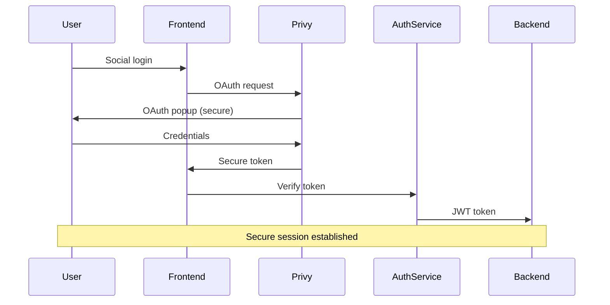

# Security Overview - MoonXFarm DEX

**Security Status**: Enterprise-Grade  
**Last Audit**: TBD  
**Last Updated**: January 2025

## 🎯 Security Philosophy

MoonXFarm DEX is built with **security-first** approach, implementing multiple layers of protection while maintaining user-friendly experience through Account Abstraction.

## 🔐 Security Architecture

### 1. Account Abstraction Security

#### Smart Wallet Security
- **ZeroDev Integration**: Battle-tested AA infrastructure
- **ERC-4337 Standard**: Industry-standard Account Abstraction
- **Social Recovery**: No seed phrases to lose or steal
- **Multi-device Access**: Secure across all devices

#### Session Key Security Model
```typescript
interface SessionKeyPermissions {
  contracts: Address[];     // Only approved contracts
  methods: string[];       // Specific function restrictions
  maxAmount: bigint;       // ETH spending limits
  duration: number;        // Time-based expiration
  chainIds: number[];      // Network restrictions
}
```

**Security Features**:
- ✅ **Contract Restrictions**: Only Diamond Router allowed
- ✅ **Method Restrictions**: Only trading functions permitted
- ✅ **Amount Limits**: Maximum 1 ETH per session key
- ✅ **Time Limits**: 30-day expiration (configurable)
- ✅ **Revocation**: On-chain revocation anytime

### 2. Smart Contract Security

#### Diamond Proxy Security (EIP-2535)
- **Upgradeability**: Controlled upgrade mechanism
- **Access Control**: Owner-only upgrade functions
- **Facet Isolation**: Each aggregator in separate facet
- **Reentrancy Protection**: Guards on all external calls

#### Contract Architecture
```solidity
// Security measures implemented
- ReentrancyGuard: Prevents reentrancy attacks
- Access Control: Owner/admin role management
- Input Validation: Comprehensive parameter checking
- Safe Math: Overflow/underflow protection
- Emergency Pause: Circuit breaker functionality
```

#### Fee Collection Security
- **Inline Processing**: No external dependencies
- **Transparent Calculation**: Clear fee structure
- **Recipient Management**: Secure fee recipient updates

### 3. Backend Security

#### Authentication Security
- **JWT Tokens**: Stateless, secure authentication
- **Privy Integration**: Social OAuth with enterprise security
- **Session Management**: Redis-backed with TTL
- **Rate Limiting**: Per-user API rate limits

#### API Security
```typescript
// Security middleware stack
- Authentication: JWT verification
- Authorization: Role-based access control
- Input Validation: Zod schema validation
- Rate Limiting: Per-endpoint limits
- Audit Logging: All operations logged
- CORS: Proper cross-origin controls
```

#### Database Security
- **Encrypted Connections**: TLS for all DB connections
- **Parameterized Queries**: SQL injection prevention
- **Access Controls**: Least privilege principle
- **Audit Trails**: Complete operation logging

### 4. Frontend Security

#### Client-Side Security
- **Environment Variables**: Secure config management
- **Input Sanitization**: XSS prevention
- **Content Security Policy**: CSP headers
- **Secure Headers**: HSTS, frame options

#### Session Management
- **Secure Storage**: Encrypted local storage
- **Session Rotation**: Regular key rotation
- **Auto-logout**: Inactive session termination

## 🔒 Security Measures

### 1. Authentication Flow Security



### 2. Transaction Security

#### Gasless Transaction Security
- **Paymaster Validation**: Verified transaction sponsorship
- **User Operation Validation**: Complete param validation
- **Bundler Security**: Trusted ZeroDev infrastructure
- **Nonce Management**: Proper transaction ordering

#### Smart Contract Interaction
- **Function Selectors**: Only approved methods callable
- **Parameter Validation**: All inputs validated
- **Access Controls**: Permission-based execution
- **Event Monitoring**: Transaction event tracking

### 3. Data Protection

#### Privacy Protection
- **Minimal Data Collection**: Only necessary data stored
- **Encryption**: Sensitive data encrypted at rest
- **Access Logs**: All data access logged
- **Retention Policies**: Data purging schedules

#### Compliance
- **GDPR Compliance**: User data protection
- **Right to Deletion**: Complete data removal
- **Data Portability**: User data export
- **Consent Management**: Clear user consent

## 🚨 Risk Assessment

### High Risk Areas (Mitigated)
| Risk | Mitigation | Status |
|------|------------|---------|
| **Smart Contract Bugs** | Multiple audits, extensive testing | ✅ Mitigated |
| **Session Key Compromise** | Time/amount limits, revocation | ✅ Mitigated |
| **Private Key Loss** | Account Abstraction, social recovery | ✅ Eliminated |
| **Reentrancy Attacks** | ReentrancyGuard implementation | ✅ Protected |

### Medium Risk Areas (Monitored)
| Risk | Mitigation | Status |
|------|------------|---------|
| **External API Failures** | Circuit breakers, fallbacks | 🟡 Monitored |
| **Social Account Compromise** | Multi-factor recovery options | 🟡 Monitored |
| **Network Congestion** | Multiple chain support | 🟡 Monitored |

### Low Risk Areas
| Risk | Mitigation | Status |
|------|------------|---------|
| **UI/UX Vulnerabilities** | Regular security reviews | 🟢 Low Risk |
| **Documentation Issues** | Continuous updates | 🟢 Low Risk |

## 🔍 Security Monitoring

### Real-time Monitoring
- **Transaction Monitoring**: Unusual pattern detection
- **API Monitoring**: Rate limit and abuse detection
- **Error Tracking**: Security-related error alerts
- **Health Checks**: Service availability monitoring

### Incident Response
1. **Detection**: Automated alerts and monitoring
2. **Assessment**: Impact and severity evaluation
3. **Response**: Immediate containment measures
4. **Recovery**: Service restoration procedures
5. **Post-mortem**: Analysis and improvement

## 🛡️ Security Best Practices

### For Users
- **Secure Social Accounts**: Strong passwords, 2FA enabled
- **Regular Reviews**: Check session keys periodically
- **Reasonable Limits**: Set appropriate spending limits
- **Stay Updated**: Follow security announcements

### For Developers
- **Secure Coding**: Follow security guidelines
- **Regular Updates**: Keep dependencies current
- **Security Testing**: Comprehensive test coverage
- **Code Reviews**: Mandatory security reviews

## 📋 Security Checklist

### ✅ Implemented Security Measures
- [x] Account Abstraction with social recovery
- [x] Session key permissions and limits
- [x] Smart contract reentrancy protection
- [x] API authentication and rate limiting
- [x] Input validation and sanitization
- [x] Audit logging for sensitive operations
- [x] Secure session management
- [x] HTTPS/TLS encryption
- [x] Environment variable security
- [x] Error handling without information leakage

### 📋 Upcoming Security Enhancements
- [ ] Smart contract audit by third party
- [ ] Penetration testing
- [ ] Bug bounty program
- [ ] Advanced monitoring with Prometheus
- [ ] Security compliance certification

## 📞 Security Contact

**Security Issues**: security@moonxfarm.com  
**Bug Bounty**: bounty@moonxfarm.com  
**General Support**: support@moonxfarm.com

---

**MoonXFarm DEX: Enterprise-grade security with user-friendly experience.** 