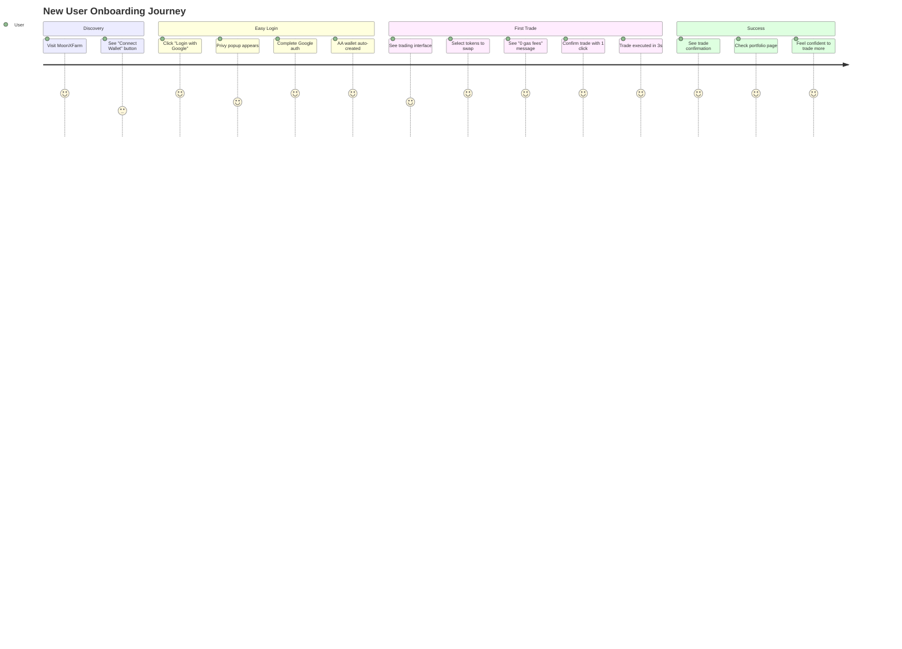
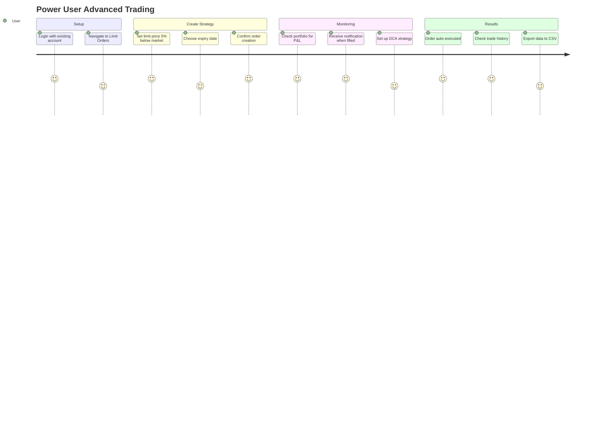
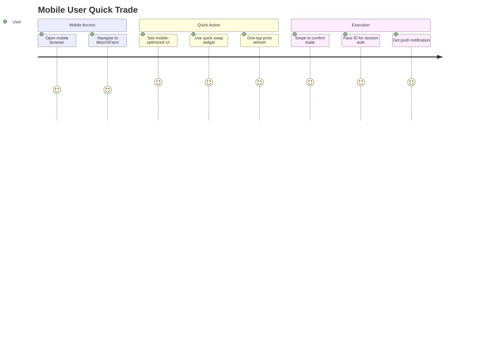

# MoonXFarm DEX - Product Context

**Ngày cập nhật**: 25/06/2025  
**Phiên bản**: v1.0  

## 🎯 Why - Tại Sao MoonXFarm Tồn Tại?

### Vấn Đề Hiện Tại Của DEX Market
1. **Gas Fees Cao**: Người dùng phải trả gas fees cao, đặc biệt khó khăn cho các giao dịch nhỏ
2. **UX Phức Tạp**: Cần setup ví, manage seed phrases, hiểu về blockchain
3. **MEV Attacks**: Người dùng bị front-running, sandwich attacks làm giảm lợi nhuận
4. **Tính Năng Hạn Chế**: Hầu hết DEX chỉ có swap cơ bản, thiếu limit orders, DCA
5. **Tốc Độ Chậm**: Quotes không real-time, swap execution mất thời gian

### Target Users Pain Points
**Retail Traders**:
- Phí gas ăn mất lợi nhuận từ giao dịch nhỏ
- Khó khăn trong việc setup và sử dụng crypto wallets
- Không có công cụ trading advanced như CEX

**DeFi Power Users**:
- Bị MEV attacks làm giảm alpha
- Phải manually execute DCA strategies
- Không có portfolio tracking tốt

**Crypto Newcomers**:
- Intimidated bởi seed phrases và private keys
- Không hiểu gas fees và blockchain mechanics
- Muốn trải nghiệm giống Web2 apps

## 🚀 What - MoonXFarm Giải Quyết Như Thế Nào?

### Core Value Propositions

#### 1. **Gasless Trading Experience**
- **10 giao dịch đầu tiên hoàn toàn miễn phí gas**
- Session Keys cho UX mượt mà như Web2
- Backend tự động sponsor gas fees

#### 2. **Social Login & Account Abstraction**
- Đăng nhập bằng Google/Twitter/Email qua Privy
- Không cần seed phrases hay private keys
- ZeroDev AA wallets tự động tạo

#### 3. **MEV Protection Built-in**
- Tự động route qua Flashbots Protect
- CoW Protocol integration cho batch trades
- Bảo vệ ≥80% giao dịch khỏi MEV

#### 4. **Advanced Trading Features**
- **Limit Orders**: On-chain escrow, tự động execute
- **DCA**: Tự động mua theo lịch
- **Real-time Quotes**: <200ms response time

#### 5. **Superior Liquidity & Pricing**
- Tích hợp multiple aggregators (LI.FI, 1inch, ParaSwap)
- Always get best price across all DEXs
- Smart routing cho optimal execution

## 🎪 How - Trải Nghiệm Người Dùng Chi Tiết

### User Journey 1: First-Time User Onboarding

**Timeline**: 2-3 phút từ landing page đến first trade completed

#### Step-by-Step Experience:
1. **Landing Page** (0-15s)
   - Clean, modern interface 
   - Prominent "Start Trading" CTA
   - Trust signals: "Gasless", "Secure", "Fast"

2. **Connect Wallet** (15-45s)
   - Click "Connect Wallet"
   - See social login options: Google, Twitter, Apple
   - Choose preferred method
   - Complete OAuth flow (redirected & back)

3. **Wallet Creation** (45-60s) 
   - AA wallet automatically created in background
   - User sees: "Welcome! Your wallet: 0x1234...5678"
   - Onboarding tooltip: "No seed phrases needed!"

4. **First Trade Setup** (60-120s)
   - Token selector with popular pairs
   - Enter amount to swap
   - See real-time quote with "0 gas fees" badge
   - Preview shows: Amount, Rate, Est. receive

5. **Trade Execution** (120-180s)
   - Click "Swap" button
   - Session key prompt: "Sign once for gasless trades"
   - User signs with social login (Privy)
   - Trade executes in background
   - Success notification with tx hash

### User Journey 2: Power User Advanced Trading

#### Advanced Features Flow:
1. **Limit Orders**
   - Set target price above/below current market
   - Funds locked in Diamond escrow contract
   - Auto-execution when price reached
   - Email/push notification when filled

2. **DCA Strategy**
   - Choose frequency: Daily, Weekly, Monthly
   - Set amount per purchase
   - Select duration or total amount
   - Auto-execute without user intervention

3. **Portfolio Management**
   - Real-time P&L calculation
   - Trade history with filters
   - Export to CSV for tax purposes
   - Performance analytics

### User Journey 3: Mobile User Quick Trade

## 🎭 User Personas & Use Cases

### Persona 1: "Crypto Curious Sarah" 
**Background**: 28, Marketing Manager, $60k income
**Crypto Experience**: Heard about Bitcoin, never traded
**Goals**: 
- Try crypto trading without complexity
- Don't want to learn about seed phrases
- Start with small amounts ($50-200)

**How MoonXFarm Helps**:
- Social login eliminates wallet complexity
- Gasless trades perfect for small amounts
- Educational tooltips guide her through process

### Persona 2: "DeFi Dave"
**Background**: 35, Software Engineer, active DeFi user
**Crypto Experience**: 3+ years, trades on multiple DEXs
**Goals**:
- Get best prices across all DEXs
- Avoid MEV attacks
- Advanced trading strategies

**How MoonXFarm Helps**:
- Multi-aggregator routing for best prices
- Built-in MEV protection
- Limit orders and DCA for strategies

### Persona 3: "Mobile Mike"
**Background**: 22, College Student, mobile-first
**Crypto Experience**: Trades on Coinbase, wants to try DEX
**Goals**:
- Trade on mobile during breaks
- Quick, simple interface
- Don't want to pay high fees

**How MoonXFarm Helps**:
- Mobile-optimized responsive design
- One-click social login
- Gasless trades perfect for frequent small trades

## 📊 Success Metrics & User Behavior

### Key User Metrics
| Metric | Target | Measurement |
|--------|--------|-------------|
| **Time to First Trade** | <3 minutes | From landing to tx confirmed |
| **Onboarding Completion** | >80% | Users who complete first trade |
| **7-Day Retention** | >60% | Users who return within week |
| **30-Day Retention** | >40% | Monthly active users |
| **Average Session Duration** | >5 minutes | Time spent per visit |
| **Trades per User** | >10/month | Monthly trading frequency |

### User Satisfaction Indicators
- **NPS Score**: Target >50 (Promoters - Detractors)
- **Support Tickets**: <2% of users need help
- **App Store Rating**: >4.5 stars (if mobile app)
- **Social Mentions**: Positive sentiment >70%

## 🚀 Future Product Vision

### Phase 2 Features (Q2-Q3 2025)
- **Mobile Native App**: iOS/Android with push notifications
- **Advanced Analytics**: Portfolio performance, yield farming tracker
- **Social Trading**: Copy trading, leaderboards
- **Cross-chain**: Multi-chain swaps, bridging integration

### Phase 3 Features (Q4 2025+)
- **Governance Token**: Platform token with utility
- **Liquidity Pools**: Provide liquidity, earn fees
- **Derivatives**: Options, futures trading
- **Enterprise API**: Institutional trading tools

## 🎯 Competitive Differentiation

### vs Traditional DEXs (Uniswap, PancakeSwap)
| Feature | Traditional DEX | MoonXFarm |
|---------|-----------------|-----------|
| Gas Fees | User pays all | First 10 free |
| Wallet Setup | Complex seed phrases | Social login |
| Trading Features | Basic swap only | Swap + Limit + DCA |
| MEV Protection | None | Built-in |
| Mobile UX | Poor | Optimized |

### vs CEXs (Binance, Coinbase)
| Feature | CEX | MoonXFarm |
|---------|-----|-----------|
| Custody | Platform holds funds | Self-custody (AA) |
| KYC Required | Yes | No |
| Trading Features | Advanced | Growing |
| Decentralization | Centralized | Decentralized |
| Geographic Limits | Yes | Global access |

### vs Aggregators (1inch, Matcha)
| Feature | Pure Aggregator | MoonXFarm |
|---------|-----------------|-----------|
| Liquidity Sources | Multiple DEXs | Multiple + Advanced features |
| User Experience | Technical | Consumer-friendly |
| Account Management | External wallet | Built-in AA wallet |
| Advanced Orders | Limited | Full limit/DCA support |

## 🔄 Continuous Improvement Strategy

### User Feedback Loops
1. **In-app Feedback**: Quick survey after trades
2. **User Interviews**: Monthly interviews with active users  
3. **Analytics**: Track user behavior, drop-off points
4. **A/B Testing**: Test UI/UX improvements continuously

### Feature Prioritization Framework
1. **User Impact**: How many users benefit?
2. **Business Value**: Revenue/retention impact
3. **Development Effort**: Engineering complexity
4. **Competitive Advantage**: Differentiation value

**Priority Matrix**: High Impact + Low Effort = Build First
