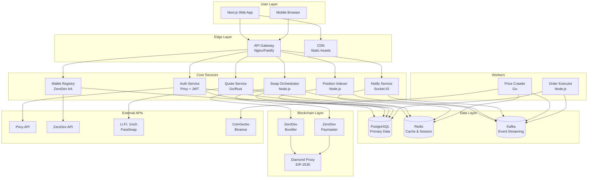
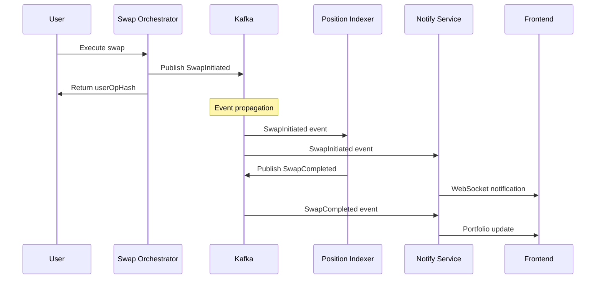
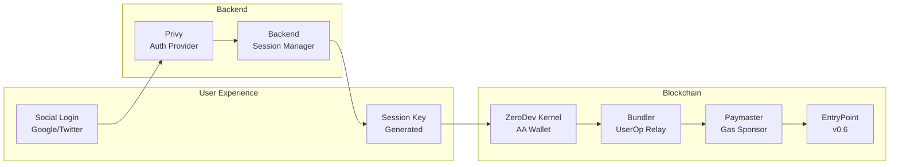
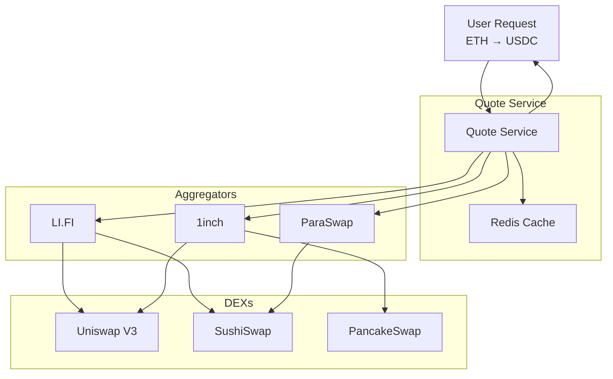

# MoonXFarm DEX - System Patterns & Architecture

**Ngày cập nhật**: 25/06/2025  
**Phiên bản**: v1.0  

## 🏗️ System Architecture Overview

MoonXFarm được thiết kế theo kiến trúc **Microservices** với **Event-Driven Architecture**, đảm bảo scalability, maintainability và fault tolerance.



## 🎯 Core Design Patterns

### 1. **Microservices Pattern**
**Rationale**: Độc lập deployment, scaling, technology choices

**Implementation**:
- Mỗi service có database riêng (Database per Service)
- Communication qua REST APIs và gRPC
- Shared data qua Event Sourcing

**Services Breakdown**:
```
├── API Gateway (3000)      # Single entry point
├── Auth Service (3001)     # Authentication & Authorization  
├── Wallet Registry (3002)  # AA Wallet management
├── Quote Service (3003)    # Price quotes & routing
├── Swap Orchestrator (3004) # Trade execution
├── Position Indexer (3005) # Portfolio tracking
└── Notify Service (3006)   # Real-time notifications
```

### 2. **Event-Driven Architecture**
**Rationale**: Loose coupling, eventual consistency, real-time updates

**Event Flow**:


**Key Events**:
- `SwapInitiated`, `SwapCompleted`, `SwapFailed`
- `LimitOrderCreated`, `LimitOrderFilled`, `LimitOrderExpired`
- `DCAScheduleCreated`, `DCAExecuted`
- `PriceUpdated`, `PortfolioUpdated`

### 3. **Diamond Proxy Pattern (EIP-2535)**
**Rationale**: Upgradeable contracts, code organization, gas optimization

**Contract Structure**:
```
Diamond Proxy (0x...)
├── DiamondCutFacet     # Upgrade functionality
├── DiamondLoupeFacet   # Introspection
├── SwapFacet          # Instant swaps
├── LimitFacet         # Limit orders  
├── DCAFacet           # Dollar-cost averaging
└── LibDiamond         # Shared storage
```

**Storage Layout**:
```solidity
struct DiamondStorage {
    mapping(address => UserInfo) users;
    mapping(bytes32 => Order) orders;
    mapping(address => uint256) balances;
    uint256 totalFees;
    address paymaster;
}
```

### 4. **Account Abstraction Pattern**
**Rationale**: Gasless UX, session keys, social recovery

**AA Wallet Flow**:


**Session Key Security**:
- Private keys encrypted với AWS KMS
- Limited permissions và expiry time
- Automatic rotation mỗi 24h

### 5. **Aggregator Pattern**
**Rationale**: Best price discovery, multiple liquidity sources

**Quote Aggregation Flow**:


## 🔄 Data Flow Patterns

### 1. **Command Query Responsibility Segregation (CQRS)**
**Write Side (Commands)**:
- User actions: Swap, CreateLimitOrder, SetupDCA
- Events published to Kafka
- Immediate response to user

**Read Side (Queries)**:
- Portfolio data từ Position Indexer
- Price data từ Redis cache
- Trade history từ PostgreSQL

### 2. **Event Sourcing for Audit Trail**
**Events Store**:
```sql
CREATE TABLE events (
    id UUID PRIMARY KEY,
    stream_id UUID NOT NULL,
    event_type VARCHAR(50) NOT NULL,
    event_data JSONB NOT NULL,
    version INTEGER NOT NULL,
    created_at TIMESTAMP DEFAULT NOW()
);
```

**Event Types**:
- UserEvents: `UserRegistered`, `SessionKeyAdded`
- TradeEvents: `SwapExecuted`, `LimitOrderFilled`
- WalletEvents: `FundsDeposited`, `FundsWithdrawn`

### 3. **Cache-Aside Pattern**
**Implementation với Redis**:
```typescript
async getQuote(tokenIn: string, tokenOut: string, amount: string) {
    const cacheKey = `quote:${tokenIn}:${tokenOut}:${amount}`;
    
    // Try cache first
    const cached = await redis.get(cacheKey);
    if (cached) return JSON.parse(cached);
    
    // Fetch from aggregators
    const quote = await fetchFromAggregators(tokenIn, tokenOut, amount);
    
    // Cache with TTL
    await redis.setex(cacheKey, 30, JSON.stringify(quote));
    
    return quote;
}
```

## 🔒 Security Patterns

### 1. **Defense in Depth**
**Multiple Security Layers**:
- API Gateway: Rate limiting, CORS, input validation
- Services: JWT validation, permission checks
- Database: Parameterized queries, connection pooling
- Smart Contracts: Reentrancy guards, access control

### 2. **Zero-Trust Architecture**
**Service-to-Service Security**:
- All internal communication over HTTPS/gRPC-TLS
- Service authentication với JWT tokens
- Network segmentation với Kubernetes NetworkPolicies

### 3. **Session Key Pattern**
**Secure Session Management**:
```typescript
interface SessionKey {
    publicKey: string;
    encryptedPrivateKey: string; // Encrypted with KMS
    permissions: Permission[];
    expiresAt: Date;
    userId: string;
}

interface Permission {
    target: 'SWAP' | 'LIMIT_ORDER' | 'DCA';
    maxAmount: BigNumber;
    allowedTokens: string[];
}
```

## 📊 Scalability Patterns

### 1. **Horizontal Scaling**
**Stateless Services**:
- Services không lưu state locally
- Session data trong Redis cluster
- Database connections qua connection pooling

**Auto-scaling**:
```yaml
apiVersion: autoscaling/v2
kind: HorizontalPodAutoscaler
metadata:
  name: quote-service-hpa
spec:
  scaleTargetRef:
    apiVersion: apps/v1
    kind: Deployment
    name: quote-service
  minReplicas: 2
  maxReplicas: 10
  metrics:
  - type: Resource
    resource:
      name: cpu
      target:
        type: Utilization
        averageUtilization: 70
```

### 2. **Database Sharding Pattern**
**User-based Sharding**:
```sql
-- Shard routing based on user_id
CREATE TABLE wallets_shard_1 (
    LIKE wallets INCLUDING ALL
) INHERITS (wallets);

CREATE TABLE wallets_shard_2 (
    LIKE wallets INCLUDING ALL  
) INHERITS (wallets);
```

### 3. **Circuit Breaker Pattern**
**External API Protection**:
```typescript
class CircuitBreaker {
    private failures = 0;
    private lastFailureTime = 0;
    private state: 'CLOSED' | 'OPEN' | 'HALF_OPEN' = 'CLOSED';
    
    async call<T>(fn: () => Promise<T>): Promise<T> {
        if (this.state === 'OPEN') {
            if (Date.now() - this.lastFailureTime > this.timeout) {
                this.state = 'HALF_OPEN';
            } else {
                throw new Error('Circuit breaker is OPEN');
            }
        }
        
        try {
            const result = await fn();
            this.onSuccess();
            return result;
        } catch (error) {
            this.onFailure();
            throw error;
        }
    }
}
```

## 🔍 Observability Patterns

### 1. **Three Pillars of Observability**
**Metrics** (Prometheus):
- Business metrics: Trading volume, user count
- Technical metrics: Response time, error rate, throughput
- Infrastructure metrics: CPU, memory, disk usage

**Logging** (Structured JSON):
```typescript
logger.info({
    event: 'swap_executed',
    userId: user.id,
    tokenIn: swap.tokenIn,
    tokenOut: swap.tokenOut,
    amountIn: swap.amountIn,
    amountOut: swap.amountOut,
    txHash: swap.txHash,
    duration: swap.executionTime
});
```

**Tracing** (Jaeger):
- Distributed tracing across services
- Performance optimization
- Error root cause analysis

### 2. **Health Check Pattern**
**Service Health Endpoints**:
```typescript
app.get('/health', async (req, res) => {
    const checks = await Promise.allSettled([
        checkDatabase(),
        checkRedis(),
        checkKafka(),
        checkExternalAPIs()
    ]);
    
    const healthy = checks.every(check => 
        check.status === 'fulfilled'
    );
    
    res.status(healthy ? 200 : 503).json({
        status: healthy ? 'healthy' : 'unhealthy',
        checks: checks.map(formatCheck),
        timestamp: new Date().toISOString()
    });
});
```

## 🚀 Performance Patterns

### 1. **Database Optimization**
**Connection Pooling**:
```typescript
const pool = new Pool({
    host: config.database.host,
    port: config.database.port,
    database: config.database.name,
    user: config.database.user,
    password: config.database.password,
    max: 20, // Maximum connections
    idleTimeoutMillis: 30000,
    connectionTimeoutMillis: 2000,
});
```

**Query Optimization**:
- Indexing strategies cho high-frequency queries
- Query result caching
- Connection pooling với pgBouncer

### 2. **API Response Optimization**
**Response Compression**:
```typescript
app.use(compression({
    filter: (req, res) => {
        if (req.headers['x-no-compression']) {
            return false;
        }
        return compression.filter(req, res);
    },
    threshold: 1024
}));
```

**Pagination Pattern**:
```typescript
interface PaginatedResponse<T> {
    data: T[];
    pagination: {
        page: number;
        limit: number;
        total: number;
        hasNext: boolean;
        hasPrev: boolean;
    };
}
```

## 🎯 Integration Patterns

### 1. **External API Integration**
**Retry with Exponential Backoff**:
```typescript
async function callWithRetry<T>(
    fn: () => Promise<T>,
    maxRetries = 3,
    baseDelay = 1000
): Promise<T> {
    for (let attempt = 1; attempt <= maxRetries; attempt++) {
        try {
            return await fn();
        } catch (error) {
            if (attempt === maxRetries) throw error;
            
            const delay = baseDelay * Math.pow(2, attempt - 1);
            await new Promise(resolve => setTimeout(resolve, delay));
        }
    }
    throw new Error('All retries failed');
}
```

### 2. **Event Publishing Pattern**
**Reliable Event Publishing**:
```typescript
async function publishEvent(event: DomainEvent) {
    const transaction = await db.beginTransaction();
    
    try {
        // Save to outbox table
        await db.query(`
            INSERT INTO outbox_events (id, event_type, payload, created_at)
            VALUES ($1, $2, $3, NOW())
        `, [event.id, event.type, JSON.stringify(event.payload)]);
        
        // Commit transaction
        await transaction.commit();
        
        // Publish to Kafka (best effort)
        await kafka.publish(event);
        
        // Mark as published
        await db.query(`
            UPDATE outbox_events 
            SET published_at = NOW() 
            WHERE id = $1
        `, [event.id]);
        
    } catch (error) {
        await transaction.rollback();
        throw error;
    }
}
```

Các patterns này đảm bảo MoonXFarm có thể scale, maintain và operate một cách hiệu quả trong production environment.
