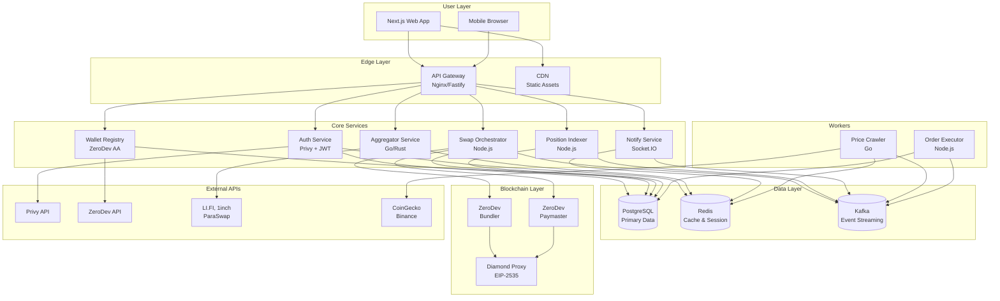

# MoonXFarm DEX - System Patterns & Architecture

**Ngày cập nhật**: 25/06/2025  
**Phiên bản**: v1.0  

## 🏗️ System Architecture Overview

MoonXFarm được thiết kế theo kiến trúc **Microservices** với **Event-Driven Architecture**, đảm bảo scalability, maintainability và fault tolerance.

### **Project Structure Reference**
> **📋 Chi tiết đầy đủ**: Xem `PROJECT_STRUCTURE.md` cho cấu trúc thư mục toàn diện và mô tả từng component

**Monorepo Organization**:
```
moonx-farm/
├── contracts/              # Smart contracts (Diamond Proxy)
├── services/               # Backend microservices
├── workers/                # Async workers (price, orders)
├── apps/web/              # Next.js frontend
├── packages/              # Shared libraries
├── configs/               # Centralized configuration
├── infrastructure/        # DevOps configs
├── database/              # Schemas & migrations
├── scripts/               # Utility scripts
└── tests/                 # Integration & E2E tests
```

**Key Architecture Decisions**:
- **Monorepo**: Single repository với independent deployment
- **Profile-based Configuration**: Service-specific config loading
- **Diamond Proxy**: Upgradeable smart contracts (EIP-2535)
- **Multi-aggregator Router**: LI.FI, 1inch, Relay integration



## 🎯 Core Design Patterns

### 1. **Microservices Pattern**
**Rationale**: Độc lập deployment, scaling, technology choices

**Implementation**:
- Mỗi service có database riêng (Database per Service)
- Communication qua REST APIs và gRPC
- Shared data qua Event Sourcing

**Services Breakdown**:
```
├── API Gateway (3000)      # Single entry point
├── Auth Service (3001)     # Authentication & Authorization  
├── Wallet Registry (3002)  # AA Wallet management
├── Aggregator Service (3003)    # Price quotes & routing
├── Swap Orchestrator (3004) # Trade execution
├── Position Indexer (3005) # Portfolio tracking
└── Notify Service (3006)   # Real-time notifications
```

### 2. **Event-Driven Architecture**
**Rationale**: Loose coupling, eventual consistency, real-time updates

**Event Flow**:


**Key Events**:
- `SwapInitiated`, `SwapCompleted`, `SwapFailed`
- `LimitOrderCreated`, `LimitOrderFilled`, `LimitOrderExpired`
- `DCAScheduleCreated`, `DCAExecuted`
- `PriceUpdated`, `PortfolioUpdated`

### 3. **Diamond Proxy Pattern (EIP-2535)**
**Rationale**: Upgradeable contracts, code organization, gas optimization

**Actual Contract Structure**:
```
MoonXFarmRouter (Diamond)
├── DiamondCutFacet        # Upgrade functionality
├── DiamondLoupeFacet      # Introspection
├── OwnershipFacet         # Access control
├── FeeCollectorFacet      # Fee recipient management
├── LifiProxyFacet         # LI.FI aggregator integration
├── OneInchProxyFacet      # 1inch aggregator integration
├── RelayProxyFacet        # Relay.link aggregator integration
└── LibDiamond             # Shared storage
```

**Key Libraries**:
```solidity
// Fee collection storage
library LibFeeCollector {
    struct Storage {
        address recipient;
    }
}

// Diamond storage with facet management
library LibDiamond {
    struct DiamondStorage {
        mapping(bytes4 => FacetAddressAndPosition) selectorToFacetAndPosition;
        mapping(address => uint256) supportedInterfaces;
        address contractOwner;
    }
}
```

### 4. **Account Abstraction Pattern**
**Rationale**: Gasless UX, session keys, social recovery

**AA Wallet Flow**:


**Session Key Security**:
- Private keys encrypted với AWS KMS
- Limited permissions và expiry time
- Automatic rotation mỗi 24h

### 5. **Multi-Aggregator Router Pattern**
**Rationale**: Best price discovery, redundancy, comprehensive liquidity access

**MoonXFarmRouter Architecture**:

```mermaid
graph TB
    USER[User Request<br/>ETH → USDC]
    
    subgraph "Aggregator Service (Backend)"
QS[Aggregator Service]
        CACHE[Redis Cache]
    end
    
    subgraph "MoonXFarmRouter (On-chain)"
        ROUTER[Diamond Proxy]
        LIFI_FACET[LifiProxyFacet]
        ONEINCH_FACET[OneInchProxyFacet]
        RELAY_FACET[RelayProxyFacet]
        FEE_FACET[FeeCollectorFacet]
    end
    
    subgraph "External Aggregators"
        LIFI[LI.FI API]
        ONEINCH[1inch API]
        RELAY[Relay.link API]
    end
    
    subgraph "Underlying DEXs"
        UNI[Uniswap V3]
        SUSHI[SushiSwap]
        PANCAKE[PancakeSwap]
        CURVE[Curve]
    end
    
    USER --> QS
    QS --> CACHE
    QS --> LIFI
    QS --> ONEINCH
    QS --> RELAY
    
    QS --> USER
    USER --> ROUTER
    
    ROUTER --> LIFI_FACET
    ROUTER --> ONEINCH_FACET
    ROUTER --> RELAY_FACET
    
    LIFI_FACET --> LIFI
    ONEINCH_FACET --> ONEINCH
    RELAY_FACET --> RELAY
    
    LIFI --> UNI
    LIFI --> SUSHI
    ONEINCH --> UNI
    ONEINCH --> PANCAKE
    RELAY --> CURVE
    
    ROUTER --> FEE_FACET
```


**Aggregator Proxy Pattern**:
```solidity
contract AggregatorProxy is ReentrancyGuard {
    // Parse token address + fee from packed uint256
    function _parseAddressAndFee(uint256 tokenWithFee) 
        internal pure returns (address token, uint16 fee);
    
    // Process fees on input/output tokens
    function _processFees(address token, uint256 amount, uint16 fee, bool isInput) 
        internal returns (uint256 remainingAmount);
    
    // Execute aggregator call with fee collection
    function _callAggregator(
        uint256 fromTokenWithFee,
        uint256 fromAmount,
        uint256 toTokenWithFee,
        bytes calldata callData
    ) internal nonReentrant;
}
```

## 🔄 Data Flow Patterns

### 1. **Router-First Architecture**
**Quote Phase (Off-chain)**:
- Query multiple aggregators for best routes
- Cache results in Redis
- Return optimized route to user

**Execution Phase (On-chain)**:
- User calls appropriate router facet
- Router executes via selected aggregator
- Fees collected automatically
- Events emitted for tracking

### 2. **Fee Collection Pattern**
**Inline Fee Processing**:
```solidity
// Fees encoded in token address
uint256 tokenWithFee = (token_address) | (fee_bps << 160);

// Automatic fee deduction
function _processFees(address token, uint256 amount, uint16 fee, bool isInput) 
    internal returns (uint256 remainingAmount) {
    if (fee == 0) return amount;
    
    address feeRecipient = LibFeeCollector.getRecipient();
    uint256 feeAmount = (amount * fee) / FEE_PERCENTAGE_BASE;
    remainingAmount = amount - feeAmount;
    
    // Transfer fees to recipient
    _handleTokenTransfer(token, feeRecipient, feeAmount);
    emit FeeCollected(token, feeRecipient, feeAmount);
    
    return remainingAmount;
}
```

### 2. **Event Sourcing for Audit Trail**
**Events Store**:
```sql
CREATE TABLE events (
    id UUID PRIMARY KEY,
    stream_id UUID NOT NULL,
    event_type VARCHAR(50) NOT NULL,
    event_data JSONB NOT NULL,
    version INTEGER NOT NULL,
    created_at TIMESTAMP DEFAULT NOW()
);
```

**Event Types**:
- UserEvents: `UserRegistered`, `SessionKeyAdded`
- TradeEvents: `SwapExecuted`, `LimitOrderFilled`
- WalletEvents: `FundsDeposited`, `FundsWithdrawn`

### 3. **Cache-Aside Pattern**
**Implementation với Redis**:
```typescript
async getQuote(tokenIn: string, tokenOut: string, amount: string) {
    const cacheKey = `quote:${tokenIn}:${tokenOut}:${amount}`;
    
    // Try cache first
    const cached = await redis.get(cacheKey);
    if (cached) return JSON.parse(cached);
    
    // Fetch from aggregators
    const quote = await fetchFromAggregators(tokenIn, tokenOut, amount);
    
    // Cache with TTL
    await redis.setex(cacheKey, 30, JSON.stringify(quote));
    
    return quote;
}
```

## 🔒 Security Patterns

### 1. **Defense in Depth**
**Multiple Security Layers**:
- API Gateway: Rate limiting, CORS, input validation
- Services: JWT validation, permission checks
- Database: Parameterized queries, connection pooling
- Smart Contracts: Reentrancy guards, access control

### 2. **Zero-Trust Architecture**
**Service-to-Service Security**:
- All internal communication over HTTPS/gRPC-TLS
- Service authentication với JWT tokens
- Network segmentation với Kubernetes NetworkPolicies

### 3. **Session Key Pattern**
**Secure Session Management**:
```typescript
interface SessionKey {
    publicKey: string;
    encryptedPrivateKey: string; // Encrypted with KMS
    permissions: Permission[];
    expiresAt: Date;
    userId: string;
}

interface Permission {
    target: 'SWAP' | 'LIMIT_ORDER' | 'DCA';
    maxAmount: BigNumber;
    allowedTokens: string[];
}
```

## 📊 Scalability Patterns

### 1. **Horizontal Scaling**
**Stateless Services**:
- Services không lưu state locally
- Session data trong Redis cluster
- Database connections qua connection pooling

**Auto-scaling**:
```yaml
apiVersion: autoscaling/v2
kind: HorizontalPodAutoscaler
metadata:
  name: aggregator-service-hpa
spec:
  scaleTargetRef:
    apiVersion: apps/v1
    kind: Deployment
    name: aggregator-service
  minReplicas: 2
  maxReplicas: 10
  metrics:
  - type: Resource
    resource:
      name: cpu
      target:
        type: Utilization
        averageUtilization: 70
```

### 2. **Database Sharding Pattern**
**User-based Sharding**:
```sql
-- Shard routing based on user_id
CREATE TABLE wallets_shard_1 (
    LIKE wallets INCLUDING ALL
) INHERITS (wallets);

CREATE TABLE wallets_shard_2 (
    LIKE wallets INCLUDING ALL  
) INHERITS (wallets);
```

### 3. **Circuit Breaker Pattern**
**External API Protection**:
```typescript
class CircuitBreaker {
    private failures = 0;
    private lastFailureTime = 0;
    private state: 'CLOSED' | 'OPEN' | 'HALF_OPEN' = 'CLOSED';
    
    async call<T>(fn: () => Promise<T>): Promise<T> {
        if (this.state === 'OPEN') {
            if (Date.now() - this.lastFailureTime > this.timeout) {
                this.state = 'HALF_OPEN';
            } else {
                throw new Error('Circuit breaker is OPEN');
            }
        }
        
        try {
            const result = await fn();
            this.onSuccess();
            return result;
        } catch (error) {
            this.onFailure();
            throw error;
        }
    }
}
```

## 🔍 Observability Patterns

### 1. **Three Pillars of Observability**
**Metrics** (Prometheus):
- Business metrics: Trading volume, user count
- Technical metrics: Response time, error rate, throughput
- Infrastructure metrics: CPU, memory, disk usage

**Logging** (Structured JSON):
```typescript
logger.info({
    event: 'swap_executed',
    userId: user.id,
    tokenIn: swap.tokenIn,
    tokenOut: swap.tokenOut,
    amountIn: swap.amountIn,
    amountOut: swap.amountOut,
    txHash: swap.txHash,
    duration: swap.executionTime
});
```

**Tracing** (Jaeger):
- Distributed tracing across services
- Performance optimization
- Error root cause analysis

### 2. **Health Check Pattern**
**Service Health Endpoints**:
```typescript
app.get('/health', async (req, res) => {
    const checks = await Promise.allSettled([
        checkDatabase(),
        checkRedis(),
        checkKafka(),
        checkExternalAPIs()
    ]);
    
    const healthy = checks.every(check => 
        check.status === 'fulfilled'
    );
    
    res.status(healthy ? 200 : 503).json({
        status: healthy ? 'healthy' : 'unhealthy',
        checks: checks.map(formatCheck),
        timestamp: new Date().toISOString()
    });
});
```

## 🚀 Performance Patterns

### 1. **Database Optimization**
**Connection Pooling**:
```typescript
const pool = new Pool({
    host: config.database.host,
    port: config.database.port,
    database: config.database.name,
    user: config.database.user,
    password: config.database.password,
    max: 20, // Maximum connections
    idleTimeoutMillis: 30000,
    connectionTimeoutMillis: 2000,
});
```

**Query Optimization**:
- Indexing strategies cho high-frequency queries
- Query result caching
- Connection pooling với pgBouncer

### 2. **API Response Optimization**
**Response Compression**:
```typescript
app.use(compression({
    filter: (req, res) => {
        if (req.headers['x-no-compression']) {
            return false;
        }
        return compression.filter(req, res);
    },
    threshold: 1024
}));
```

**Pagination Pattern**:
```typescript
interface PaginatedResponse<T> {
    data: T[];
    pagination: {
        page: number;
        limit: number;
        total: number;
        hasNext: boolean;
        hasPrev: boolean;
    };
}
```

## 🎯 Integration Patterns

### 1. **External API Integration**
**Retry with Exponential Backoff**:
```typescript
async function callWithRetry<T>(
    fn: () => Promise<T>,
    maxRetries = 3,
    baseDelay = 1000
): Promise<T> {
    for (let attempt = 1; attempt <= maxRetries; attempt++) {
        try {
            return await fn();
        } catch (error) {
            if (attempt === maxRetries) throw error;
            
            const delay = baseDelay * Math.pow(2, attempt - 1);
            await new Promise(resolve => setTimeout(resolve, delay));
        }
    }
    throw new Error('All retries failed');
}
```

### 2. **Event Publishing Pattern**
**Reliable Event Publishing**:
```typescript
async function publishEvent(event: DomainEvent) {
    const transaction = await db.beginTransaction();
    
    try {
        // Save to outbox table
        await db.query(`
            INSERT INTO outbox_events (id, event_type, payload, created_at)
            VALUES ($1, $2, $3, NOW())
        `, [event.id, event.type, JSON.stringify(event.payload)]);
        
        // Commit transaction
        await transaction.commit();
        
        // Publish to Kafka (best effort)
        await kafka.publish(event);
        
        // Mark as published
        await db.query(`
            UPDATE outbox_events 
            SET published_at = NOW() 
            WHERE id = $1
        `, [event.id]);
        
    } catch (error) {
        await transaction.rollback();
        throw error;
    }
}
```

Các patterns này đảm bảo MoonXFarm có thể scale, maintain và operate một cách hiệu quả trong production environment.
