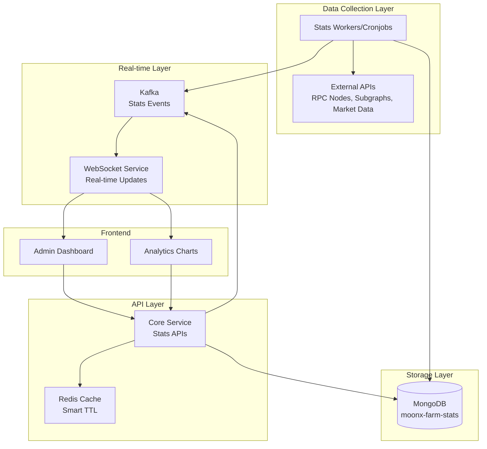

# Stats System Overview - MoonXFarm Platform

## 🎯 **Architecture Overview**

The MoonXFarm Stats System is designed as a **read-only analytics layer** that provides comprehensive blockchain and DeFi metrics. The system separates data collection from data serving for optimal performance and scalability.



## 🏗️ **System Components**

### 1. **Core Service - Stats APIs** (✅ **COMPLETED**)
- **Purpose**: Read-only API layer for stats consumption
- **Database**: Separate MongoDB (`moonx-farm-stats`) 
- **Caching**: Redis with smart TTL (2min stats, 1min alerts, 5min aggregated)
- **API Endpoints**: 7 comprehensive endpoints for different stats types

### 2. **WebSocket Service** (✅ **COMPLETED**)
- **Purpose**: Real-time stats updates via WebSocket
- **Integration**: Enhanced with 6 new routing rules for stats events
- **Channels**: `stats`, `chain_stats`, `bridge_stats`, `dex_stats`, `token_stats`, `alerts`
- **Broadcasting**: Automatic forwarding of stats events to subscribed clients

### 3. **Stats Workers** (📋 **TO BE IMPLEMENTED**)
- **Purpose**: Data collection from external sources
- **Implementation**: Separate worker processes/cronjobs
- **Data Sources**: RPC nodes, subgraphs, market data APIs
- **Scheduling**: Configurable intervals (5min, 15min, 1hour, 24hour)

## 📊 **Data Types & Metrics**

### **Chain Performance Stats**
```typescript
interface ChainPerformanceStats {
  // Basic chain info
  chainId: number;
  chainName: string;
  chainSymbol: string;
  
  // Block & Network metrics
  blockNumber: number;
  blockTime: number;
  avgBlockTime: number;
  gasPrice: number;
  gasUtilization: number;
  
  // Transaction metrics
  transactionCount: number;
  totalTransactions: number;
  transactionSuccessRate: number;
  
  // Volume metrics (24h)
  volume24h: number;
  volumeChange24h: number;
  bridgeVolumeIn: number;
  bridgeVolumeOut: number;
  dexVolume: number;
  
  // Market data
  nativeTokenPrice: number;
  marketCap: number;
  tvl: number;
  
  // Health metrics
  rpcLatency: number;
  rpcSuccessRate: number;
  nodeStatus: 'healthy' | 'degraded' | 'unhealthy';
}
```

### **Bridge Performance Stats**
```typescript
interface BridgeLatencyStats {
  // Bridge identification
  bridgeId: string;
  bridgeName: string;
  bridgeProtocol: string; // LayerZero, Wormhole, etc.
  
  // Route info
  fromChainId: number;
  toChainId: number;
  
  // Latency metrics
  avgLatency: number;
  p95Latency: number;
  p99Latency: number;
  
  // Success metrics
  successRate: number;
  failureRate: number;
  totalTransactions: number;
  
  // Volume metrics (24h)
  volume24h: number;
  volumeChange24h: number;
  topTokensByVolume: Array<{
    tokenSymbol: string;
    volume: number;
    percentage: number;
  }>;
  
  // Liquidity metrics
  liquidityFrom: number;
  liquidityTo: number;
  liquidityUtilization: number;
  
  // Status
  status: 'optimal' | 'slow' | 'degraded' | 'down';
}
```

### **DEX Performance Stats**
```typescript
interface DEXPerformanceStats {
  // DEX identification
  dexId: string;
  dexName: string;
  dexProtocol: string;
  chainId: number;
  
  // Volume metrics
  volume24h: number;
  volume7d: number;
  volumeChange24h: number;
  
  // Liquidity metrics
  tvl: number;
  tvlChange24h: number;
  activeLiquidityPools: number;
  
  // Trading metrics
  totalTrades24h: number;
  avgTradeSize: number;
  uniqueTraders24h: number;
  
  // Fee metrics
  totalFeesGenerated24h: number;
  avgFeePerTrade: number;
  
  // Performance metrics
  avgSlippage: number;
  failedTransactionRate: number;
}
```

### **Token Performance Stats**
```typescript
interface TokenPerformanceStats {
  // Token identification
  tokenAddress: string;
  tokenSymbol: string;
  tokenName: string;
  chainId: number;
  
  // Price metrics
  priceUSD: number;
  priceChange1h: number;
  priceChange24h: number;
  priceChange7d: number;
  
  // Market metrics
  marketCap: number;
  marketCapRank: number;
  circulatingSupply: number;
  
  // Trading metrics
  volume24h: number;
  holders: number;
  totalTransfers24h: number;
  
  // Liquidity metrics
  totalLiquidity: number;
  poolCount: number;
  
  // Security metrics
  riskLevel: 'low' | 'medium' | 'high' | 'extreme';
}
```

## 🚀 **API Documentation**

### **Core Service API Endpoints**

| Endpoint | Purpose | Response Data |
|----------|---------|---------------|
| `GET /api/v1/stats/chain` | Chain performance metrics | `ChainPerformanceStats[]` |
| `GET /api/v1/stats/bridge` | Bridge latency metrics | `BridgeLatencyStats[]` |
| `GET /api/v1/stats/all` | Combined chain + bridge | Both arrays |
| `GET /api/v1/stats/alerts` | Active alerts | `ChainAlert[]` + `BridgeAlert[]` |
| `GET /api/v1/stats/overview` | System overview | Dashboard summary |
| `GET /api/v1/stats/aggregated` | Time-based aggregations | Metrics over time |
| `GET /api/v1/stats/health` | Service health | Health status |

### **Query Parameters**
```typescript
interface StatsQueryParams {
  // General filters
  chainIds?: string;        // "1,137,10"
  startTime?: string;       // ISO timestamp
  endTime?: string;         // ISO timestamp
  limit?: number;           // Max: 500
  offset?: number;          // Pagination
  
  // Bridge filters
  bridgeIds?: string;       // "layerzero-eth-polygon"
  bridgeProtocols?: string; // "LayerZero,Wormhole"
  
  // DEX filters
  dexIds?: string;          // "uniswap-v3-ethereum"
  minVolume24h?: number;    // Minimum volume filter
  
  // Token filters
  tokenSymbols?: string;    // "ETH,USDC,WBTC"
  minMarketCap?: number;    // Minimum market cap
  
  // Alert filters
  severity?: "low" | "medium" | "high" | "critical";
  resolved?: boolean;       // Active vs resolved alerts
}
```

## 📡 **WebSocket Real-time Updates**

### **Available Channels**
```typescript
type StatsChannels = 
  | 'stats'           // General stats updates
  | 'chain_stats'     // Chain-specific updates
  | 'bridge_stats'    // Bridge-specific updates  
  | 'dex_stats'       // DEX-specific updates
  | 'token_stats'     // Token-specific updates
  | 'alerts';         // Alert notifications
```

### **Message Format**
```typescript
interface StatsWebSocketMessage {
  id: string;
  type: 'stats_update' | 'chain_stats_update' | 'bridge_stats_update' | 'alert_update';
  timestamp: string;
  data: {
    // Stats data based on message type
    [key: string]: any;
    
    // Common metadata
    source: string;
    statType?: string;
    priority?: 'normal' | 'high';
  };
}
```

### **Subscription Example**
```typescript
// Frontend subscription
websocket.subscribe('chain_stats', (message) => {
  if (message.type === 'chain_stats_update') {
    updateChainStatsChart(message.data);
  }
});

websocket.subscribe('alerts', (message) => {
  if (message.type === 'alert_update') {
    showAlertNotification(message.data);
  }
});
```

## 💾 **Database Schema**

### **MongoDB Collections**
```typescript
// Collection: chainStats
{
  _id: ObjectId,
  chainId: Number,
  chainName: String,
  chainSymbol: String,
  blockNumber: Number,
  blockTime: Number,
  // ... all ChainPerformanceStats fields
  timestamp: Date,
  createdAt: Date,
  updatedAt: Date,
  dataVersion: String
}

// Collection: bridgeStats
{
  _id: ObjectId,
  bridgeId: String,
  bridgeName: String,
  bridgeProtocol: String,
  fromChainId: Number,
  toChainId: Number,
  // ... all BridgeLatencyStats fields
  timestamp: Date,
  createdAt: Date,
  updatedAt: Date,
  dataVersion: String
}

// Collection: dexStats
{
  _id: ObjectId,
  dexId: String,
  dexName: String,
  dexProtocol: String,
  chainId: Number,
  // ... all DEXPerformanceStats fields
  timestamp: Date,
  createdAt: Date,
  updatedAt: Date,
  dataVersion: String
}

// Collection: tokenStats
{
  _id: ObjectId,
  tokenAddress: String,
  tokenSymbol: String,
  tokenName: String,
  chainId: Number,
  // ... all TokenPerformanceStats fields
  timestamp: Date,
  createdAt: Date,
  updatedAt: Date,
  dataVersion: String
}

// Collection: chainAlerts
{
  _id: ObjectId,
  chainId: Number,
  type: String,
  severity: String,
  message: String,
  threshold: Number,
  currentValue: Number,
  timestamp: Date,
  resolved: Boolean,
  resolvedAt: Date,
  createdAt: Date,
  updatedAt: Date,
  dataVersion: String
}

// Collection: bridgeAlerts
{
  _id: ObjectId,
  bridgeId: String,
  type: String,
  severity: String,
  message: String,
  threshold: Number,
  currentValue: Number,
  timestamp: Date,
  resolved: Boolean,
  resolvedAt: Date,
  createdAt: Date,
  updatedAt: Date,
  dataVersion: String
}
```

### **Indexes for Performance**
```typescript
// Compound indexes for optimal query performance
db.chainStats.createIndex({ chainId: 1, timestamp: -1 });
db.chainStats.createIndex({ timestamp: -1 });
db.chainStats.createIndex({ "nodeStatus": 1, timestamp: -1 });

db.bridgeStats.createIndex({ bridgeId: 1, timestamp: -1 });
db.bridgeStats.createIndex({ fromChainId: 1, toChainId: 1, timestamp: -1 });
db.bridgeStats.createIndex({ "status": 1, timestamp: -1 });

db.dexStats.createIndex({ dexId: 1, timestamp: -1 });
db.dexStats.createIndex({ chainId: 1, timestamp: -1 });
db.dexStats.createIndex({ "volume24h": -1, timestamp: -1 });

db.tokenStats.createIndex({ tokenSymbol: 1, chainId: 1, timestamp: -1 });
db.tokenStats.createIndex({ "marketCap": -1, timestamp: -1 });
db.tokenStats.createIndex({ "priceUSD": -1, timestamp: -1 });

db.chainAlerts.createIndex({ chainId: 1, resolved: 1, timestamp: -1 });
db.chainAlerts.createIndex({ severity: 1, resolved: 1, timestamp: -1 });

db.bridgeAlerts.createIndex({ bridgeId: 1, resolved: 1, timestamp: -1 });
db.bridgeAlerts.createIndex({ severity: 1, resolved: 1, timestamp: -1 });
```

## 🔧 **Caching Strategy**

### **Redis Cache TTL**
```typescript
const CACHE_TTL = {
  chainStats: 120,      // 2 minutes
  bridgeStats: 120,     // 2 minutes
  dexStats: 300,        // 5 minutes
  tokenStats: 300,      // 5 minutes
  alerts: 60,           // 1 minute (more fresh)
  overview: 60,         // 1 minute
  aggregated: 300,      // 5 minutes
  health: 30            // 30 seconds
};
```

### **Cache Keys Pattern**
```typescript
// Cache key format: stats:{type}:{filters_hash}
const cacheKeys = {
  chainStats: 'stats:chain_stats:chainIds:1,137:limit:100',
  bridgeStats: 'stats:bridge_stats:bridgeIds:layerzero:limit:50',
  overview: 'stats:overview',
  health: 'stats:health'
};
```

## 🎯 **Implementation Roadmap**

### **✅ Phase 1: API Layer (COMPLETED)**
- [x] Core Service Stats APIs (7 endpoints)
- [x] MongoDB integration with comprehensive schemas
- [x] Redis caching with smart TTL
- [x] Type-safe request/response handling
- [x] Comprehensive API documentation

### **✅ Phase 2: Real-time Layer (COMPLETED)**
- [x] WebSocket service routing rules
- [x] 6 specialized channels for different stats types
- [x] Message transformation and broadcasting
- [x] Event-driven architecture integration

### **📋 Phase 3: Data Collection (TO BE IMPLEMENTED)**
- [ ] Chain performance collectors (RPC integration)
- [ ] Bridge latency collectors (event monitoring)
- [ ] DEX stats collectors (subgraph integration)
- [ ] Token stats collectors (market data APIs)
- [ ] Alert system with thresholds
- [ ] Configurable collection intervals

### **📋 Phase 4: Advanced Features (FUTURE)**
- [ ] Historical data analysis
- [ ] Machine learning anomaly detection
- [ ] Advanced alerting rules
- [ ] Custom dashboard builder
- [ ] API rate limiting and quotas
- [ ] Data export capabilities

## 🌟 **Key Features**

### **🚀 Performance**
- **Sub-second API responses** with Redis caching
- **Optimized MongoDB queries** with compound indexes
- **Parallel data fetching** for combined endpoints
- **Smart caching strategies** based on data freshness requirements

### **📊 Comprehensive Data**
- **Volume metrics** across chains, bridges, DEXs, tokens
- **Performance metrics** including latency, success rates, utilization
- **Market data** with price tracking and market cap analysis
- **Alert system** with severity-based notifications

### **🔄 Real-time Updates**
- **WebSocket integration** for live data streaming
- **Event-driven architecture** with Kafka messaging
- **Channel-based subscriptions** for targeted updates
- **Automatic broadcasting** of stats changes

### **🛡️ Production Ready**
- **Type-safe implementations** with comprehensive TypeScript
- **Error handling** with graceful degradation
- **Health monitoring** for all service dependencies
- **Structured logging** with correlation IDs

## 🔗 **Integration Examples**

### **Frontend Dashboard**
```typescript
// React component for chain stats
const ChainStatsComponent = () => {
  const [chainStats, setChainStats] = useState([]);
  
  useEffect(() => {
    // Initial load
    fetchChainStats({ chainIds: '1,137,10' })
      .then(setChainStats);
    
    // Real-time updates
    websocket.subscribe('chain_stats', (message) => {
      if (message.type === 'chain_stats_update') {
        updateChainStats(message.data);
      }
    });
  }, []);
  
  return (
    <div>
      {chainStats.map(chain => (
        <ChainStatsCard key={chain.chainId} data={chain} />
      ))}
    </div>
  );
};
```

### **Alert Monitoring**
```typescript
// Alert monitoring service
class AlertMonitor {
  constructor() {
    this.websocket.subscribe('alerts', this.handleAlert);
  }
  
  handleAlert = (message) => {
    const { severity, alertType, data } = message.data;
    
    switch (severity) {
      case 'critical':
        this.sendPagerDuty(data);
        this.sendSlack(data);
        break;
      case 'high':
        this.sendSlack(data);
        break;
      case 'medium':
        this.logAlert(data);
        break;
    }
  };
}
```

## 📈 **Benefits**

1. **🔍 Comprehensive Monitoring**: Full visibility into blockchain and DeFi metrics
2. **⚡ Real-time Insights**: Live updates via WebSocket for immediate awareness
3. **📊 Data-driven Decisions**: Rich analytics for platform optimization
4. **🚨 Proactive Alerting**: Early warning system for performance issues
5. **🔧 Extensible Design**: Easy to add new metrics and data sources
6. **📱 Frontend Ready**: Clean APIs for dashboard and analytics integration

---

**The MoonXFarm Stats System provides a robust foundation for monitoring and analyzing blockchain and DeFi performance across multiple networks, enabling data-driven decision making and proactive system management.** 