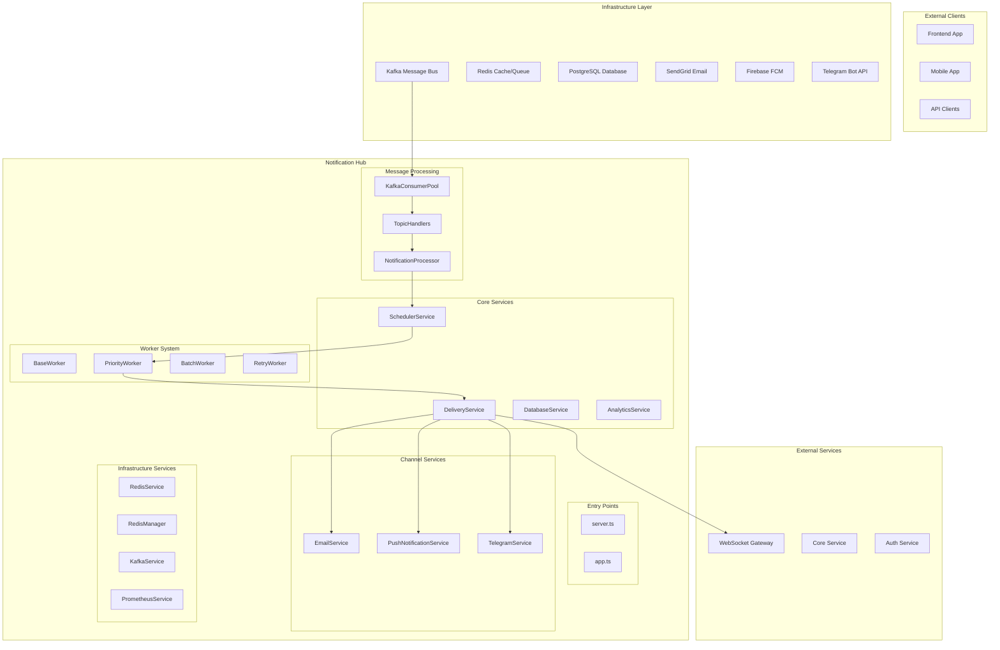

# 🚀 Notification Hub Service

## 📋 **Tổng quan**

**Notification Hub** là thành phần trung tâm trong **Split Architecture (Phase 2)** của hệ thống thông báo MoonXFarm. Nó đóng vai trò như một **Message Processing Engine** chuyên xử lý business logic và phân phối thông báo đến các kênh khác nhau, được thiết kế để scale từ 5K đến 50K+ users.

## 🏗️ **Kiến trúc Hệ thống**

### **Split Architecture Overview**



### **Luồng Xử lý Thông báo**

1. **Message Ingestion**: Kafka Consumer Pool nhận events từ các services
2. **Topic Routing**: Topic Handlers phân loại và route messages
3. **Business Logic**: Notification Processor xử lý rules và validation
4. **Scheduling**: Scheduler Service quản lý timing và recurring patterns
5. **Worker Processing**: Priority/Batch/Retry Workers xử lý theo loại
6. **Multi-Channel Delivery**: Delivery Service phân phối đến tất cả channels
7. **Analytics Tracking**: Analytics Service theo dõi metrics và engagement

## 📁 **Cấu trúc Thư mục**

```
notification-hub/
├── README.md                    # Documentation chính
├── IMPLEMENTATION_REVIEW.md     # Đánh giá implementation
├── DEPLOYMENT.md               # Hướng dẫn deployment
├── package.json                # Dependencies và scripts
├── pnpm-lock.yaml             # Lock file
│
├── config/                     # Production configuration
│   └── production.env          # 200+ environment variables
│
├── src/                        # Source code chính
│   ├── server.ts              # Main server entry point (production)
│   ├── app.ts                 # Alternative entry point
│   │
│   ├── services/              # Core business services
│   │   ├── databaseService.ts      # Database operations (1049 lines)
│   │   ├── deliveryService.ts      # Multi-channel delivery coordinator
│   │   ├── schedulerService.ts     # Advanced scheduling engine
│   │   ├── notificationProcessor.ts # Business logic processor
│   │   ├── analyticsService.ts     # Metrics và tracking
│   │   │
│   │   ├── emailService.ts         # SendGrid email delivery
│   │   ├── pushNotificationService.ts # Firebase FCM delivery  
│   │   ├── telegramService.ts      # Telegram bot delivery
│   │   │
│   │   ├── kafkaConsumerPool.ts    # Kafka message consumption
│   │   ├── kafkaService.ts         # Kafka infrastructure integration
│   │   ├── redisManager.ts         # Redis operations (legacy)
│   │   ├── redisService.ts         # Redis infrastructure integration
│   │   └── prometheusService.ts    # Metrics collection
│   │
│   ├── workers/               # Worker system for job processing
│   │   ├── baseWorker.ts          # Abstract base class với common logic
│   │   ├── priorityWorker.ts      # High-priority notification processing
│   │   ├── batchWorker.ts         # Bulk operation processing
│   │   └── retryWorker.ts         # Intelligent retry logic
│   │
│   ├── handlers/              # Message processing handlers
│   │   └── topicHandlers.ts       # Kafka topic routing và processing
│   │
│   └── utils/                 # Shared utilities
│       └── logger.ts              # Logging utilities
│
├── database/                  # Database management
│   ├── README.md              # Database documentation
│   ├── schema.sql             # Complete database schema (570 lines)
│   │
│   ├── migrations/            # Database migrations
│   │   └── 001_create_notification_schema.sql # Initial schema migration
│   │
│   └── seeds/                 # Sample data
│       └── sample_data.sql    # Test data cho development
│
└── scripts/                   # Deployment và automation scripts
    └── deploy-database.sh     # Database deployment script
```

## 🔧 **Core Components**

### **1. Entry Points**
- **`server.ts`**: Production server với comprehensive setup
- **`app.ts`**: Alternative entry point với worker management

### **2. Worker System (Advanced Job Processing)**
- **`BaseWorker`**: Abstract class với common functionality
  - Job queuing, retry logic, metrics, graceful shutdown
- **`PriorityWorker`**: High-frequency processing (8 concurrency, 100ms polling)
  - Price alerts, urgent notifications, real-time events
- **`BatchWorker`**: Bulk operations (2 concurrency, rate-limited)
  - Email campaigns, system announcements, user segmentation
- **`RetryWorker`**: Intelligent retry với channel-specific strategies
  - Exponential backoff, Dead Letter Queues, recovery logic

### **3. Core Services**
- **`NotificationProcessor`**: Business logic engine
- **`SchedulerService`**: Advanced scheduling với recurring patterns
- **`DeliveryService`**: Multi-channel delivery coordinator
- **`DatabaseService`**: Comprehensive database operations (1049 lines)
- **`AnalyticsService`**: Metrics tracking và user engagement

### **4. Channel Services (Multi-Channel Delivery)**
- **`EmailService`**: SendGrid integration với template support
- **`PushNotificationService`**: Firebase FCM delivery
- **`TelegramService`**: Bot integration với rate limiting
- **WebSocket**: Via external WebSocket Gateway service

### **5. Infrastructure Integration**
- **`KafkaConsumerPool`**: Event-driven message consumption
- **`RedisService`**: Modern Redis integration (infrastructure pattern)
- **`RedisManager`**: Legacy Redis operations (sẽ được deprecated)
- **`PrometheusService`**: Metrics collection

## 🗄️ **Database Architecture**

### **Comprehensive Schema (15+ Tables)**
- **Core System**: notifications, user_preferences, notification_templates
- **Advanced Alerts**: price_alerts, volume_alerts, whale_alerts, portfolio_alerts
- **DeFi Features**: position_health_alerts, yield_farming_alerts, governance_alerts
- **Operational**: notification_delivery_log, rate_limits, analytics, engagement_metrics

### **Performance Features**
- **50+ Indexes**: Optimized query performance
- **JSONB Support**: Flexible data storage
- **Triggers**: Automatic timestamp updates
- **Views**: Common query optimizations

## ⚡ **Performance Characteristics**

### **Scalability Targets**
| Metric | Current | Target |
|--------|---------|--------|
| Concurrent Users | 5,000 | 50,000+ |
| Messages/Second | 1,000 | 10,000+ |
| Processing Latency | 50-100ms | 20-50ms |
| Delivery Success Rate | >95% | >99% |

### **Worker Performance**
- **PriorityWorker**: 8 concurrency, <50ms processing
- **BatchWorker**: 2 concurrency, 1000+ users per batch
- **RetryWorker**: 4 concurrency, smart backoff strategies

## 🚀 **Production Features**

### **Configuration Management**
- **200+ Environment Variables**: Complete production setup
- **Service Discovery**: Automatic dependency resolution
- **Feature Flags**: Runtime configuration
- **Secret Management**: Secure credential handling

### **Monitoring & Analytics**
- **Prometheus Metrics**: Performance monitoring
- **Delivery Tracking**: Success/failure rates
- **User Engagement**: Click-through rates, engagement scores
- **Error Analysis**: Comprehensive failure categorization

### **Security Features**
- **JWT Authentication**: Token-based verification
- **Rate Limiting**: DDoS protection
- **Data Encryption**: PII protection
- **Input Validation**: Comprehensive sanitization

## 🔧 **Architecture Pattern**

### **Layered Architecture Implementation**
1. **Infrastructure Layer** (`*Service.ts`)
   - `redisService.ts`: Redis connection management, infrastructure operations
   - `kafkaService.ts`: Kafka connection management, infrastructure operations
   - **Pattern**: Singleton services cho shared connections

2. **Business Logic Layer** (`*Manager.ts` / `*Pool.ts`)
   - `redisManager.ts`: Business-specific Redis operations (user management, caching, queues)
   - `kafkaConsumerPool.ts`: Business-specific Kafka operations (topic handling, message processing)
   - **Pattern**: Specialized classes cho domain-specific operations

### **No Redundancy - Proper Separation**
- **Infrastructure Services**: Handle connections, health checks, metrics
- **Business Services**: Handle domain logic, business rules, processing
- **Integration**: Business layer sử dụng infrastructure layer internally
- **Benefits**: Clean separation, testability, maintainability, scalability

### **Directory Structure Excellence**
- **Clean Architecture**: Infrastructure → Business → Workers → Handlers
- **Separation of Concerns**: Database, messaging, caching, processing
- **Production Ready**: Migrations, seeds, configuration, deployment
- **Scalable Design**: Worker system, service pattern, queue management

## 🎯 **Key Differentiators**

1. **Advanced DeFi Features**: Price/volume alerts, whale tracking, portfolio monitoring
2. **Intelligent Processing**: Priority-based workers, smart retry strategies
3. **Comprehensive Analytics**: User engagement, delivery tracking, performance metrics
4. **Production Infrastructure**: Kafka, Redis, PostgreSQL integration
5. **Scalable Architecture**: Ready cho enterprise deployment từ 5K → 50K+ users

## 📊 **Business Value**

### **User Experience**
- ⚡ Real-time notifications với sub-100ms latency
- 🎯 Personalized alerts dựa trên user preferences
- 📱 Multi-device delivery seamless
- 🔧 Extensive customization options

### **Operational Excellence**
- 📈 Horizontal scaling ready
- 🛡️ Enterprise-grade reliability
- 📊 Comprehensive observability
- 🚀 Production-ready deployment

**Status: 🚀 READY FOR PRODUCTION DEPLOYMENT** 