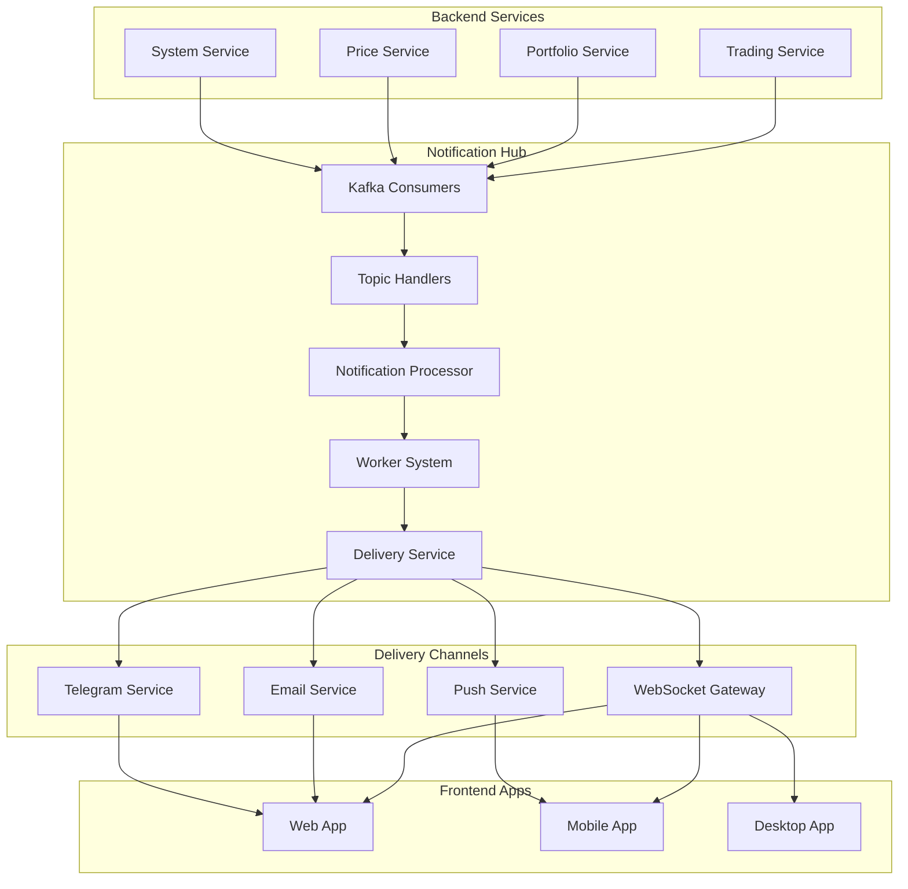

# 📚 Notification Hub Documentation

## 📋 **Tổng quan Tài liệu**

Đây là bộ tài liệu toàn diện cho **Notification Hub** - hệ thống xử lý và phân phối thông báo trong **Split Architecture Phase 2** của MoonX Farm. Tài liệu được thiết kế dành cho các đối tượng khác nhau trong quá trình phát triển và triển khai.

## 🎯 **Đối tượng Sử dụng**

| Tài liệu | Đối tượng | Mục đích |
|----------|-----------|----------|
| [**Service Integration Guide**](./SERVICE-INTEGRATION-GUIDE.md) | Backend Developers | Tích hợp services để gửi thông báo |
| [**Configuration Guide**](./CONFIGURATION-GUIDE.md) | Backend/Admin Developers | Quản lý cấu hình thông báo |
| [**Development Guide**](./DEVELOPMENT-GUIDE.md) | Platform Developers | Bảo trì và mở rộng Hub |
| [**Frontend Integration Guide**](./FRONTEND-INTEGRATION-GUIDE.md) | Frontend Developers | Tích hợp UI nhận thông báo |

## 🚀 **Quick Start Guides**

### **1. Dành cho Backend Services**
```bash
# Tích hợp service của bạn với Notification Hub
👉 Đọc: Service Integration Guide
   - Kafka integration (recommended)
   - HTTP API integration  
   - Event format & validation
   - Examples cho mọi service types
```

### **2. Dành cho Admin/Config Management**
```bash
# Quản lý rules, preferences, alerts
👉 Đọc: Configuration Guide
   - Notification Rules API
   - User Preferences Management
   - Subscriptions & Alerts
   - Templates & Bulk Operations
```

### **3. Dành cho Platform Development**
```bash
# Thêm features mới cho Hub
👉 Đọc: Development Guide
   - Adding new notification types
   - Creating new delivery channels
   - Extending worker system
   - Database schema evolution
```

### **4. Dành cho Frontend Integration**
```bash
# Xây dựng UI notification system
👉 Đọc: Frontend Integration Guide
   - WebSocket real-time connection
   - React hooks & components
   - Notification preferences UI
   - Mobile push notifications
```

## 🏗️ **Architecture Overview**

```
┌─────────────────────────────────────────────────────────────────┐
│                 MoonX Farm Notification System                  │
├─────────────────────────────────────────────────────────────────┤
│                                                                 │
│  ┌─────────────────┐    ┌─────────────────┐    ┌─────────────┐  │
│  │  Backend        │    │  Notification   │    │  Frontend   │  │
│  │  Services       │───▶│  Hub            │───▶│  Apps       │  │
│  │                 │    │                 │    │             │  │
│  │ - Trading       │    │ - Processing    │    │ - Web App   │  │
│  │ - Portfolio     │    │ - Scheduling    │    │ - Mobile    │  │
│  │ - Price         │    │ - Analytics     │    │ - Desktop   │  │
│  │ - Auth          │    │ - Delivery      │    │             │  │
│  └─────────────────┘    └─────────────────┘    └─────────────┘  │
│           │                       │                       │     │
│           ▼                       ▼                       ▼     │
│  ┌─────────────────┐    ┌─────────────────┐    ┌─────────────┐  │
│  │ Kafka Events    │    │ WebSocket       │    │ Real-time   │  │
│  │ HTTP APIs       │    │ Email           │    │ UI Updates  │  │
│  │ Configuration   │    │ Push            │    │ Settings    │  │
│  │ Rules           │    │ Telegram        │    │ Management  │  │
│  └─────────────────┘    └─────────────────┘    └─────────────┘  │
└─────────────────────────────────────────────────────────────────┘
```

## 📖 **Chi tiết Tài liệu**

### **1. 🔗 [Service Integration Guide](./SERVICE-INTEGRATION-GUIDE.md)**

**Mục đích**: Hướng dẫn các backend services tích hợp với Notification Hub để gửi thông báo.

**Nội dung chính**:
- **Kafka Integration** (Recommended approach)
  - Event format chuẩn
  - Topic configuration
  - Producer setup
  - Error handling

- **HTTP API Integration** (Alternative approach)
  - REST endpoints
  - Authentication
  - Request/response format
  - Rate limiting

- **Service Examples**:
  - Trading Service (trade execution, order fills)
  - Price Service (price alerts, market updates)
  - Portfolio Service (balance changes, P&L)
  - System Service (announcements, maintenance)

- **Best Practices**:
  - Message validation
  - Error handling
  - Performance optimization
  - Security considerations

**Khi nào sử dụng**: Khi bạn cần tích hợp backend service để gửi thông báo đến users.

---

### **2. ⚙️ [Configuration Guide](./CONFIGURATION-GUIDE.md)**

**Mục đích**: Hướng dẫn tạo, quản lý và đẩy cấu hình thông báo vào Notification Hub.

**Nội dung chính**:
- **Notification Rules Management**
  - Rule structure & conditions
  - Action definitions
  - Priority & scheduling
  - CRUD operations

- **User Preferences Management**
  - Channel preferences (WebSocket, Email, Push, Telegram)
  - Notification type preferences
  - Frequency settings
  - Quiet hours configuration

- **Subscriptions & Alerts**
  - Price alerts
  - Volume alerts  
  - Whale alerts
  - Portfolio alerts
  - Custom subscriptions

- **Advanced Features**:
  - Bulk operations
  - Configuration templates
  - Event-driven sync
  - Webhooks integration

**Khi nào sử dụng**: Khi bạn cần quản lý rules, preferences, hoặc alerts cho users.

---

### **3. 🔧 [Development Guide](./DEVELOPMENT-GUIDE.md)**

**Mục đích**: Hướng dẫn developers bảo trì, mở rộng và phát triển tính năng mới cho Notification Hub.

**Nội dung chính**:
- **Adding New Notification Types**
  - Event type definition
  - Kafka topic setup
  - Handler implementation
  - Database schema updates
  - API routes

- **Adding New Delivery Channels**
  - Channel service creation
  - DeliveryService integration
  - Configuration management
  - Error handling

- **Worker System Extension**
  - Custom worker types
  - Job processing logic
  - Performance optimization
  - Monitoring integration

- **Infrastructure & Scaling**:
  - Database migrations
  - Feature flags
  - Dynamic configuration
  - Performance monitoring
  - Testing strategies

**Khi nào sử dụng**: Khi bạn cần thêm tính năng mới hoặc maintain existing codebase.

---

### **4. 🖥️ [Frontend Integration Guide](./FRONTEND-INTEGRATION-GUIDE.md)**

**Mục đích**: Hướng dẫn frontend developers tích hợp với Notification Hub để nhận thông báo real-time.

**Nội dung chính**:
- **WebSocket Real-time Connection**
  - Socket.IO client setup
  - Authentication flow
  - Event handling
  - Reconnection logic

- **React Integration**
  - Custom hooks (useNotifications)
  - Components (NotificationBell, Toast)
  - State management
  - Performance optimization

- **Notification UI Components**
  - Notification bell với dropdown
  - Toast notifications
  - Settings interface
  - Alert management UI

- **Advanced Features**:
  - Push notification registration
  - Offline notification handling
  - Theme customization
  - Mobile considerations

**Khi nào sử dụng**: Khi bạn cần xây dựng UI để hiển thị và quản lý notifications.

---

## 🔄 **Integration Flow Diagram**



## 🎯 **Use Cases & Examples**

### **Scenario 1: Trading Notification**
```
1. User thực hiện trade trên Trading Service
2. Trading Service gửi event qua Kafka → Notification Hub
3. Hub xử lý event, kiểm tra user preferences
4. Hub gửi notification qua WebSocket → Frontend
5. Frontend hiển thị real-time notification
```

**Tài liệu liên quan**: Service Integration Guide → Frontend Integration Guide

### **Scenario 2: Price Alert Setup**
```
1. User tạo price alert trên Frontend
2. Frontend gọi API → Notification Hub
3. Hub lưu alert configuration vào database
4. Khi price trigger, Price Service gửi event → Hub
5. Hub xử lý và gửi alert notification
```

**Tài liệu liên quan**: Configuration Guide → Frontend Integration Guide

### **Scenario 3: New Notification Type**
```
1. Developer định nghĩa new notification type
2. Thêm Kafka topic và handler
3. Update database schema
4. Tạo API routes
5. Frontend update UI components
```

**Tài liệu liên quan**: Development Guide → Frontend Integration Guide

## 🛠️ **Development Workflow**

### **Phase 1: Setup & Integration**
1. **Backend**: Đọc Service Integration Guide
2. **Configuration**: Đọc Configuration Guide  
3. **Testing**: Verify integration works

### **Phase 2: Frontend Development**
1. **UI Integration**: Đọc Frontend Integration Guide
2. **Components**: Build notification UI
3. **Testing**: End-to-end testing

### **Phase 3: Extension & Maintenance**
1. **New Features**: Đọc Development Guide
2. **Scaling**: Performance optimization
3. **Monitoring**: Analytics và metrics

## 📊 **API Reference Quick Links**

### **Notification Hub APIs**
```bash
# System APIs
GET  /api/system/health              # Health check
GET  /api/system/metrics             # Prometheus metrics
GET  /api/system/analytics           # Analytics data

# Rules Management
POST /api/rules/create               # Create notification rule
GET  /api/rules/list                 # Get rules
PUT  /api/rules/:ruleId             # Update rule
DELETE /api/rules/:ruleId            # Delete rule

# User Preferences  
GET  /api/preferences/:userId        # Get preferences
PUT  /api/preferences/:userId        # Update preferences
PATCH /api/preferences/:userId/:section # Update section

# Subscriptions
GET  /api/subscriptions/:userId      # Get subscriptions
POST /api/subscriptions/:userId      # Create subscription
PUT  /api/subscriptions/:userId/:id  # Update subscription

# Alerts
GET  /api/alerts/:userId             # Get alerts
POST /api/alerts/:userId/price       # Create price alert
POST /api/alerts/:userId/volume      # Create volume alert
POST /api/alerts/:userId/whale       # Create whale alert
```

### **WebSocket Gateway Events**
```typescript
// Client → Server
join_room: { room: 'user:123' }
leave_room: { room: 'price:BTC-USDC' }
subscribe: { types: ['price_updates'] }

// Server → Client  
notification: { type, title, body, data }
price_update: { symbol, price, change }
portfolio_update: { totalValue, positions }
```

## 🔧 **Environment Setup**

### **Development Environment**
```bash
# Clone và setup
git clone https://github.com/moonx-farm/notification-hub
cd notification-hub
npm install

# Environment variables
cp .env.example .env
# Configure database, Redis, Kafka, etc.

# Start development
npm run dev
```

### **Production Deployment**
```bash
# Docker deployment
docker-compose -f docker-compose.production.yml up -d

# Kubernetes deployment  
kubectl apply -f k8s/
```

## 📞 **Support & Resources**

### **Development Team Contacts**
- **Architecture Questions**: [Team Lead]
- **Integration Issues**: [Backend Team]
- **Frontend Support**: [Frontend Team]
- **DevOps/Deployment**: [DevOps Team]

### **Additional Resources**
- **GitHub Repository**: [Notification Hub Repo]
- **API Documentation**: [Swagger/OpenAPI Docs]
- **Monitoring Dashboard**: [Grafana Dashboard]
- **Slack Channel**: [#notification-hub]

### **Common Issues & Solutions**
- **Connection Issues**: Check WebSocket Gateway health
- **Missing Notifications**: Verify user preferences & rules
- **Performance Issues**: Monitor worker queues & Redis
- **Configuration Errors**: Validate API requests

---

## 🎉 **Conclusion**

Bộ tài liệu này cung cấp hướng dẫn toàn diện cho việc phát triển, tích hợp và maintain Notification Hub. Mỗi tài liệu được thiết kế cho một nhóm đối tượng cụ thể nhưng có thể tham khảo lẫn nhau.

**Recommended Reading Order**:
1. **Newcomers**: Bắt đầu với tài liệu phù hợp với role
2. **Backend Developers**: Service Integration → Configuration  
3. **Frontend Developers**: Frontend Integration → Configuration
4. **Platform Developers**: Development → All others

**Happy coding với Notification Hub! 🚀** 