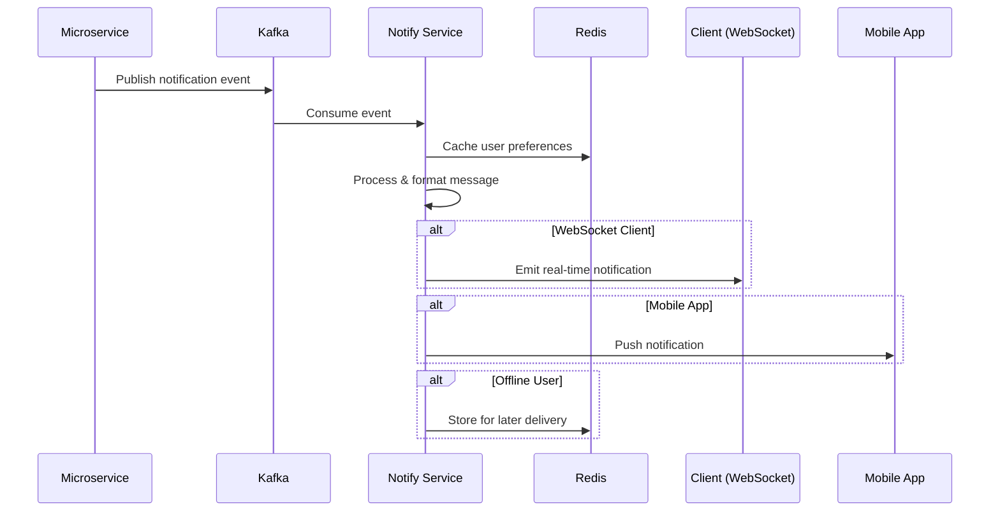

# MoonXFarm Notify Service - Architecture Design

**Ngày tạo**: 01/01/2025  
**Trạng thái**: Production Ready Design  
**Mục tiêu**: Real-time notifications với high scalability  

## 🎯 Requirements Analysis

### **Core Requirements**
1. **Real-time Notifications**: WebSocket push cho chart updates, alerts
2. **High Concurrency**: Xử lý lượng lớn notifications đồng thời
3. **Inter-service Communication**: Nhận messages từ microservices khác
4. **Mobile Support**: Compatible với mobile browsers + native apps
5. **Scalability**: Có thể scale horizontal khi cần
6. **Reliability**: Message delivery guarantee, error handling

### **Technical Challenges**
- **Connection Management**: 10k+ concurrent WebSocket connections
- **Message Throughput**: 1M+ notifications/hour
- **Real-time Chart Data**: Sub-second latency requirements
- **Mobile Compatibility**: Connection stability, battery optimization
- **Cross-service Integration**: Seamless microservice communication

## 🏗️ Architecture Overview

### **Phase 1: Single Service (Monolithic Notify)**
```
┌─────────────────────────────────────────────────────┐
│                Notify Service                        │
├─────────────────────────────────────────────────────┤
│  ┌─────────────┐  ┌─────────────┐  ┌─────────────┐  │
│  │   Socket.IO │  │   Kafka     │  │   Redis     │  │
│  │   Server    │  │  Consumer   │  │   Manager   │  │
│  └─────────────┘  └─────────────┘  └─────────────┘  │
│  ┌─────────────┐  ┌─────────────┐  ┌─────────────┐  │
│  │    HTTP     │  │  Notification│  │   Mobile    │  │
│  │    API      │  │   Processor  │  │   Push      │  │
│  └─────────────┘  └─────────────┘  └─────────────┘  │
└─────────────────────────────────────────────────────┘
```

### **Phase 2: Split Architecture (High Scale)**
```
┌─────────────────────┐    ┌─────────────────────┐
│  WebSocket Gateway  │    │  Notification Hub   │
├─────────────────────┤    ├─────────────────────┤
│  ┌───────────────┐  │    │  ┌───────────────┐  │
│  │   Socket.IO   │  │◄──►│  │ Kafka Consumer│  │
│  │   Cluster     │  │    │  │   Pool        │  │
│  └───────────────┘  │    │  └───────────────┘  │
│  ┌───────────────┐  │    │  ┌───────────────┐  │
│  │  Connection   │  │    │  │ Notification  │  │
│  │   Manager     │  │    │  │  Processor    │  │
│  └───────────────┘  │    │  └───────────────┘  │
└─────────────────────┘    └─────────────────────┘
```

## 📊 Message Flow Architecture

### **Event-Driven Notification Flow**


### **Notification Types & Routing**
```typescript
interface NotificationTypes {
  // Trading notifications
  SWAP_COMPLETED: 'swap_completed';
  ORDER_FILLED: 'order_filled';
  ORDER_EXPIRED: 'order_expired';
  
  // Price alerts
  PRICE_ALERT: 'price_alert';
  PRICE_TARGET_HIT: 'price_target_hit';
  
  // Portfolio updates
  PORTFOLIO_SYNC: 'portfolio_sync';
  PNL_UPDATE: 'pnl_update';
  
  // Chart data
  CHART_UPDATE: 'chart_update';
  LIQUIDITY_UPDATE: 'liquidity_update';
  
  // System notifications
  SYSTEM_MAINTENANCE: 'system_maintenance';
  FEATURE_ANNOUNCEMENT: 'feature_announcement';
}
```

## 🔧 Phase 1: Single Service Implementation

### **Service Structure**
```
services/notify-service/
├── package.json                   # Dependencies
├── Dockerfile                     # Container config
├── .env.example                   # Environment variables
├── src/
│   ├── server.ts                  # Main server entry
│   ├── config/
│   │   ├── socket.ts              # Socket.IO configuration
│   │   ├── kafka.ts               # Kafka consumer setup
│   │   └── redis.ts               # Redis connection
│   ├── controllers/
│   │   ├── notificationController.ts  # HTTP API endpoints
│   │   └── healthController.ts    # Health checks
│   ├── services/
│   │   ├── socketManager.ts       # WebSocket connection management
│   │   ├── notificationService.ts # Core notification logic
│   │   ├── kafkaConsumer.ts       # Kafka message processing
│   │   ├── redisManager.ts        # Redis operations
│   │   ├── emailService.ts        # Email notifications
│   │   └── pushService.ts         # Mobile push notifications
│   ├── middleware/
│   │   ├── auth.ts                # WebSocket authentication
│   │   ├── rateLimiter.ts         # Connection rate limiting
│   │   └── errorHandler.ts        # Error handling
│   ├── models/
│   │   ├── notification.ts        # Notification data models
│   │   ├── subscription.ts        # User subscription preferences
│   │   └── connection.ts          # Connection tracking
│   ├── consumers/
│   │   ├── swapConsumer.ts        # Swap event consumer
│   │   ├── orderConsumer.ts       # Order event consumer
│   │   ├── priceConsumer.ts       # Price update consumer
│   │   └── portfolioConsumer.ts   # Portfolio update consumer
│   ├── utils/
│   │   ├── messageFormatter.ts    # Message formatting
│   │   ├── rateLimiter.ts         # Rate limiting utilities
│   │   └── logger.ts              # Logging utilities
│   └── types/
│       └── index.ts               # TypeScript definitions
└── tests/
    ├── unit/
    └── integration/
```

### **Core Technologies**
```json
{
  "framework": "Node.js + TypeScript",
  "websocket": "Socket.IO v4.7+",
  "messaging": "kafkajs v2.2+",
  "cache": "ioredis v5.3+",
  "database": "PostgreSQL (notifications log)",
  "monitoring": "prometheus-client",
  "testing": "jest + supertest"
}
```

### **Socket.IO Configuration**
```typescript
// src/config/socket.ts
import { Server } from 'socket.io';
import { createAdapter } from '@socket.io/redis-adapter';
import { createClient } from 'redis';

export const createSocketServer = (httpServer: any) => {
  const io = new Server(httpServer, {
    cors: {
      origin: process.env.ALLOWED_ORIGINS?.split(',') || ['http://localhost:3000'],
      methods: ['GET', 'POST'],
      credentials: true
    },
    transports: ['websocket', 'polling'],
    pingTimeout: 60000,
    pingInterval: 25000,
    maxHttpBufferSize: 1e6, // 1MB
    allowEIO3: true // Mobile compatibility
  });

  // Redis adapter for horizontal scaling
  const pubClient = createClient({ url: process.env.REDIS_URL });
  const subClient = pubClient.duplicate();
  
  io.adapter(createAdapter(pubClient, subClient));

  return io;
};
```

### **Kafka Consumer Configuration**
```typescript
// src/config/kafka.ts
import { Kafka } from 'kafkajs';

export const createKafkaConsumer = () => {
  const kafka = new Kafka({
    clientId: 'notify-service',
    brokers: process.env.KAFKA_BROKERS?.split(',') || ['localhost:9092'],
    retry: {
      retries: 5,
      initialRetryTime: 100,
      maxRetryTime: 30000
    }
  });

  return kafka.consumer({
    groupId: 'notify-service-group',
    sessionTimeout: 30000,
    heartbeatInterval: 3000,
    maxBytesPerPartition: 1048576, // 1MB
    minBytes: 1,
    maxBytes: 10485760, // 10MB
    maxWaitTimeInMs: 5000
  });
};

export const KAFKA_TOPICS = {
  SWAP_EVENTS: 'swap-events',
  ORDER_EVENTS: 'order-events',
  PRICE_UPDATES: 'price-updates',
  PORTFOLIO_UPDATES: 'portfolio-updates',
  SYSTEM_ALERTS: 'system-alerts'
};
```

## 🚀 Phase 2: Split Architecture (High Scale)

### **WebSocket Gateway Service**
```
services/websocket-gateway/
├── package.json
├── src/
│   ├── server.ts                  # WebSocket server
│   ├── services/
│   │   ├── connectionManager.ts   # Connection pooling
│   │   ├── messageRouter.ts       # Message routing
│   │   └── authService.ts         # Authentication
│   ├── middleware/
│   │   ├── rateLimiter.ts         # Connection limiting
│   │   └── loadBalancer.ts        # Load balancing
│   └── types/
│       └── index.ts
└── tests/
```

### **Notification Hub Service**
```
services/notification-hub/
├── package.json
├── src/
│   ├── server.ts                  # Processing server
│   ├── services/
│   │   ├── notificationProcessor.ts  # Message processing
│   │   ├── kafkaConsumer.ts       # Kafka integration
│   │   ├── redisManager.ts        # Cache management
│   │   └── deliveryService.ts     # Message delivery
│   ├── workers/
│   │   ├── priorityWorker.ts      # Priority message handling
│   │   └── batchWorker.ts         # Batch processing
│   └── types/
│       └── index.ts
└── tests/
```

### **Service Communication**
```typescript
// WebSocket Gateway → Notification Hub
interface GatewayToHubMessage {
  type: 'connection_established' | 'connection_lost' | 'message_ack';
  connectionId: string;
  userId?: string;
  metadata?: Record<string, any>;
}

// Notification Hub → WebSocket Gateway
interface HubToGatewayMessage {
  type: 'send_notification' | 'broadcast' | 'disconnect_user';
  targetConnections: string[];
  message: NotificationMessage;
  priority: 'high' | 'medium' | 'low';
}
```

## 📱 Mobile Support Strategy

### **WebSocket Mobile Optimization**
```typescript
// Mobile-specific Socket.IO config
const mobileSocketConfig = {
  transports: ['websocket', 'polling'],
  upgrade: true,
  rememberUpgrade: true,
  forceNew: false,
  reconnection: true,
  reconnectionAttempts: 5,
  reconnectionDelay: 1000,
  reconnectionDelayMax: 5000,
  timeout: 20000,
  forceBase64: false // Better mobile performance
};
```

### **Push Notification Integration**
```typescript
// src/services/pushService.ts
import { messaging } from 'firebase-admin';

export class PushNotificationService {
  async sendToDevice(deviceToken: string, notification: NotificationMessage) {
    const message = {
      token: deviceToken,
      notification: {
        title: notification.title,
        body: notification.body,
        icon: '/icons/notification-icon.png'
      },
      data: {
        type: notification.type,
        payload: JSON.stringify(notification.payload)
      },
      android: {
        priority: 'high' as const,
        notification: {
          channelId: 'trading-alerts',
          sound: 'default',
          clickAction: 'FLUTTER_NOTIFICATION_CLICK'
        }
      },
      apns: {
        payload: {
          aps: {
            alert: {
              title: notification.title,
              body: notification.body
            },
            badge: 1,
            sound: 'default',
            'content-available': 1
          }
        }
      }
    };

    return messaging().send(message);
  }
}
```

## 🔄 Inter-Service Communication

### **REST API Endpoints**
```typescript
// HTTP API cho microservices
app.post('/api/v1/notifications/send', async (req, res) => {
  const { userId, type, message, priority = 'medium' } = req.body;
  
  await notificationService.sendToUser(userId, {
    type,
    message,
    priority,
    timestamp: new Date()
  });
  
  res.json({ success: true });
});

app.post('/api/v1/notifications/broadcast', async (req, res) => {
  const { type, message, filters } = req.body;
  
  await notificationService.broadcast({
    type,
    message,
    filters,
    timestamp: new Date()
  });
  
  res.json({ success: true });
});
```

### **Service Discovery Pattern**
```typescript
// Service registration
const serviceRegistry = {
  'core-service': 'http://core-service:3007',
  'aggregator-service': 'http://aggregator-service:3003',
  'auth-service': 'http://auth-service:3001'
};

// Auto-discovery cho Docker/Kubernetes
const discoverServices = async () => {
  const services = await dns.promises.resolve('notify-service');
  return services.map(ip => `http://${ip}:3006`);
};
```

## 📊 Performance Optimization

### **Connection Management**
```typescript
// Connection pooling và load balancing
export class ConnectionManager {
  private connections = new Map<string, Socket>();
  private userConnections = new Map<string, Set<string>>();
  
  async addConnection(socket: Socket, userId: string) {
    this.connections.set(socket.id, socket);
    
    if (!this.userConnections.has(userId)) {
      this.userConnections.set(userId, new Set());
    }
    this.userConnections.get(userId)!.add(socket.id);
    
    // Cleanup old connections
    this.cleanupStaleConnections();
  }
  
  async sendToUser(userId: string, message: any) {
    const connectionIds = this.userConnections.get(userId);
    if (!connectionIds) return;
    
    const promises = Array.from(connectionIds).map(connId => {
      const socket = this.connections.get(connId);
      return socket?.emit('notification', message);
    });
    
    await Promise.all(promises);
  }
}
```

### **Message Queuing & Batching**
```typescript
// Priority queue cho messages
export class MessageQueue {
  private highPriorityQueue: NotificationMessage[] = [];
  private mediumPriorityQueue: NotificationMessage[] = [];
  private lowPriorityQueue: NotificationMessage[] = [];
  
  async processMessages() {
    // Process high priority first
    while (this.highPriorityQueue.length > 0) {
      const message = this.highPriorityQueue.shift()!;
      await this.deliverMessage(message);
    }
    
    // Batch process medium priority
    if (this.mediumPriorityQueue.length > 0) {
      const batch = this.mediumPriorityQueue.splice(0, 100);
      await this.deliverBatch(batch);
    }
    
    // Background process low priority
    if (this.lowPriorityQueue.length > 0) {
      const batch = this.lowPriorityQueue.splice(0, 50);
      setImmediate(() => this.deliverBatch(batch));
    }
  }
}
```

## 📈 Monitoring & Observability

### **Metrics Collection**
```typescript
// Prometheus metrics
const connectionGauge = new prometheus.Gauge({
  name: 'websocket_connections_total',
  help: 'Total number of WebSocket connections'
});

const messageCounter = new prometheus.Counter({
  name: 'notifications_sent_total',
  help: 'Total number of notifications sent',
  labelNames: ['type', 'priority']
});

const deliveryLatency = new prometheus.Histogram({
  name: 'notification_delivery_duration_seconds',
  help: 'Time taken to deliver notifications',
  buckets: [0.1, 0.5, 1, 2, 5, 10]
});
```

### **Health Checks**
```typescript
// Health endpoint
app.get('/health', (req, res) => {
  const health = {
    status: 'healthy',
    timestamp: new Date().toISOString(),
    services: {
      redis: redisClient.status === 'ready',
      kafka: kafkaConsumer.connected,
      database: databaseHealthy
    },
    metrics: {
      activeConnections: connectionManager.getConnectionCount(),
      messagesPerSecond: messageQueue.getRate(),
      memoryUsage: process.memoryUsage()
    }
  };
  
  res.json(health);
});
```

## 🎯 Implementation Timeline

### **Phase 1: Single Service (2-3 weeks)**
- ✅ Basic Socket.IO server setup
- ✅ Kafka consumer integration
- ✅ Redis caching layer
- ✅ HTTP API endpoints
- ✅ Mobile push notifications
- ✅ Basic authentication & rate limiting

### **Phase 2: Split Architecture (1-2 weeks)**
- 📋 WebSocket Gateway service
- 📋 Notification Hub service
- 📋 Service discovery & load balancing
- 📋 Advanced monitoring & metrics
- 📋 Performance optimization

### **Phase 3: Production Hardening (1 week)**
- 📋 Security auditing
- 📋 Load testing
- 📋 Failover mechanisms
- 📋 Documentation complete

## 🔒 Security Considerations

### **Authentication & Authorization**
```typescript
// JWT validation cho WebSocket connections
io.use(async (socket, next) => {
  const token = socket.handshake.auth.token;
  
  try {
    const payload = jwt.verify(token, process.env.JWT_SECRET!);
    socket.userId = payload.userId;
    next();
  } catch (error) {
    next(new Error('Authentication failed'));
  }
});
```

### **Rate Limiting**
```typescript
// Connection rate limiting
const rateLimiter = new Map<string, number>();

io.use((socket, next) => {
  const clientIp = socket.handshake.address;
  const count = rateLimiter.get(clientIp) || 0;
  
  if (count > 100) { // Max 100 connections per IP
    next(new Error('Rate limit exceeded'));
    return;
  }
  
  rateLimiter.set(clientIp, count + 1);
  next();
});
```

---

**Tổng kết**: Notify service được thiết kế với khả năng scale từ development đến production với hàng triệu notifications/hour. Architecture linh hoạt cho phép chuyển đổi từ single service sang split architecture khi cần thiết. 