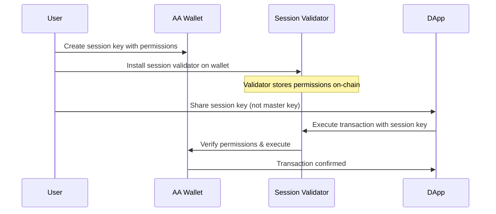

# Session Keys in Wallet Registry

## 📚 **Session Key Concept**

> **"Session keys are the JWTs of Web3"** - ZeroDev Documentation

Session keys enable **temporary delegation** of specific actions from a master AA wallet to a session key without sharing the master private key.

### 🎯 **Core Benefits**

1. **Reduced Friction**: Users sign once to delegate, then session key can execute multiple transactions
2. **Limited Permissions**: Session keys have restricted scopes (contracts, amounts, time limits)
3. **Security**: Master key remains secure, session key can be safely shared with dApps/services
4. **User Experience**: No need to sign every single transaction

### 🔄 **How Session Keys Work**



## 🏗️ **Implementation Architecture**

### **1. Session Key Creation Flow**

```typescript
// User creates session key for existing wallet
const sessionResult = await sessionKeyManager.createSessionKey({
  walletId: "existing-wallet-id",
  userId: "user-123",
  permissions: {
    contractAddresses: ["0x1234..."], // Only these contracts
    maxAmount: "1000000000000000000", // Max 1 ETH per tx
    maxGasLimit: "500000",
    allowedMethods: ["transfer", "approve"],
    timeframe: {
      validAfter: Math.floor(Date.now() / 1000),
      validUntil: Math.floor(Date.now() / 1000) + 86400 * 30 // 30 days
    }
  },
  expirationDays: 30
});
```

### **2. Modern ZeroDev Permissions Integration**

The implementation uses ZeroDev's modern permissions pattern:

```typescript
// STEP 1: Generate session key (agent/dApp side)
const sessionKeyGeneration = await zeroDevClient.generateSessionKey();

// STEP 2: Create approval (wallet owner side)
const approvalResult = await zeroDevClient.createSessionKeyApproval(
  chainId,
  walletPrivateKey,
  sessionKeyGeneration.sessionKeyAddress,
  permissions
);

// STEP 3: Use session key (agent/dApp side)
const sessionKeyClient = await zeroDevClient.createSessionKeyClient(
  chainId,
  approvalResult.approval,
  sessionKeyGeneration.sessionKeySigner
);

// Execute transactions with session key
await sessionKeyClient.sendUserOperation({ callData: ... });
```

### **3. Key Components**

#### **ZeroDevClientService**
- Creates session keys and validators
- Installs validators on existing wallets
- Manages ZeroDev SDK integration

#### **SessionKeyManager**
- High-level session key operations
- Database persistence
- Permission management
- Validation and revocation

#### **Database Schema**
```sql
CREATE TABLE session_keys (
  id VARCHAR(36) PRIMARY KEY,
  wallet_id VARCHAR(36) NOT NULL,
  user_id VARCHAR(255) NOT NULL,
  public_key VARCHAR(255) NOT NULL, -- Session key address
  encrypted_private_key TEXT NOT NULL, -- Encrypted session key
  permissions TEXT NOT NULL, -- JSON permissions
  expires_at TIMESTAMP NOT NULL,
  is_active BOOLEAN DEFAULT true,
  created_at TIMESTAMP DEFAULT CURRENT_TIMESTAMP,
  updated_at TIMESTAMP DEFAULT CURRENT_TIMESTAMP
);
```

## 🔐 **Security Model**

### **Permission System**

Session keys have **strictly limited permissions**:

```typescript
interface SessionKeyPermissions {
  contractAddresses: string[]; // Whitelist of contracts
  maxGasLimit: string; // Gas limit per transaction
  maxAmount: string; // Max ETH/token amount per transaction
  allowedMethods: string[]; // Allowed contract methods
  timeframe: {
    validAfter: number; // Valid after timestamp
    validUntil: number; // Expires at timestamp
  };
}
```

### **Security Features**

1. **Time-bounded**: Session keys automatically expire
2. **Contract-specific**: Can only interact with whitelisted contracts
3. **Amount-limited**: Maximum spend per transaction
4. **Method-restricted**: Only specific contract methods allowed
5. **Revocable**: Can be deactivated by user anytime

## 🚀 **Use Cases**

### **1. GameFi Applications**
```typescript
// Player authorizes game to spend items for 24 hours
const gameSessionKey = await createSessionKey({
  permissions: {
    contractAddresses: ["0xGameItemContract"],
    maxAmount: "0", // No ETH, just NFT operations
    allowedMethods: ["transfer", "burn", "mint"],
    timeframe: {
      validAfter: now,
      validUntil: now + 86400 // 24 hours
    }
  }
});
```

### **2. DeFi Auto-Trading**
```typescript
// User authorizes trading bot for limited amounts
const tradingSessionKey = await createSessionKey({
  permissions: {
    contractAddresses: ["0x1inchRouter", "0xUniswapRouter"],
    maxAmount: "100000000000000000", // Max 0.1 ETH per trade
    allowedMethods: ["swap", "swapTokensForETH"],
    timeframe: {
      validAfter: now,
      validUntil: now + 604800 // 7 days
    }
  }
});
```

### **3. Subscription Payments**
```typescript
// User authorizes recurring payments
const subscriptionSessionKey = await createSessionKey({
  permissions: {
    contractAddresses: ["0xUSDCToken"],
    maxAmount: "10000000", // Max 10 USDC per payment
    allowedMethods: ["transfer"],
    timeframe: {
      validAfter: now,
      validUntil: now + 31536000 // 1 year
    }
  }
});
```

## 🛠️ **API Usage**

### **Create Session Key**
```bash
POST /api/session-keys
{
  "walletId": "wallet-uuid",
  "userId": "user-123",
  "permissions": {
    "contractAddresses": ["0x1234..."],
    "maxAmount": "1000000000000000000",
    "maxGasLimit": "500000",
    "allowedMethods": ["transfer"],
    "timeframe": {
      "validAfter": 1640995200,
      "validUntil": 1643673600
    }
  },
  "expirationDays": 30
}
```

**Response:**
```json
{
  "sessionKey": {
    "id": "session-uuid",
    "walletId": "wallet-uuid",
    "userId": "user-123",
    "publicKey": "0xSessionKeyAddress",
    "permissions": {...},
    "expiresAt": "2024-02-01T00:00:00Z",
    "isActive": true
  },
  "publicKey": "0xSessionKeyAddress",
  "approval": "0xSerializedPermissionApproval..."
}
```

### **Get Session Keys**
```bash
GET /api/wallets/{walletId}/session-keys?activeOnly=true
```

### **Revoke Session Key**
```bash
DELETE /api/session-keys/{sessionKeyId}
{
  "onChainRevoke": true // Optional: defaults to true, set false for database-only revocation
}
```

**Response:**
```json
{
  "success": true,
  "txHash": "0x1234567890abcdef" // Only if on-chain revocation was performed
}
```

### **Validate Session Key**
```bash
GET /api/session-keys/{sessionKeyId}/validate
```

## 🔄 **Integration with Existing Systems**

### **Auth Service Integration**
- Session keys inherit user authentication from Auth Service
- JWT tokens validate user permissions for session key operations

### **Quote Service Integration**
- Session keys can be used to execute quotes automatically
- Permissions ensure safe execution within user-defined limits

### **Event System**
- Session key creation/revocation emits events
- Monitoring and analytics integration

## 📊 **Monitoring & Analytics**

### **Key Metrics**
- Session key usage frequency
- Permission utilization rates
- Expiration patterns
- Security incidents

### **Logging**
```typescript
logger.info('Session key created and validator installed', {
  sessionKeyId,
  walletId,
  userId,
  sessionKeyAddress,
  installTxHash,
  expiresAt,
  note: 'Session key can now execute transactions on behalf of wallet'
});
```

## 🔧 **Maintenance**

### **Automated Cleanup**
```typescript
// Automatically deactivate expired session keys
await sessionKeyManager.cleanupExpiredKeys();
```

### **Security Auditing**
- Regular review of active session keys
- Permission usage analysis
- Suspicious activity detection

## 📈 **Future Enhancements**

1. **Dynamic Permissions**: Update permissions without recreating session key
2. **Multi-Chain Support**: Session keys working across multiple chains
3. **Advanced Rules**: Complex permission logic (spending velocity, time patterns)
4. **Integration APIs**: Direct integration with popular dApps
5. **Analytics Dashboard**: User-facing session key management interface

---

**Note**: Session keys represent a paradigm shift in Web3 UX, enabling the convenience of Web2 while maintaining the security and decentralization of Web3. 

# Session Keys Architecture - MoonXFarm Wallet Registry

## Overview

Session keys trong MoonXFarm là một hệ thống cho phép ủy quyền thực thi giao dịch trong thời gian giới hạn với quyền hạn cụ thể, được xây dựng trên ZeroDev Account Abstraction và Kernel v3.1.

## Core Concepts

### Account Abstraction Wallets
- **AA Wallet Address**: Địa chỉ ví Account Abstraction được tạo theo standards khác nhau
- **EIP-7702**: Ethereum Mainnet sử dụng Native Account Abstraction 
- **ERC-4337**: Base, BSC, Polygon sử dụng EntryPoint-based Account Abstraction
- **Address Storage**: Database lưu địa chỉ AA wallet chính xác, được update sau deployment nếu cần
- **Deployment Status**: Wallet có thể tồn tại trong database trước khi được deploy on-chain

### Session Key Permissions
- **Contract Addresses**: Danh sách các contract address mà session key có thể tương tác
- **Function Selectors**: Các method cụ thể có thể gọi (optional, mặc định là tất cả)
- **Spending Limits**: Giới hạn số tiền có thể spend trong transaction và tổng cộng
- **Time Restrictions**: Thời gian hiệu lực từ validAfter đến validUntil
- **Smart Reuse**: Session keys với permissions tương thích sẽ được reuse thay vì tạo mới

### Security Architecture
- **Encrypted Storage**: Approval strings được mã hóa và lưu trong database
- **Zero Client Exposure**: Clients không bao giờ nhận được approval string raw
- **Permission Validation**: Multi-layer validation cho compatibility checking
- **Auto-Expiry**: Session keys tự động expire và có thể được revoke

## Wallet Lifecycle

### 1. Wallet Creation
```typescript
// Tạo AA wallet với standard tương ứng
const walletResponse = await walletService.createWallet({
    userId: "user123",
    chainId: 8453, // Base mainnet -> ERC-4337
    saltNonce: "optional-custom-salt"
});

// Response
{
    wallet: {
        id: "wallet-uuid",
        address: "0x123...aa-wallet", // AA wallet address
        aaStandard: "ERC-4337", // Base sử dụng ERC-4337
        entryPointAddress: "0x5FF137D4b0FDCD49DcA30c7CF57E578a026d2789",
        isDeployed: false
    },
    isDeployed: false
}
```

### 2. Wallet Deployment
```typescript
// Deploy AA wallet on-chain
const deployResponse = await walletService.deployWallet({
    walletId: "wallet-uuid"
});

// Response
{
    txHash: "0xabc...",
    walletAddress: "0x123...aa-wallet", // Final AA wallet address
    blockNumber: 12345
}

// Database được cập nhật với final address nếu cần
// Logging sẽ cho biết original và deployed address có khớp không
```

### 3. Address Verification
```typescript
// Sau khi deploy, wallet record được cập nhật
const wallet = await walletService.getWalletById("wallet-uuid");

// wallet.address giờ là final AA wallet address
// wallet.aaStandard cho biết standard đã sử dụng
// wallet.isDeployed = true
// wallet.deploymentTxHash có transaction hash
```

## Session Key Workflow

### 1. Create Session Key
```typescript
const sessionKey = await sessionKeyManager.createSessionKey({
    walletId: "wallet-uuid",
    permissions: {
        contractAddresses: ["0xContractA", "0xContractB"],
        maxAmount: "1000000000000000000", // 1 ETH in wei
        timeframe: {
            validAfter: Math.floor(Date.now() / 1000),
            validUntil: Math.floor(Date.now() / 1000) + 30 * 24 * 60 * 60 // 30 days
        }
    },
    useCase: "trading"
});

// Response
{
    sessionKeyId: "session-uuid",
    sessionKeyAddress: "0x456...",
    expiresAt: "2024-02-01T00:00:00Z",
    permissions: { ... }
}
```

### 2. Execute Transactions
```typescript
// Method 1: Manual session key usage
const result = await sessionKeyManager.executeTransactions({
    sessionKeyId: "session-uuid",
    transactions: [
        {
            to: "0xContractA",
            value: "0",
            data: "0x..."
        }
    ]
});

// Method 2: Auto session management (RECOMMENDED)
const result = await walletController.executeTransactionsWithAutoSession({
    walletId: "wallet-uuid",
    transactions: [...],
    permissions: { ... },
    useCase: "trading"
});
```

### 3. Session Key Reuse Logic
```typescript
// Hệ thống tự động tìm session key tương thích
const compatibleSession = await sessionKeyManager.findOrCreateSessionKey({
    walletId: "wallet-uuid",
    requiredPermissions: {
        contractAddresses: ["0xContractA"], // Subset of existing permissions
        maxAmount: "500000000000000000", // Lower than existing limit
        timeframe: { ... }
    },
    useCase: "trading"
});

// Nếu tìm thấy session key tương thích -> reuse
// Nếu không -> tạo mới
```

## API Endpoints

### Core Wallet Operations
- `POST /api/wallets` - Create wallet (returns predicted address)
- `POST /api/wallets/:walletId/deploy` - Deploy wallet (updates to actual address)
- `GET /api/wallets/:walletId` - Get wallet info (shows actual address if deployed)
- `GET /api/wallets/:walletId/status` - Check deployment status

### Session Key Management
- `POST /api/session-keys` - Create session key với approval encryption
- `GET /api/session-keys/:sessionKeyId` - Get session key details
- `DELETE /api/session-keys/:sessionKeyId` - Revoke session key
- `POST /api/session-keys/execute` - Execute transactions with existing session key

### Auto Session Management (Recommended)
- `POST /api/transactions/auto-session` - Auto session management với smart reuse

### Gas Sponsorship
- `GET /api/wallets/:walletId/gas-sponsorship` - Check sponsorship status

## Smart Permission Compatibility

Session keys được reuse khi:

1. **Contract Addresses**: Existing permissions bao gồm tất cả required contracts
2. **Spending Limits**: Existing limits >= required limits  
3. **Time Frame**: Existing session key chưa expire và còn đủ thời gian
4. **Use Case**: Cùng use case hoặc compatible use cases

```typescript
// Ví dụ compatibility check
const existing = {
    contractAddresses: ["0xA", "0xB", "0xC"],
    maxAmount: "2000000000000000000", // 2 ETH
    expiresAt: Date.now() + 20 * 24 * 60 * 60 * 1000 // 20 days
};

const required = {
    contractAddresses: ["0xA", "0xB"], // Subset ✅
    maxAmount: "1000000000000000000", // 1 ETH ✅ 
    minTimeRemaining: 7 * 24 * 60 * 60 * 1000 // 7 days ✅
};

// Result: Compatible - existing session key sẽ được reuse
```

## Gas Sponsorship Integration

### Automatic Policy Creation
```typescript
// Khi tạo wallet mới, gas policy được tự động tạo
{
    dailyLimit: "5000000000000000", // 0.005 ETH
    monthlyLimit: "50000000000000000", // 0.05 ETH
    perTransactionLimit: "2000000000000000", // 0.002 ETH
}
```

### Intelligent Sponsorship
- **Session Key Operations**: Luôn được sponsor (critical cho UX)
- **Regular Transactions**: Check eligibility với policies
- **First Deployment**: Luôn được sponsor cho smooth onboarding
- **Fallback Strategy**: Nếu không eligible, fallback về user-paid gas

## Security Considerations

### Approval Security
- ✅ Approval strings KHÔNG BAO GIỜ được gửi về client
- ✅ Tất cả approvals được mã hóa trong database
- ✅ Session key operations chỉ cần sessionKeyId
- ✅ Clients không có access vào sensitive permission data

### Permission Boundaries
- Session keys không thể exceed owner permissions
- Contract whitelist enforced tại validation layer
- Spending limits enforced tại execution time
- Time boundaries checked trước mỗi transaction

### Revocation Strategy
- Database-only revocation cho expired sessions (gas-free)
- On-chain revocation cho active sessions (gas-sponsored nếu eligible)
- Automatic cleanup cho expired sessions

## Error Handling

### Common Error Scenarios
- `WALLET_NOT_FOUND`: Wallet không tồn tại
- `WALLET_NOT_DEPLOYED`: Cần deploy wallet trước khi tạo session key
- `SESSION_KEY_EXPIRED`: Session key đã hết hạn
- `INSUFFICIENT_PERMISSIONS`: Transaction exceed session key permissions
- `GAS_SPONSORSHIP_FAILED`: Không thể sponsor gas cho transaction

### Retry Logic
- Network failures: Automatic retry với exponential backoff
- Gas estimation failures: Fallback gas estimates
- Paymaster failures: Fallback về user-paid transactions

## Development Guidelines

### Best Practices
1. **Luôn sử dụng auto session endpoints** cho new implementations
2. **Check wallet deployment status** trước khi tạo session keys
3. **Handle address updates** sau wallet deployment
4. **Implement proper error boundaries** cho gas sponsorship failures
5. **Log address mismatches** để debugging deployment issues

### Testing Strategy
1. **Unit Tests**: Session key generation, permission validation
2. **Integration Tests**: End-to-end session key workflows
3. **Gas Tests**: Sponsorship eligibility và cost tracking
4. **Security Tests**: Approval encryption, permission boundaries

## Performance Considerations

### Optimization Strategies
- Session key reuse giảm số lượng approvals cần tạo
- Intelligent caching cho permission compatibility checks
- Batch operations cho multiple transactions
- Async gas cost recording để không block user operations

### Monitoring Metrics
- Session key creation/reuse ratios
- Gas sponsorship success rates
- Average session key lifetime
- Permission compatibility hit rates
- Address prediction accuracy rates 